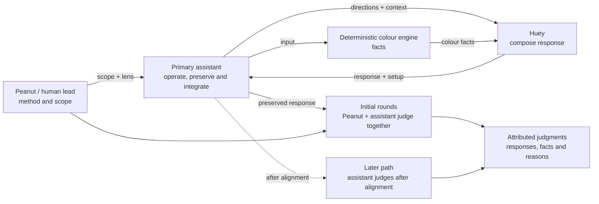

# Staged Behaviour Pulse

| Field | Value |
| --- | --- |
| Status | `staged` |
| Direction recorded | `2026-09-18`; shared judgment `2026-09-19`; bank-free correction `2026-09-20` |
| Owns | responsibilities and information flow for the next behaviour eval method |
| Boundary note | [Pre-Beta: 15-Minute Behaviour Pulses](../research/030_PB_BEHAVIOUR.md) |

The flow separates assistant operation from judgment ownership. It does not
choose whether joint judgment occurs during or after the 15-minute clock; both
clock boundaries and judgment timing remain staging choices. Initial rounds are
judged by Peanut and the primary assistant together. Independent assistant
judgment is a later path only after alignment.

## Reading the Diagram

| Surface | Responsibility |
| --- | --- |
| Peanut / human lead | defines method and scope, aligns staging choices and acceptance |
| Primary assistant | operates pulse, preserves canonical evidence and integrates the result |
| Colour engine | supplies deterministic matching, family, rank and replacement facts |
| Huey | develops wording and relationships from character directions, facts and context |
| Initial joint judgment | Peanut and the assistant develop the assistant's reading of signal and nuance |
| Pulse evidence | preserves actual setup, responses, attributed judgments and reasons |

The diagram follows the [bank-free direction](../research/460_BANK_FREE_FOUNDATION.md)
under D-056. The existing [composer](../runtime/COMPOSITION.md) still supplies
bank entries and awaits alignment. The [pipeline](PIPELINE.md) owns that
implementation detail. The primary assistant operates the pulse;
Peanut and the assistant share initial judgment, and any later independent
judgment remains conditional.

## Implemented Starting Point

The earlier local library and composer remain implemented. Composition records
preserve setup and actual output, including mechanical failures. The target
bank-free setup awaits alignment with the inspected platform prompts, including
the colour engine's replacement ownership. Timing, observation
unit, pulse-wide verdict rule and the length of the shared
judgment phase remain open in the [boundary note](../research/030_PB_BEHAVIOUR.md).

The [behaviour database and notebook](../runtime/BEHAVIOUR_RECORDS.md) now
store original records and attributed judgment history. This supplies a review
surface while the timed pulse protocol remains staged.
