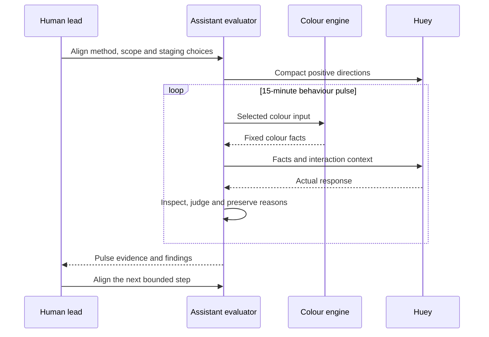

# Staged Behaviour Pulse

| Field | Value |
| --- | --- |
| Status | `staged` |
| Direction recorded | `2026-09-18` |
| Owns | responsibilities and information flow for the next behaviour eval method |
| Boundary note | [Pre-Beta: 15-Minute Behaviour Pulses](../research/030_PB_BEHAVIOUR.md) |

## Reading the Diagram

| Surface | Responsibility |
| --- | --- |
| Human lead | defines the method and scope, aligns staging choices, and steers the next step |
| Colour engine | supplies deterministic matching, family, rank, and replacement facts |
| Huey under evaluation | acts on the small positive instruction set with room to reason |
| Assistant evaluator | runs the pulse, inspects responses, assigns verdicts, and records supporting reasons |
| Pulse evidence | preserves the actual setup, observations, and judgments for discussion |

The directions and evaluator lens have distinct recipients. The final
model-facing payload is a staging choice, including which fields from the
existing fact export reach Huey. Clock boundaries and judgment timing are also
staging choices documented in the boundary note.

## Implemented Starting Point

The [current pipeline](PIPELINE.md) supplies colour results and fixed family
lines. `behaviour-facts` exposes those facts with response-contract metadata.
The existing SQLite records describe colour outputs and their judgments.

This diagram describes the next execution shape. Its model invocation,
behavioural record, and pulse-wide verdict rule remain to be aligned and
implemented. The first completed pulse will establish the new evidence surface.
