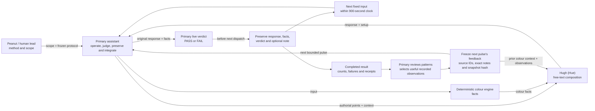

# Current Behaviour Pulse

| Field | Value |
| --- | --- |
| Status | `active` |
| Direction recorded | `2026-09-18`; shared judgment `2026-09-19`; bank-free correction `2026-09-20` |
| Owns | responsibilities and information flow for the current behaviour pulse |
| Current execution | first pulse completed; feedback connection offline-validated under D-065 |
| Boundary note | [Pre-Beta: 15-Minute Behaviour Pulses](../research/030_PB_BEHAVIOUR.md) |

Method authority remains with the human lead; the primary owns live verdicts and
the preserved record. The completed run preserved 9 responses: 4 `PASS`, 5
`FAIL`, 1 mechanical failure and 0 request errors. A delayed ninth primary
review left less than 60 seconds after the first three cases repeated, so cases
10–12 were not dispatched; this is a coverage limit, not an aggregate verdict.

## Reading the Diagram

| Surface | Responsibility |
| --- | --- |
| Peanut / human lead | defines method and scope, aligns staging choices and acceptance |
| Primary assistant | operates the fixed pulse, records live `PASS`/`FAIL`, preserves canonical evidence and integrates the result |
| Colour engine | supplies deterministic matching, family, rank and replacement facts |
| Huey | develops wording and relationships from character directions, facts and context |
| Response judgment | primary reads the original response and supplied facts before the next dispatch; optional concise observation |
| Pulse evidence | preserves exact setup, requests, raw responses, attributed judgments, mechanical failures and receipts |

The [composer](../runtime/COMPOSITION.md) adapts the [supplied prompt](../research/340_HUGH_PROMPT.md)
under D-063; the deterministic [pipeline](PIPELINE.md) supplies colour facts
and the replacement. [Behaviour Records and the notebook](../runtime/BEHAVIOUR_RECORDS.md)
owns the current outputs and attributed judgments.

Under [D-065](../governance/DECISIONS.md#d-065-connect-sequential-pulses-through-attributed-feedback),
feedback is fixed within a pulse and selected again at its boundary. The brief
and colour engine remain stable. Full source responses stay in local evidence;
only selected observations and their prior colour context enter the next request.
[Validation](../research/350_PULSE_FEEDBACK.md) covers this connection offline.

## Implemented Starting Point

The [integration record](../research/320_BANK_FREE_ALIGNMENT.md) owns validation;
the [protocol](../../.local/behaviour-pulses/20260921T175241Z/protocol.json) and
[Behaviour Records](../runtime/BEHAVIOUR_RECORDS.md) own current pulse bounds,
records, and judgments. The completed pulse is bounded evidence and does not
promote a beta.
