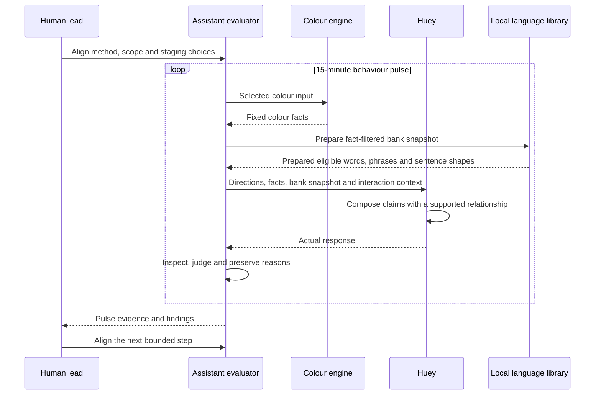

# Staged Behaviour Pulse

| Field | Value |
| --- | --- |
| Status | `staged` |
| Direction recorded | `2026-09-18`; local library clarified `2026-09-19` |
| Owns | responsibilities and information flow for the next behaviour eval method |
| Boundary note | [Pre-Beta: 15-Minute Behaviour Pulses](../research/030_PB_BEHAVIOUR.md) |

## Reading the Diagram

| Surface | Responsibility |
| --- | --- |
| Human lead | defines the method and scope, aligns staging choices, and steers the next step |
| Colour engine | supplies deterministic matching, family, rank, and replacement facts |
| Huey under evaluation | acts on the small positive instruction set with room to reason |
| Local language library | supplies wording and relationship shapes with usage conditions |
| Assistant evaluator | runs the pulse, inspects responses, assigns verdicts, and records supporting reasons |
| Pulse evidence | preserves the actual setup, observations, and judgments for discussion |

The directions and evaluator lens have distinct recipients. The
[implemented composer](../runtime/COMPOSITION.md) supplies fixed colour facts,
fact-filtered bank entries, and five positive directions to the configured model.
Fixed family lines and old response instructions stay in the carried commands.
The [library note](../research/450_LOCAL_LANGUAGE.md) describes connector
relationships and language entries. Clock boundaries and judgment timing remain
staging choices documented in the boundary note.

## Implemented Starting Point

The [current pipeline](PIPELINE.md) supplies colour results and fixed family
lines. `behaviour-facts` exposes those facts with response-contract metadata.
The existing SQLite records describe colour outputs and their judgments.

The local library and composer are implemented. Composition records preserve
setup and actual output, including mechanical failures. The bank snapshot is
prepared and supplied before composition; it is an input surface, not a pulse
verdict. This diagram describes the staged pulse shape. Timing, observation
unit, assistant judgment record, and pulse-wide verdict rule remain to be
aligned and implemented. The assistant owns operation and verdicts once the
first pulse runs; the human lead owns scope and acceptance.
