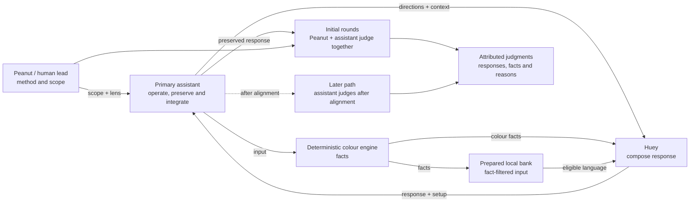

# Staged Behaviour Pulse

| Field | Value |
| --- | --- |
| Status | `staged` |
| Direction recorded | `2026-09-18`; local library and initial shared judgment clarified `2026-09-19` |
| Owns | responsibilities and information flow for the next behaviour eval method |
| Boundary note | [Pre-Beta: 15-Minute Behaviour Pulses](../research/030_PB_BEHAVIOUR.md) |

The flow separates assistant operation from judgment ownership. It does not
choose whether joint judgment occurs during or after the 15-minute clock; both
clock boundaries and judgment timing remain staging choices. Initial rounds are
judged by Peanut and the primary assistant together. Independent assistant
judgment is a later path only after alignment.

## Reading the Diagram

| Surface | Responsibility |
| --- | --- |
| Peanut / human lead | defines method and scope, aligns staging choices and acceptance |
| Primary assistant | operates pulse, preserves canonical evidence and integrates the result |
| Colour engine | supplies deterministic matching, family, rank and replacement facts |
| Prepared bank snapshot | supplies eligible language and connector meanings for the fixed facts |
| Huey | composes the response from supplied directions, facts, bank and context |
| Initial joint judgment | Peanut and the assistant develop the assistant's reading of signal and nuance |
| Pulse evidence | preserves actual setup, responses, attributed judgments and reasons |

The [implemented composer](../runtime/COMPOSITION.md) supplies fixed colour
facts, fact-filtered bank entries and five positive directions to Hugh. The
[pipeline](PIPELINE.md) and [library note](../research/450_LOCAL_LANGUAGE.md)
own the implementation details. The primary assistant operates the pulse;
Peanut and the assistant share initial judgment, and any later independent
judgment remains conditional.

## Implemented Starting Point

The local library and composer are implemented. Composition records preserve
setup and actual output, including mechanical failures. The prepared bank
snapshot is an input to composition, not a pulse verdict. Timing, observation
unit, judgment record, pulse-wide verdict rule and the length of the shared
judgment phase remain open in the [boundary note](../research/030_PB_BEHAVIOUR.md).
