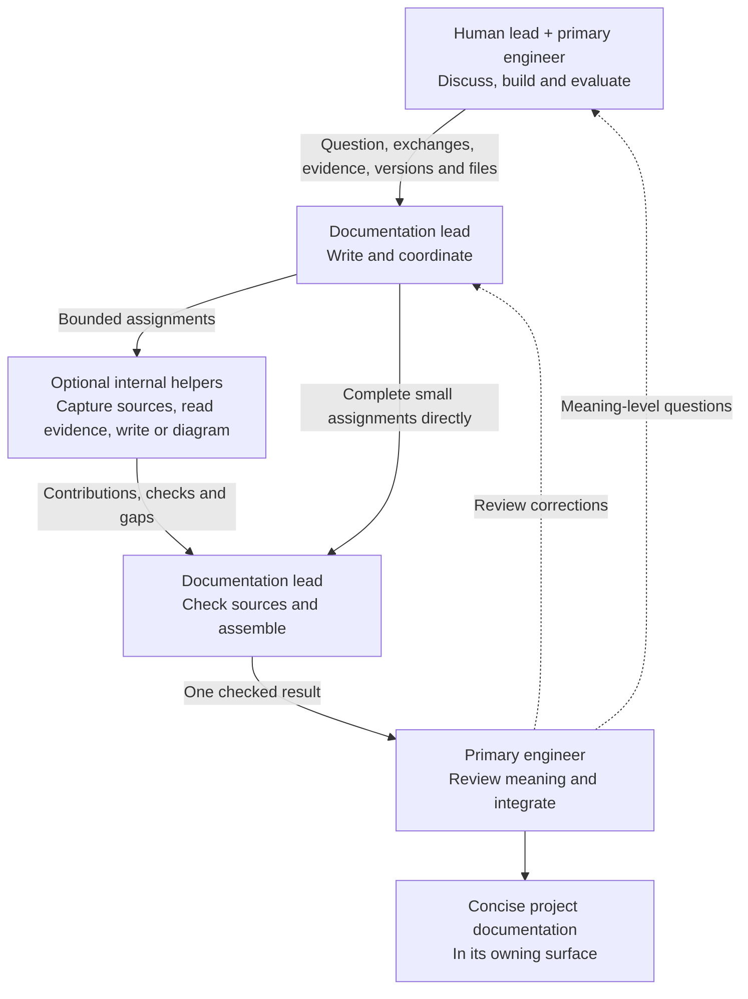

# Experiment and Documentation Collaboration

The human lead and primary engineer work together while the continuing
documentation task supports the same active scope in the shared checkout.
[D-050](../governance/DECISIONS.md#d-050-use-a-continuing-documentation-task)
records the adopted workflow.

| Owner | Responsibility |
| --- | --- |
| Human lead | Scope, acceptance, meaning and go/no-go |
| Primary engineer | Experiments, eval verdicts, assignments, final review, integration and Git |
| Documentation lead | Assigned files, helper coordination, source checks and coherent return |
| Internal helpers | Bounded contributions with explicit coverage and gaps |

The primary supplies or identifies source exchanges at handoff points so capture
can progress alongside discussion. Exact wording stays distinct from summaries;
corrections, source gaps and capture/discourse dates retain their context.
Transcript captures stay private under `docs/peanut/transcripts/`.

The [charter](../governance/CHARTER.md#documentation-delegation) owns the rules;
the [handoff](../governance/SESSION_HANDOFF.md#documentation-task) owns the task
identifier and current assignment. Each assigned file has one coordinated writer.
