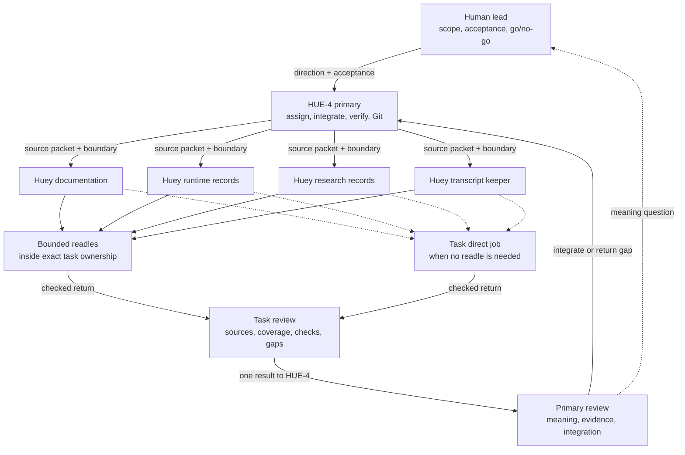

# Experiment and Documentation Collaboration

Huey applies [D-050](../governance/DECISIONS.md#d-050-use-a-continuing-documentation-task)
through the role setup in [D-051](../governance/DECISIONS.md#d-051-assign-documentation-roles-from-source-audits):
four focused tasks, bounded readles, and two reviews in the shared checkout. The
[charter](../governance/CHARTER.md#documentation-delegation)
owns the durable boundary; the [handoff](../governance/SESSION_HANDOFF.md#documentation-task)
owns the current registry and assignments.

## Responsibility

| Owner | Responsibility |
| --- | --- |
| Human lead | scope, acceptance, meaning and go/no-go |
| HUE-4 primary | assignments, experiments, pulse clock, evaluation under the agreed method, canonical evidence, integration and Git |
| Huey documentation | `README.md`, `CHARTER.md`, `SESSION_HANDOFF.md`, `COLLABORATION.md` |
| Huey runtime records | `DECISIONS.md`, `ARCHITECTURE.md`, `RUNBOOK.md`, `START_END_REFERENCE.md`, and assigned execution pipeline docs such as `PIPELINE.md` |
| Huey research records | assigned tracked and private research, including method, gate, condition and finding diagrams such as `BEHAVIOUR_PULSE.md` |
| Huey transcript keeper | curated private transcripts and relevant source diagrams with excerpts, using the [transcript README](../peanut/transcripts/README.md) |
| Task review | each task checks readle sources, coverage, validation and gaps |
| Primary review | HUE-4 checks meaning against evidence and conversation, resolves cross-owner gaps, and integrates |

## Huey assignments

| Assignment | Bounded return |
| --- | --- |
| Authorial/source mapping | exact human wording, runtime adaptation, source settings and provenance |
| Fact/method reading | supported-claim and required-fact table, case coverage and open method choices |
| Composition evidence | path, setup/version/hash, exact output, mechanical status, attributed verdict state and limits |
| Diagram or chart | editable source-linked visual with units, chronology and evidence mapping |

Diagrams distinguish verified or observed flows from proposals and
interpretation, and retain source provenance; individual assignments name the
exact files.

## Lean handoff

An assignment names the question, intended result, complete source spans and
versions, evidence IDs or endpoints, owned files, allowed operations and known
gaps. A return contains the artifact, actual coverage, source links, checks,
unresolved questions and attribution limits. One coordinated writer owns each
file. Each task may delegate bounded readles only inside its inherited
ownership, reviews their returns, and returns to HUE-4. Tasks receive only
dispatched source packets; later parent messages do not arrive automatically.
Combine small jobs; split only when source coverage or checks are independently
useful.

Preserve exact authorial wording separately from interpretation. Keep original
failures, null or unassigned verdicts and setup versions visible. Historical
model-reported relations remain claims to inspect, not verified reasoning traces.
The primary supplies future pulse records alongside execution; the
documentation team records them without operating the pulse or writing its
canonical evidence.

Transcript captures stay in `docs/peanut/transcripts/` and use the [transcript
README](../peanut/transcripts/README.md) for format; provisional reports and
receipts stay in `docs/peanut/research/`; canonical live evidence stays in
`.local/`. Parallel implementation uses dedicated worktrees within an
authorized kernel; those worktrees still resolve the canonical `.local` store
and are not independent evidence systems. This guide activates no runtime
change or future pulse.
