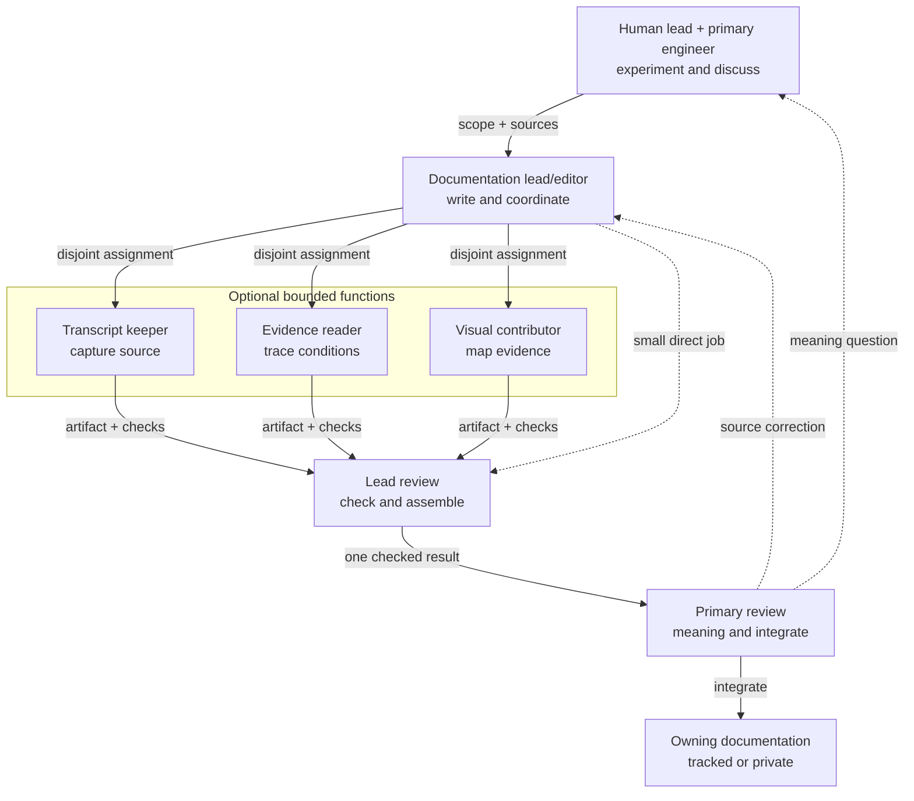

# Experiment and Documentation Collaboration

Huey applies [D-050](../governance/DECISIONS.md#d-050-use-a-continuing-documentation-task)
through the role setup in [D-051](../governance/DECISIONS.md#d-051-assign-documentation-roles-from-source-audits):
one continuing lead/editor, optional bounded documentation functions, and two
reviews in the shared checkout. The [charter](../governance/CHARTER.md#documentation-delegation)
owns the durable boundary; the [handoff](../governance/SESSION_HANDOFF.md#documentation-task)
owns the current task and assignment.

## Responsibility

| Owner | Responsibility |
| --- | --- |
| Human lead | scope, acceptance, meaning and go/no-go |
| Primary engineer | assignments, experiments, pulse clock, verdicts, evidence writes, integration and Git |
| Documentation lead/editor | assigned docs, helper coordination, source checks and one coherent return |
| Optional helpers | bounded transcript, evidence or visual work with coverage, checks and gaps |
| Reviews | lead checks sources; primary checks meaning against evidence and conversation |

## Huey assignments

| Assignment | Bounded return |
| --- | --- |
| Authorial/source mapping | exact human wording, runtime adaptation, source settings and provenance |
| Fact/method reading | supported-claim and required-fact table, case coverage and open method choices |
| Composition evidence | path, setup/version/hash, exact output, mechanical status, attributed verdict state and limits |
| Diagram or chart | editable source-linked visual with units, chronology and evidence mapping |

## Lean handoff

An assignment names the question, intended result, complete source spans and
versions, evidence IDs or endpoints, owned files, allowed operations and known
gaps. A return contains the artifact, actual coverage, source links, checks,
unresolved questions and attribution limits. One coordinated writer owns each
file. Combine small jobs; split only when source coverage or checks are
independently useful.

Preserve exact authorial wording separately from interpretation. Keep original
failures, null or unassigned verdicts and setup versions visible. Historical
model-reported relations remain claims to inspect, not verified reasoning traces.
The primary supplies future pulse records alongside execution; the
documentation team records them without operating the pulse or writing its
canonical evidence.

Transcript captures stay in `docs/peanut/transcripts/`; provisional reports and
receipts in `docs/peanut/research/`; canonical live evidence in `.local/`.
Parallel implementation uses dedicated worktrees within an authorized kernel;
those worktrees still resolve the canonical `.local` store and are not
independent evidence systems. This guide activates no runtime change or future
pulse.
