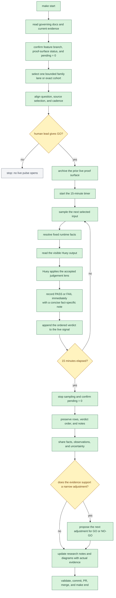

# Live Eval Workflow

This is the next-beta operating flow established by `D-036`. It changes the
eval pulse to a 15-minute live run with immediate binary verdicts. It does not
change Huey's deterministic runtime or invalidate the existing evidence
archive.

The alignment gate is deliberate. Choosing the question, source selection, and
cadence is a human-led decision before a pulse opens, not a decision made by
the diagram or sampler.

## Method Boundaries

- The run lasts exactly `15` minutes.
- Every evaluation receives `PASS` or `FAIL` while the pulse is live.
- Verdict order is the live signal. It is preserved before interpretation.
- `retain`, `evict`, and legacy pulse labels are not verdicts or evidence
  labels for this method.
- Huey records verdicts by applying the human lead's established judgement
  standard. The human lead owns the research question, acceptance criteria,
  and GO or NO-GO decisions.
- Existing completed evals remain historical evidence. A live pulse changes
  neither the archive nor Huey's deterministic colour runtime.

## Authority

- [Charter](../governance/CHARTER.md): runtime rules, evidence handling, and
  human-lead ownership.
- [D-036](../governance/DECISIONS.md): 15-minute live `PASS`/`FAIL` method.
- [Architecture](../runtime/ARCHITECTURE.md): fixed facts before visible-output
  evaluation.
