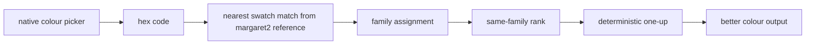

# Pipeline

This is the canonical target flow for Huemiliator.

The runtime is not implemented yet. This diagram records the contract we are
building toward.

```mermaid
flowchart LR
  A["native colour picker"]
  B["hex code"]
  C["nearest swatch match from margaret2 reference"]
  D["family assignment"]
  E["same-family rank"]
  F["deterministic one-up"]
  G["better colour output"]

  A --> B --> C --> D --> E --> F --> G
```
