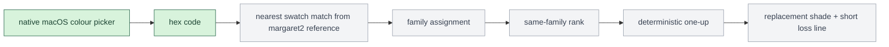

# Pipeline

This is the canonical target flow for Huemiliator.

The first picker kernel is implemented. The rest of the flow is still the
target path.

```mermaid
flowchart LR
  A["native macOS colour picker"]
  B["hex code"]
  C["nearest swatch match from margaret2 reference"]
  D["family assignment"]
  E["same-family rank"]
  F["deterministic one-up"]
  G["replacement shade + short loss line"]

  A --> B --> C --> D --> E --> F --> G

  classDef implemented fill:#d8f3dc,stroke:#2d6a4f,color:#1b4332
  classDef pending fill:#f3f4f6,stroke:#9ca3af,color:#374151
  class A,B implemented
  class C,D,E,F,G pending
```
