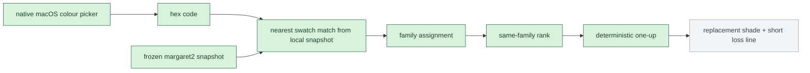

# Pipeline

This is the canonical target flow for Huemiliator.

The picker kernel, the frozen swatch snapshot, nearest-swatch resolution,
family assignment, same-family rank, and deterministic replacement step are
implemented. The rest of the flow is still the target path.

