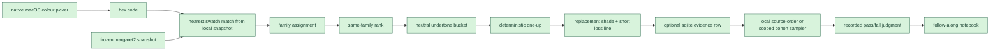

# Pipeline

This is the implemented colour pipeline carried into behaviour-beta staging.
The [staged behaviour pulse](BEHAVIOUR_PULSE.md) shows the next method's
responsibilities and information flow.

The picker kernel, the frozen swatch snapshot, nearest-swatch resolution,
family assignment, same-family rank, neutral undertone constraint,
deterministic replacement step, fixed loss-line layer, and first local evidence
surface are implemented.

```mermaid
flowchart LR
  A["native macOS colour picker"]
  B["hex code"]
  S["frozen margaret2 snapshot"]
  C["nearest swatch match from local snapshot"]
  D["family assignment"]
  E["same-family rank"]
  U["neutral undertone bucket"]
  F["deterministic one-up"]
  G["replacement shade + short loss line"]
  H["optional sqlite evidence row"]
  I["local source-order or scoped cohort sampler"]
  J["recorded pass/fail judgment"]
  K["follow-along notebook"]

  A --> B --> C --> D --> E --> U --> F --> G
  G --> H --> I --> J --> K
  S --> C

  classDef implemented fill:#d8f3dc,stroke:#2d6a4f,color:#1b4332
  classDef pending fill:#f3f4f6,stroke:#9ca3af,color:#374151
  class A,B,S,C,D,E,U,F,G,H,I,J,K implemented
```
