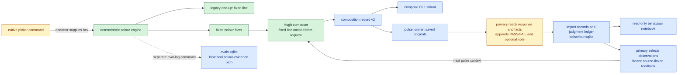

# Pipeline

The current [behaviour method](../research/030_PB_BEHAVIOUR.md) uses Hugh's
[composer](../runtime/COMPOSITION.md) on deterministic colour facts.

```mermaid
flowchart LR
  P["native picker command"] -->|"operator supplies hex"| R["deterministic colour engine"]
  R --> U["legacy one-up: fixed line"]
  R --> F["fixed colour facts"]
  F --> C["Hugh composer<br/>fixed line omitted from request"]
  C --> S["composition record v2"]
  S --> O["compose CLI: stdout"]
  S --> W["pulse runner: saved originals"]
  W --> J["primary reads response and facts<br/>appends PASS/FAIL and optional note"]
  J --> I["import records and judgment ledger<br/>behaviour.sqlite"]
  I --> N["read-only behaviour notebook"]
  I --> B["primary selects observations<br/>freeze source-linked feedback"]
  B -->|"next pulse context"| C
  R -.->|"separate eval-log command"| E["evals.sqlite<br/>historical colour-evidence path"]

  classDef runtime fill:#d8f3dc,stroke:#2d6a4f,color:#1b4332
  classDef evidence fill:#dbeafe,stroke:#1d4ed8,color:#1e3a8a
  classDef operator fill:#fef3c7,stroke:#b45309,color:#78350f
  class P,J operator
  class R,U,F,C runtime
  class S,O,W,I,N,E,B evidence
```

`pick` prints a hex for the operator to supply to another command. The engine
owns frozen-swatch matching, family, rank and replacement. `behaviour-facts`
exposes those facts with the legacy loss line; the composer removes that line
from the model request.

`compose --format json` prints a record without creating files or database rows.
The first pulse's runner called the same composer functions directly and saved
original evidence. Its judgment helper appended each verdict to the ledger,
then imported records and judgments before the next dispatch. Manual saved-run
imports and later appended judgments remain available through
[Behaviour Records](../runtime/BEHAVIOUR_RECORDS.md).

The [current pulse diagram](BEHAVIOUR_PULSE.md) owns timing and evaluator
responsibility. The [review notebook](../../output/jupyter-notebook/huemiliator-behaviour-review.ipynb)
reads the behaviour store; the separate colour store retains its historical scope.
