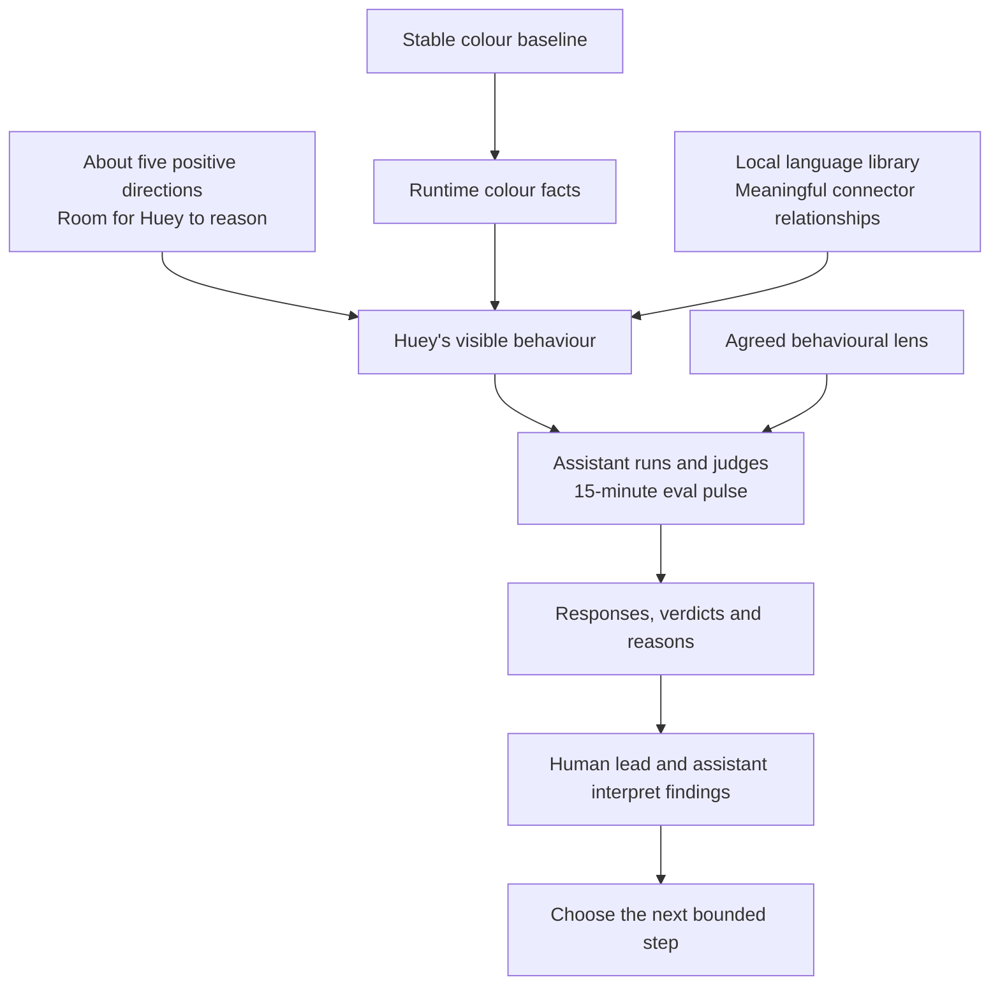

# Pre-Beta: 15-Minute Behaviour Pulses

| Field | Value |
| --- | --- |
| Code | `PB_BEHAVIOUR` |
| Category | `boundary` |
| Status | `staged` |
| Direction recorded | `2026-09-18`; local library clarified `2026-09-19` |
| Last evidence | `2026-08-03`, carried colour baseline |
| Owns | the transition to assistant-run behaviour evaluation in 15-minute pulses |

## What This Boundary Asks

How does Huey use a small set of positive directions and stable colour facts
to produce its colour one-up behaviour, with room to reason?

The next research focus is chosen. Staging prepares the instructions, diagrams,
judgment lens, and execution shape for that focus.

## Status

| Agreed direction | Meaning |
| --- | --- |
| Focus | Huey's behaviour, with colour logic held as the stable foundation |
| Cadence | 15-minute eval pulses |
| Instruction shape | approximately five short, positive directions at most |
| Reasoning space | Huey has room to choose how it carries out those directions |
| Language resources | [starter bank](../runtime/LANGUAGE_BANK.md) implemented with 106 entries and 14 connector senses |
| Character | Hue (Hugh), a pretentious and celebrated colour theory academic; the agreed five-point configuration is recorded in D-046 |
| Operator and evaluator | the assistant runs the pulses and supplies verdicts |
| Current work | beta notes, diagrams, and staging alignment |

This direction comes from the human lead's September 18 clarification,
recorded in [D-038](../governance/DECISIONS.md#d-038-stage-assistant-run-behaviour-evals-in-15-minute-pulses).
The September 19 library clarification is recorded in
[D-039](../governance/DECISIONS.md#d-039-stage-a-local-language-library-and-connector-logic).
The draft wording and mechanics below are engineering proposals for review.
The numbered beta designation remains to be chosen at promotion.

## Current Proof Surface

| Carried surface | Evidence | Role here |
| --- | --- | --- |
| Closed `Beta 1.0` | family sweep, neutral correction, warm-edge and boundary audits | stable colour-method baseline |
| Latest colour pulse | `20163..20166`: four anchors, zero seams, zero excluded | preserved neutral / pink / brown / red comparison inputs |
| Corrected red rerun | `18424..19691`: 1,268 judged rows | older row-level comparison baseline |
| Behaviour pulses | first pulse awaits staging completion | new evidence to establish |

The [closed beta](020_B10.md) and [boundary audit](440_COLOUR_BOUNDARY_AUDIT.md)
own those findings. The next source slice is a bounded set of behavioural
observations using the fixed colour facts; its initial cases remain a staging
choice. Colour-family lanes stay parked.

## Diagram

The [staged execution diagram](../diagrams/BEHAVIOUR_PULSE.md) separates the
agent's directions, supplied facts, local library, and evaluator's work.
The [local language draft](450_LOCAL_LANGUAGE.md) shows the proposed library
structure and how claims, relationships, and wording fit together.

## What This Would Change

| Dimension | Carried colour method | Staged behaviour method |
| --- | --- | --- |
| Judged object | family and replacement results | Huey's visible behaviour using those results |
| Bounded unit | scoped colour pulse, often counted rows | 15-minute behaviour pulse |
| Evidence inside the pulse | colour rows and labels | actual responses, supplied facts, context, and assistant judgments |
| Verdict ownership | operator-supplied labels and existing tally | assistant supplies verdicts under the aligned behavioural lens |
| Meaning | evidence about colour routing and selection | evidence about how Huey carries out its compact directions |

The assistant owns pulse operation and evaluation. The human lead owns the
method and scope; both discuss what the findings warrant next.

## Instructions and Judgment Lens

The [agreed authorial configuration](450_LOCAL_LANGUAGE.md#agreed-authorial-configuration)
under [D-046](../governance/DECISIONS.md#d-046-record-hughs-agreed-academic-configuration)
now owns the character direction: grounded verbosity, graceful generic
compliments, meaningful colour rationale, and exacting statements or rhetorical
questions. Runtime and library alignment with that configuration is pending.

The five directions below are the carried instruction version `1.2.0` currently
sent by the composer. They record the existing implementation, including its
earlier brevity and wordplay emphasis:

1. Speak as Hue (Hugh), an eloquent intellectual tastemaker assured of his own taste.
2. Open with a backhanded compliment on the chosen colour, referring to it at family level.
3. Present the replacement by its supplied Pantone name alone, asserting its aesthetic superiority as settled fact.
4. Use concise, natural, gracious library phrasing with deliberate rhythm, wordplay, and implied judgment.
5. Use connector words that express the relationship between your ideas.

The [implemented composer](../runtime/COMPOSITION.md) leaves expression to Hugh.
It supplies fixed colour facts and local bank entries to the configured model.
The fixed family lines remain in the carried `one-up` path under D-006 and are
omitted from the composer request under D-042. Detailed entry conditions and
relationship definitions live in the [library note](450_LOCAL_LANGUAGE.md).
The [character direction and authorial openings](450_LOCAL_LANGUAGE.md#character-direction-write-hues-voice)
ground these directions in the human lead's clarification. Existing fixed lines are
implementation history, with behavioural fidelity still to be demonstrated.

| Candidate evaluation lens | What the assistant inspects |
| --- | --- |
| Factual grounding | colour claims and replacement match the supplied facts |
| Coherence | claims fit together and the connector expresses a supported relationship |
| Behavioural fit | inspect against D-046's agreed academic configuration, including generic courtesy, meaningful colour rationale, and coherent development |
| Context fit | the wording fits the actual input and interaction |

Candidate judgment unit: one visible response with its facts and context.
Each assistant verdict would carry a response reference and a short reason.
These are proposed criteria; the pulse-wide verdict rule remains to be aligned.
Reasoning space is evaluated through Huey's observable choices.

The author's clarification under
[D-044](../governance/DECISIONS.md#d-044-hugh-delivers-aesthetic-verdicts-as-settled-fact)
establishes the manner of Hugh's assertion: aesthetic superiority delivered
as settled fact. The exact supplied fragment is “is just more satisfying”.

## Why It Matters

Stable colour facts make behavioural judgments attributable. Compact positive
directions leave room to observe how Huey uses those facts, while short pulses
give the research a repeatable occasion to inspect, judge, and choose again.

## What It Still Needs

| Staging choice | Review surface |
| --- | --- |
| Composer review | implemented model call, five directions, fact-filtered bank, and inspection record |
| Pulse timing | clock start, deadline, judgment timing, and handling of an in-flight response |
| Judgment contract | observation unit, case selection, PASS/FAIL criterion, and pulse-wide verdict rule |
| Pulse evidence | attach assistant verdicts and reasons to the implemented composition records; define pulse membership and completion |

The existing duration sampler produces deterministic colour rows. Existing
`behaviour-facts` exports facts and contract metadata. Those are starting
components for the staged work. The starter language bank, `language-bank`
inspection, and model-driven `compose` command are available. Composition
records preserve the exact setup and actual output, including mechanical
failures. The pulse protocol and assistant judgment record remain staging work.

## What Would Promote It

Staging completes when the human lead and assistant align the instruction set,
language setup, timing convention, judgment contract, and evidence record.

The boundary becomes active when the aligned setup produces its first completed
15-minute behaviour pulse with preserved responses and assistant verdicts. A
documented PASS or FAIL supplies that first evidence surface. The beta note
then records the designation, setup, result, limitations, and next decision.

Immediate next step: inspect [composition records](../runtime/COMPOSITION.md),
then align pulse timing, case selection, and the judgment contract beside the
[execution diagram](../diagrams/BEHAVIOUR_PULSE.md).
