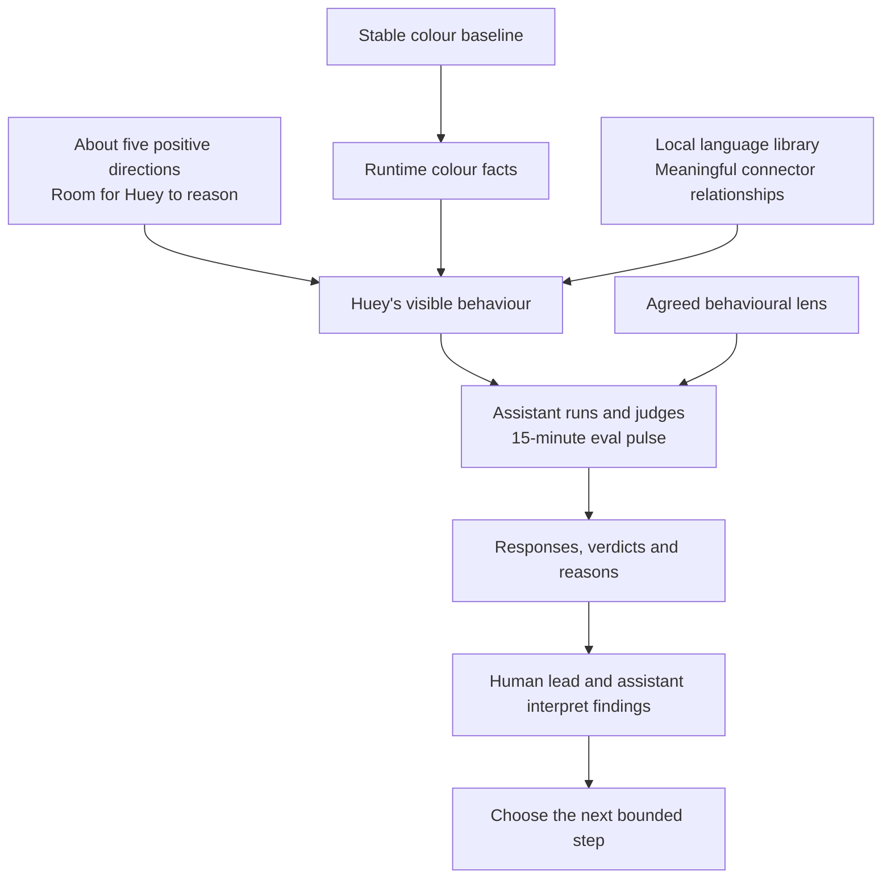

# Pre-Beta: 15-Minute Behaviour Pulses

| Field | Value |
| --- | --- |
| Code | `PB_BEHAVIOUR` |
| Category | `boundary` |
| Status | `staged` |
| Direction recorded | `2026-09-18`; local library clarified `2026-09-19` |
| Last evidence | `2026-08-03`, carried colour baseline |
| Owns | the transition to assistant-run behaviour evaluation in 15-minute pulses |

## What This Boundary Asks

How does Huey use a small set of positive directions and stable colour facts
to produce its colour one-up behaviour, with room to reason?

The next research focus is chosen. Staging prepares the instructions, diagrams,
judgment lens, and execution shape for that focus.

## Status

| Agreed direction | Meaning |
| --- | --- |
| Focus | Huey's behaviour, with colour logic held as the stable foundation |
| Cadence | 15-minute eval pulses |
| Instruction shape | approximately five short, positive directions at most |
| Reasoning space | Huey has room to choose how it carries out those directions |
| Language resources | [starter bank](../runtime/LANGUAGE_BANK.md) implemented with 94 entries and five connector senses |
| Character | Hue (Hugh), a courteous snob who begins with a backhanded compliment; “Huey” is our nickname |
| Operator and evaluator | the assistant runs the pulses and supplies verdicts |
| Current work | beta notes, diagrams, and staging alignment |

This direction comes from the human lead's September 18 clarification,
recorded in [D-038](../governance/DECISIONS.md#d-038-stage-assistant-run-behaviour-evals-in-15-minute-pulses).
The September 19 library clarification is recorded in
[D-039](../governance/DECISIONS.md#d-039-stage-a-local-language-library-and-connector-logic).
The draft wording and mechanics below are engineering proposals for review.
The numbered beta designation remains to be chosen at promotion.

## Current Proof Surface

| Carried surface | Evidence | Role here |
| --- | --- | --- |
| Closed `Beta 1.0` | family sweep, neutral correction, warm-edge and boundary audits | stable colour-method baseline |
| Latest colour pulse | `20163..20166`: four anchors, zero seams, zero excluded | preserved neutral / pink / brown / red comparison inputs |
| Corrected red rerun | `18424..19691`: 1,268 judged rows | older row-level comparison baseline |
| Behaviour pulses | first pulse awaits staging completion | new evidence to establish |

The [closed beta](020_B10.md) and [boundary audit](440_COLOUR_BOUNDARY_AUDIT.md)
own those findings. The next source slice is a bounded set of behavioural
observations using the fixed colour facts; its initial cases remain a staging
choice. Colour-family lanes stay parked.

## Diagram

The [staged execution diagram](../diagrams/BEHAVIOUR_PULSE.md) separates the
agent's directions, supplied facts, local library, and evaluator's work.
The [local language draft](450_LOCAL_LANGUAGE.md) shows the proposed library
structure and how claims, relationships, and wording fit together.

## What This Would Change

| Dimension | Carried colour method | Staged behaviour method |
| --- | --- | --- |
| Judged object | family and replacement results | Huey's visible behaviour using those results |
| Bounded unit | scoped colour pulse, often counted rows | 15-minute behaviour pulse |
| Evidence inside the pulse | colour rows and labels | actual responses, supplied facts, context, and assistant judgments |
| Verdict ownership | operator-supplied labels and existing tally | assistant supplies verdicts under the aligned behavioural lens |
| Meaning | evidence about colour routing and selection | evidence about how Huey carries out its compact directions |

The assistant owns pulse operation and evaluation. The human lead owns the
method and scope; both discuss what the findings warrant next.

## Draft Instructions and Judgment Lens

These five positive directions are a review draft for Huey's setup:

1. Speak as Hue (Hugh), an eloquent tastemaker assured of his own taste.
2. Begin with a backhanded compliment on the chosen colour.
3. Present your preferred replacement by name and hex, using the supplied colour facts.
4. Choose concise, gracious library language, carrying your judgment through implication.
5. Use connector words that express the relationship between your ideas.

The draft leaves expression to Huey. The current runtime's fixed family lines
remain the implemented baseline under D-006; their role in the new library
is an explicit choice before implementation. Detailed entry conditions and
relationship definitions live in the [library draft](450_LOCAL_LANGUAGE.md).
The mechanism that selects and composes language remains to be chosen.
The [character direction and authorial openings](450_LOCAL_LANGUAGE.md#character-direction-write-hues-voice)
ground this draft in the human lead's clarification. Existing fixed lines are
implementation history, with behavioural fidelity still to be demonstrated.

| Candidate evaluation lens | What the assistant inspects |
| --- | --- |
| Factual grounding | colour claims and replacement match the supplied facts |
| Coherence | claims fit together and the connector expresses a supported relationship |
| Behavioural fit | Hugh opens with a backhanded compliment and carries the one-up through courteous, assured taste |
| Context fit | the wording fits the actual input and interaction |

Candidate judgment unit: one visible response with its facts and context.
Each assistant verdict would carry a response reference and a short reason.
These are proposed criteria; the pulse-wide verdict rule remains to be aligned.
Reasoning space is evaluated through Huey's observable choices.

## Why It Matters

Stable colour facts make behavioural judgments attributable. Compact positive
directions leave room to observe how Huey uses those facts, while short pulses
give the research a repeatable occasion to inspect, judge, and choose again.

## What It Still Needs

| Staging choice | Review surface |
| --- | --- |
| Actual language setup | local library, selection and composition mechanism, exact directions, supplied facts, and interaction context |
| Expressive scope | role of the fixed loss-line bank alongside the draft's wording freedom |
| Pulse timing | clock start, deadline, judgment timing, and handling of an in-flight response |
| Judgment contract | observation unit, case selection, PASS/FAIL criterion, and pulse-wide verdict rule |
| Evidence record | instruction, library, and composer versions; input facts, context, responses, timestamps, verdicts, and reasons |

The existing duration sampler produces deterministic colour rows. Existing
`behaviour-facts` exports facts and contract metadata. Those are starting
components for the staged work. The starter language bank and read-only
`language-bank` inspection are now available. The local selection/composition
path and behavioural evidence record await implementation alignment.

## What Would Promote It

Staging completes when the human lead and assistant align the instruction set,
language setup, timing convention, judgment contract, and evidence record.

The boundary becomes active when the aligned setup produces its first completed
15-minute behaviour pulse with preserved responses and assistant verdicts. A
documented PASS or FAIL supplies that first evidence surface. The beta note
then records the designation, setup, result, limitations, and next decision.

Immediate next step: use the [starter bank](../runtime/LANGUAGE_BANK.md) to align
the selection and composition mechanism beside the instructions, judgment lens,
and [execution diagram](../diagrams/BEHAVIOUR_PULSE.md).
