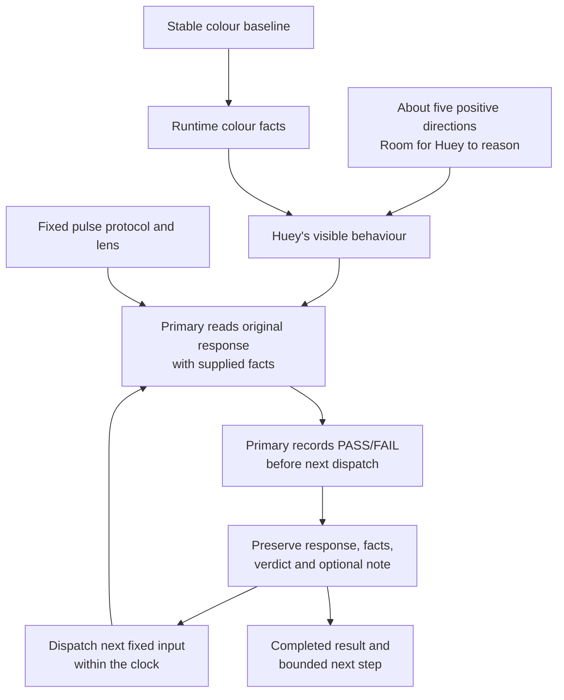

# Pre-Beta: 15-Minute Behaviour Pulses

| Field | Value |
| --- | --- |
| Code | `PB_BEHAVIOUR` |
| Category | `boundary` |
| Status | `active` |
| Direction recorded | `2026-09-18`; shared judgment `2026-09-19`; bank-free correction `2026-09-20` |
| Last evidence | `2026-09-21`, first current-app pulse completed with 9 judged responses |
| Current execution | `completed`: `20260921T175241Z`, 857.587 seconds, stopped at the gated request window |
| Owns | the transition to assistant-run behaviour evaluation in 15-minute pulses |

## What This Boundary Asks

How does Hugh use compact positive directions, stable colour facts and useful
evaluation feedback across sequential 15-minute pulses?

The first pulse supplies a bounded current read. Peanut's sequential-pulse
direction now connects useful observations to the next pulse under
[D-065](../governance/DECISIONS.md#d-065-connect-sequential-pulses-through-attributed-feedback).
The primary selects feedback between pulses; each pulse fixes its context and
records live judgments. [Offline validation](350_PULSE_FEEDBACK.md) establishes
the connection; behavioural improvement remains to be evaluated.

## Status

| Agreed direction | Meaning |
| --- | --- |
| Focus | Huey's behaviour, with colour logic held as the stable foundation |
| Cadence | 15-minute eval pulses |
| Instruction shape | approximately five short, positive directions at most |
| Reasoning space | Huey has room to choose how it carries out those directions |
| Language direction | five authorial points from the [supplied prompt](340_HUGH_PROMPT.md), with construction left to Hugh under D-063 |
| Character | Hugh (Hue), a pretentious and celebrated colour theory academic; crisp, brief delivery with model-owned wording and reasoning |
| Operator and evaluator | the primary assistant operates the fixed pulse and records live `PASS`/`FAIL` per response before the next dispatch; the human lead owns method, scope and acceptance |
| Current work | [bank-free integration checked](320_BANK_FREE_ALIGNMENT.md); first pulse recorded; review through [Behaviour Records and notebook](../runtime/BEHAVIOUR_RECORDS.md) and [Composition](../runtime/COMPOSITION.md) |

This direction comes from the human lead's September 18 clarification,
recorded in [D-038](../governance/DECISIONS.md#d-038-stage-assistant-run-behaviour-evals-in-15-minute-pulses).
The September 20 bank-free correction under
[D-056](../governance/DECISIONS.md#d-056-establish-a-bank-free-character-foundation)
supersedes September 19's local-library direction.
The implemented directions and completed first pulse are distinguished below.
The numbered beta designation remains to be chosen at promotion.

## Authorized First-Pulse Judgment

The first current-app pulse is authorized under
`.local/behaviour-pulses/20260921T175241Z/protocol.json`. The primary assistant
reads each original response with its supplied facts as it arrives, records a
binary `PASS` or `FAIL` before the next dispatch, and adds a concise observation
only when it adds value. There is no required separate Peanut-verdict column.

The earlier [D-052](../governance/DECISIONS.md#d-052-judge-the-first-behaviour-rounds-together)
joint-reading agreement and [“your” in “your pink”](240_YOUR_PINK.md) remain
calibration and provenance for the method; they do not become an invented
per-response result in this pulse. Meaning-level acceptance and the go/no-go
boundary remain with Peanut and the human lead.

## Current Proof Surface

| Carried surface | Evidence | Role here |
| --- | --- | --- |
| Closed `Beta 1.0` | family sweep, neutral correction, warm-edge and boundary audits | stable colour-method baseline |
| Historical colour pulse | `20163..20166`: four anchors, zero seams, zero excluded | preserved colour labels, separate from wording judgments |
| Carried wording review | `20163..20166`: four Peanut **FAILs**, September 20 | “the responses are too basic.”; [correction record](230_CARRIED_WORDING.md) |
| Corrected red rerun | `18424..19691`: 1,268 judged rows | older row-level comparison baseline |
| Behaviour pulses | [Current records](../runtime/BEHAVIOUR_RECORDS.md), run `20260921T175241Z`, output IDs `7–15`: 9 responses, 4 `PASS`, 5 `FAIL`, 1 mechanical failure, 0 request errors | first response evidence; coverage is bounded |

The [closed beta](020_B10.md) and [boundary audit](440_COLOUR_BOUNDARY_AUDIT.md)
own those findings. The current source slice is a bounded set of behavioural
observations using the fixed colour facts; its cases and order are fixed by the
first-pulse protocol. After the first three cases repeated, a delayed ninth
primary review left less than 60 seconds, so cases 10–12 were not dispatched.
Colour-family lanes stay parked.

## Diagram

The [execution diagram](../diagrams/BEHAVIOUR_PULSE.md) separates the
authorial points, picker context, supplied facts and primary evaluator's work
under D-063. The current run completed with its recorded finish.
The [prompt record](340_HUGH_PROMPT.md) owns the exact source; the
[local language draft](450_LOCAL_LANGUAGE.md) preserves the superseded design.

## What It Showed

| Dimension | Carried colour method | Current behaviour pulse |
| --- | --- | --- |
| Judged object | family and replacement results | Huey's visible behaviour using those results |
| Bounded unit | scoped colour pulse, often counted rows | 15-minute behaviour pulse |
| Evidence inside the pulse | colour rows and labels | actual responses, supplied facts, context, and attributed judgments |
| Verdict ownership | operator-supplied labels and existing tally | primary assistant records live `PASS`/`FAIL` per response; human lead owns method, acceptance and go/no-go |
| Meaning | evidence about colour routing and selection | evidence about how Huey carries out its compact directions |

## Instructions and Judgment Lens

The [runtime directions](../../src/huemiliator/agent.py) preserve the five points
of Peanut's [supplied prompt](340_HUGH_PROMPT.md) under D-063. Picker context names
the user's colour family and the engine's supplied replacement. Hugh owns
wording, connections and sentence construction; the engine owns the colour facts.

The completed pulse retains its original Luna / medium reasoning / low verbosity
and Top P `0.98` setup. Composer `0.7.0` / instructions `2.2.0` now use the
separately selected Platform settings under
[D-066](../governance/DECISIONS.md#d-066-apply-the-selected-platform-log-settings).
The [composer guide](../runtime/COMPOSITION.md#selected-platform-settings) owns
the current request and record contract. This later configuration has no live
behavioural result yet. Colour selection and labelled swatches remain
deterministic; the legacy fixed family line stays outside the composition request.

| Evaluation lens | What the assistant inspects |
| --- | --- |
| Factual grounding | colour claims and replacement match the supplied facts |
| Coherence | claims fit together and the connector expresses a supported relationship |
| Behavioural fit | inspect against the five authorial points under D-063, including generic courtesy, meaningful colour rationale, crisp delivery and coherent development |
| Context fit | the wording fits the actual input and interaction |

Judgment unit in this pulse: one visible response with its facts and context.
Each primary verdict carries its response reference and may carry one concise
observation when it adds value. The pulse records actual counts and mechanical
failures; it does not invent an aggregate behaviour verdict.
Reasoning space is evaluated through Huey's observable choices.

Shared calibration: Peanut marked [“your” in “your pink”](240_YOUR_PINK.md) as
a **high signal** in its supplied response. The case preserves the wording,
attribution and contextual read; it guides evaluation without prescribing a token.

The author's clarification under
[D-044](../governance/DECISIONS.md#d-044-hugh-delivers-aesthetic-verdicts-as-settled-fact)
establishes the manner of Hugh's assertion: aesthetic superiority delivered
as settled fact. The exact supplied fragment is “is just more satisfying”.

## Why It Matters

Stable colour facts make behavioural judgments attributable. Compact positive
directions leave room to observe how Huey uses those facts, while short pulses
give the research a repeatable occasion to inspect, judge, and choose again.

## What It Still Needs

| Current surface | Review role |
| --- | --- |
| Current review | [Behaviour Records and notebook](../runtime/BEHAVIOUR_RECORDS.md) exposes the completed records and attributed judgments |
| Composer contract | [Composition](../runtime/COMPOSITION.md) owns generated requests, v2 records and mechanical checks |
| Pulse method | [D-064](../governance/DECISIONS.md#d-064-authorize-live-per-response-judging-for-the-first-current-app-pulse) and the [protocol](../../.local/behaviour-pulses/20260921T175241Z/protocol.json) own live per-response judging and bounds |
| Evidence meaning | current per-response findings remain bounded; no aggregate behaviour verdict or beta promotion |

The existing duration sampler produces deterministic colour rows. Existing
`behaviour-facts` exports facts and contract metadata. The bank-free `compose`
command preserves the exact setup and actual free-text output, including
mechanical failures. The first protocol fixed pulse membership, timing and
per-response judgment; the completed validation preserved the records and
receipts without changing runtime source or the colour database.

## What Would Promote It

The prepared state became running when
`.local/behaviour-pulses/20260921T175241Z/started.json` appeared and completed
with `finished.json` and `validation.json`. The run supplies 9 responses and
attributed primary verdicts, not the full 12-attempt plan.

The boundary is now active with that first completed pulse. The resulting record
documents actual counts, observations, limitations and the gated-clock stop; it
does not promote a beta or invent an aggregate behaviour verdict.

The [integration checks](320_BANK_FREE_ALIGNMENT.md) are complete. The first
protocol, completed records, and [execution diagram](../diagrams/BEHAVIOUR_PULSE.md)
now point to the same current pulse; the next bounded step remains open.
