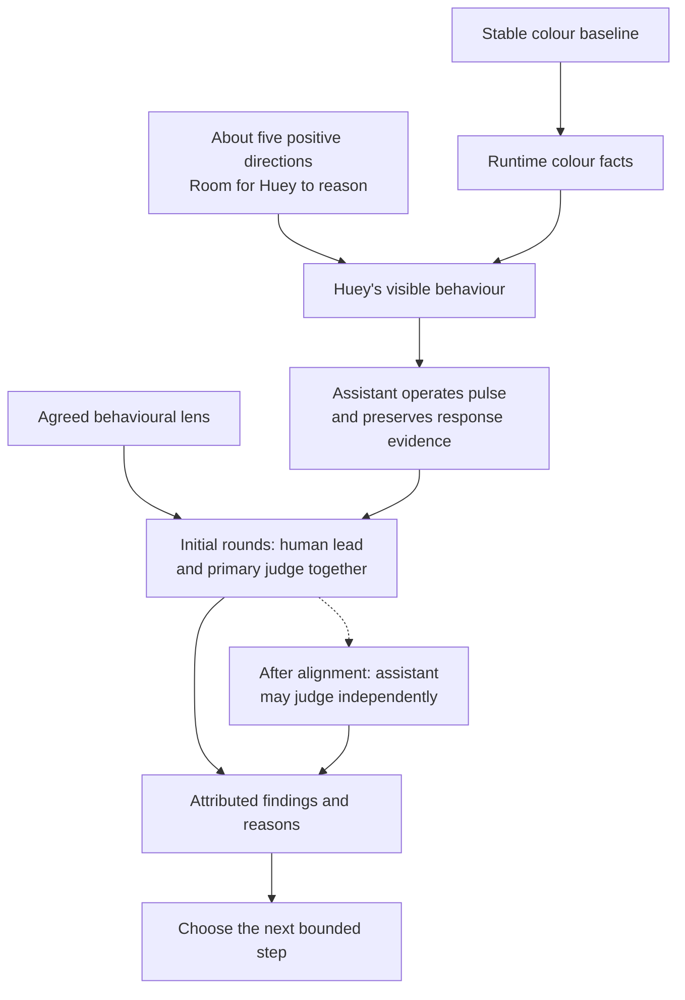

# Pre-Beta: 15-Minute Behaviour Pulses

| Field | Value |
| --- | --- |
| Code | `PB_BEHAVIOUR` |
| Category | `boundary` |
| Status | `staged` |
| Direction recorded | `2026-09-18`; shared judgment `2026-09-19`; bank-free correction `2026-09-20` |
| Last evidence | `2026-09-20`, carried wording review and accepted platform character foundation; timed behaviour pulses remain staged |
| Owns | the transition to assistant-run behaviour evaluation in 15-minute pulses |

## What This Boundary Asks

How does Huey use a small set of positive directions and stable colour facts
to produce its colour one-up behaviour, with room to reason?

The next research focus is chosen. Staging prepares the instructions, diagrams,
judgment lens, and execution shape for that focus.

## Status

| Agreed direction | Meaning |
| --- | --- |
| Focus | Huey's behaviour, with colour logic held as the stable foundation |
| Cadence | 15-minute eval pulses |
| Instruction shape | approximately five short, positive directions at most |
| Reasoning space | Huey has room to choose how it carries out those directions |
| Language direction | five bank-free directions adapted from the [v10 benchmark](470_V10_BENCHMARK.md) under D-060, with existing colour responsibilities retained |
| Character | Hue (Hugh), a pretentious and celebrated colour theory academic; crisp, brief delivery with model-owned wording and reasoning |
| Operator and evaluator | the assistant operates the planned pulses; the human lead and primary assistant judge the first rounds together |
| Current work | [bank-free integration checked](320_BANK_FREE_ALIGNMENT.md); ready for shared response judgment, with pulse protocol staged |

This direction comes from the human lead's September 18 clarification,
recorded in [D-038](../governance/DECISIONS.md#d-038-stage-assistant-run-behaviour-evals-in-15-minute-pulses).
The September 20 bank-free correction under
[D-056](../governance/DECISIONS.md#d-056-establish-a-bank-free-character-foundation)
supersedes September 19's local-library direction.
The implemented directions and proposed pulse mechanics are distinguished below.
The numbered beta designation remains to be chosen at promotion.

## Initial Shared Judgment

Under [D-052](../governance/DECISIONS.md#d-052-judge-the-first-behaviour-rounds-together),
the human lead refined the first-round path: “so for the first rounds of evals,
we'll judge them together so you can learn high signals and low signals with
the nuances in between”. The assistant operates the planned pulses while the
human lead and primary assistant judge initial rounds together; the length of
that phase and any transition to independent assistant judgment remain open.

## Current Proof Surface

| Carried surface | Evidence | Role here |
| --- | --- | --- |
| Closed `Beta 1.0` | family sweep, neutral correction, warm-edge and boundary audits | stable colour-method baseline |
| Historical colour pulse | `20163..20166`: four anchors, zero seams, zero excluded | preserved colour labels, separate from wording judgments |
| Carried wording review | `20163..20166`: four Peanut **FAILs**, September 20 | “the responses are too basic.”; [correction record](230_CARRIED_WORDING.md) |
| Corrected red rerun | `18424..19691`: 1,268 judged rows | older row-level comparison baseline |
| Behaviour pulses | first pulse awaits staging completion | new evidence to establish |

The [closed beta](020_B10.md) and [boundary audit](440_COLOUR_BOUNDARY_AUDIT.md)
own those findings. The next source slice is a bounded set of behavioural
observations using the fixed colour facts; its initial cases remain a staging
choice. Colour-family lanes stay parked.

## Diagram

The [staged execution diagram](../diagrams/BEHAVIOUR_PULSE.md) separates the
adapted directions, supplied facts and evaluator's work under D-060. The
[v10 benchmark](470_V10_BENCHMARK.md) owns the exact source setup; the
[local language draft](450_LOCAL_LANGUAGE.md) preserves the superseded design.

## What This Would Change

| Dimension | Carried colour method | Staged behaviour method |
| --- | --- | --- |
| Judged object | family and replacement results | Huey's visible behaviour using those results |
| Bounded unit | scoped colour pulse, often counted rows | 15-minute behaviour pulse |
| Evidence inside the pulse | colour rows and labels | actual responses, supplied facts, context, and attributed judgments |
| Verdict ownership | operator-supplied labels and existing tally | assistant operates; human lead and primary assistant judge initial rounds together; later independent assistant judgment requires alignment |
| Meaning | evidence about colour routing and selection | evidence about how Huey carries out its compact directions |

## Instructions and Judgment Lens

The [runtime directions](../../src/huemiliator/agent.py) adapt v10's character
and behavioural foundation under D-060. Five positive directions support Hugh's
academic pretension, crisp delivery, backhanded courtesy and meaningful rationale
for the supplied replacement. The model owns wording, connections and sentence
construction. The [exact platform template](470_V10_BENCHMARK.md#benchmark-prompt)
remains source evidence.

Composer `0.5.0` / instructions `2.0.0` use Luna, medium reasoning, low verbosity
and Top P `0.98`. The [composer guide](../runtime/COMPOSITION.md) owns the request
and record contract. Colour selection and labelled swatches remain deterministic;
the legacy fixed family line stays outside the composition request.

| Candidate evaluation lens | What the assistant inspects |
| --- | --- |
| Factual grounding | colour claims and replacement match the supplied facts |
| Coherence | claims fit together and the connector expresses a supported relationship |
| Behavioural fit | inspect against the v10 behavioural benchmark and D-060 adaptation, including generic courtesy, meaningful colour rationale, crisp delivery and coherent development |
| Context fit | the wording fits the actual input and interaction |

Candidate judgment unit: one visible response with its facts and context.
Each verdict would carry its evaluator attribution, response reference and a short reason.
These are proposed criteria; the pulse-wide verdict rule remains to be aligned.
Reasoning space is evaluated through Huey's observable choices.

Shared calibration: Peanut marked [“your” in “your pink”](240_YOUR_PINK.md) as
a **high signal** in its supplied response. The case preserves the wording,
attribution and contextual read; it guides evaluation without prescribing a token.

The author's clarification under
[D-044](../governance/DECISIONS.md#d-044-hugh-delivers-aesthetic-verdicts-as-settled-fact)
establishes the manner of Hugh's assertion: aesthetic superiority delivered
as settled fact. The exact supplied fragment is “is just more satisfying”.

## Why It Matters

Stable colour facts make behavioural judgments attributable. Compact positive
directions leave room to observe how Huey uses those facts, while short pulses
give the research a repeatable occasion to inspect, judge, and choose again.

## What It Still Needs

| Staging choice | Review surface |
| --- | --- |
| Composer review | judge fresh responses under the shared method after completed mechanical integration checks |
| Pulse timing | clock start, deadline, judgment timing, and handling of an in-flight response |
| Judgment contract | initial joint reading, observation unit, case selection, PASS/FAIL criterion, and pulse-wide verdict rule |
| Pulse evidence | attributed records are implemented; define timed pulse membership and completion |

The existing duration sampler produces deterministic colour rows. Existing
`behaviour-facts` exports facts and contract metadata. Those are starting
components for the staged work. The bank-free `compose` command preserves the
exact setup and actual free-text output, including mechanical failures. The
[behaviour database and notebook](../runtime/BEHAVIOUR_RECORDS.md) now
preserve records and attributed judgments. Pulse membership, timing and
aggregation remain staging work.

## What Would Promote It

Staging completes when the human lead and assistant align the instruction set,
language setup, timing convention, judgment contract, and evidence record.

The boundary becomes active when the aligned setup produces its first completed
15-minute behaviour pulse with preserved responses and attributed verdicts. A
documented PASS or FAIL supplies that first evidence surface. The beta note
then records the designation, setup, result, limitations, and next decision.

The [integration checks](320_BANK_FREE_ALIGNMENT.md) are complete. Fresh shared
judgment is next; pulse timing, case selection and the judgment contract follow
their agreed scope beside the [execution diagram](../diagrams/BEHAVIOUR_PULSE.md).
