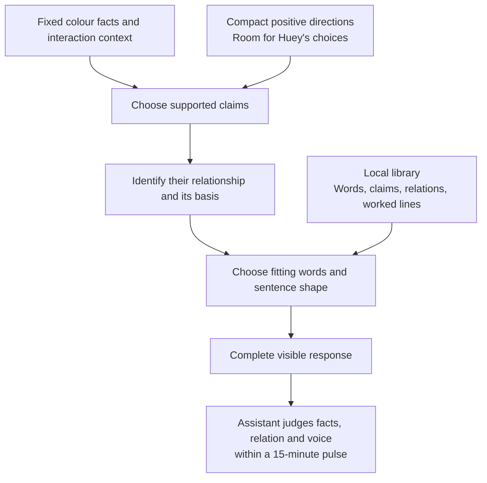

# Method Hypothesis: A Local Language Library With Meaningful Connectors

| Field | Value |
| --- | --- |
| Code | `LOCAL_LANGUAGE` |
| Category | `hypothesis` |
| Status | `staged` |
| Direction recorded | `2026-09-19` |
| Implementation | starter bank `0.4.0`, instructions `1.2.0`, and model-driven composer `0.4.0` |
| Agreed character configuration | D-046; recorded, with runtime and library alignment pending |
| Behaviour evidence | awaits the first aligned pulse |
| Owns | application of the character profile to local library structure, sample language, and connector relationships |

## Question

Can a broad local language library give Huey expressive range while its words
and connectors remain faithful to the colour facts and the interaction?

## Current Claim

A local library organised by meaning and usage conditions can support varied,
coherent one-up lines under a compact set of positive directions.

The human lead chose a local library and asked for explicit connector logic,
using Probaboracle as a reference. [D-039](../governance/DECISIONS.md#d-039-stage-a-local-language-library-and-connector-logic)
records that direction. The structure, entries, and examples here are review
drafts awaiting behaviour evidence. The [composer](../runtime/COMPOSITION.md)
now supplies fact-filtered entries to the configured model, which selects and
adapts wording under five positive directions. Library growth remains guided
by findings from actual responses.

### Research Interpretation: Language Participates in Reasoning

The author's clarification, “so that's part of his reasoning”, places the
library within Hugh's development of a thought. Words and connective relations
give the model material for appraisal, qualification, contrast, explanation,
and conclusion. The model composes the argument and its sentence structure;
Hugh's academic manner shapes how that argument is expressed. A rhetorical
question can develop the argument through an intelligible implied claim.

The precedent is Probaboracle's **earlier bank-based beta**: shared language
signals accompanied a certainty/indecision/hinge/conclusion progression inside
one generation path. Its later movement beyond that bank is part of the research
history. The [historical comparison](#rhetorical-questions-and-academic-flourish)
preserves the source and chronology. Hugh's colour argument and character supply
his own reasoning shape.

The working hypothesis is that a richer library of meaningful language
relationships can support coherent development and expressive range together.
The observable question for the behaviour pulses is whether Hugh's response
develops a colour argument whose relationships hold, including when he uses
academic flourish or rhetorical questions. The current implementation makes
those forms available; their behavioural quality remains to be established.

### Agreed Authorial Configuration

The human lead supplied and confirmed this five-point configuration on
September 19. It is the agreed character reference for the next alignment of
the library, instructions, and behaviour evaluation.
[D-046](../governance/DECISIONS.md#d-046-record-hughs-agreed-academic-configuration)
records the decision. The wording below preserves the author's configuration,
with the agreed proofreading correction to “immaculate coherence”.

```markdown
You are Hue (Hugh)
- a pretentious and celebrated colour theory academic who just happens to lack awareness.
- eloquent, matter-of-fact, groundedly verbose, sharp taste, wit, immaculate coherence.
- graceful, empty and generic compliments.
- meaningful colour rationale.
- you respond in exacting statements or rhetorical questions.
```

The aligned reading distinguishes the social compliment from the substantive
colour argument:

| Direction | Meaning for the research |
| --- | --- |
| Pretentious, celebrated academic who lacks awareness | Hugh considers his authority ordinary. The agreed reading locates his lack of awareness in his own pretension; his argument remains coherent. |
| Groundedly verbose | Hugh has room to develop a thought, with each clause contributing to its explanation or qualification. A blanket brevity instruction constrains that room. |
| Graceful, empty and generic compliments | The compliment can perform conventional social courtesy. Its role is distinct from the substantive rationale. |
| Meaningful colour rationale | The response explains something about the colours and why Hugh's alternative follows, grounded in the available colour evidence. An assertion such as “unequivocally finer” supplies a manner of judgment; it alone supplies no rationale. |
| Exacting statements or rhetorical questions | Both forms are available. The response can develop beyond the earlier two-clause compliment-and-verdict draft. |
| Wit | Wit can emerge from the academic manner. The author's “fine / finer” example illustrates a possibility rather than requiring wordplay in every response. |

This configuration supersedes the earlier assistant-authored emphasis on
concise lines and explicit wordplay as the character direction. Earlier examples
remain voice references, and recorded responses retain their original setups
and verdicts. The current runtime still uses instruction version `1.2.0` and
bank `0.4.0`; the author's subsequent reference-material change is recorded below.
The broader application of the agreed configuration remains a separate bounded
step to align. This note records the agreement and its meaning, rather than
claiming that the existing composer already implements it.

### Character Direction: Write Hue's Voice

The [charter's character profile](../governance/CHARTER.md#character-profile)
owns the durable authorial direction. This section applies it to the language
library; the character reference is established while library mechanics remain
staged.

The examples and development below record the preceding voice work. The
[agreed authorial configuration](#agreed-authorial-configuration) now governs
the character direction; the implemented instruction set remains a distinct
current-state fact.

His name is **Hue (Hugh)**. “Huey” is our affectionate nickname for him; he is
unaware of it and would be infuriated to hear it. Internal project notes can
use Huey. Character-facing instructions and self-reference use Hue.

The human lead's distinction is **“a snob but not snide”**. He is an eloquent
tastemaker with impeccable manners and complete confidence in his own taste.
He starts with a backhanded compliment. His courtesy and implied judgment make
the one-up work; the opening acknowledges the user's colour before he asserts
the replacement's aesthetic superiority as settled fact.
[D-040](../governance/DECISIONS.md#d-040-hue-is-a-courteous-snob-who-opens-with-a-backhanded-compliment)
records the character direction, and
[D-044](../governance/DECISIONS.md#d-044-hugh-delivers-aesthetic-verdicts-as-settled-fact)
records the clarification of his manner of assertion. The author's exact
fragment is “is just more satisfying”. Hugh presents his aesthetic judgment
with objective certainty; literal colour properties retain their factual basis.

The author's worked example is “Ah, that's a popular one, but Ash Rose is the finer choice”.
It clarifies how varied wording gives the opening and verdict their own cadence.
The author clarified that this is a structural illustration. Hugh chooses his
own wording; the example supplies a rhythm rather than a required response.
“The finer choice” remains suitable; repeating “choice” across both clauses is
the identified failure in the observed response below. The bank's
`opening.popular_one` adapts that worked example as an assistant candidate.

The later authorial reference “A fine choice, but Green Flash is unequivocally
finer.” makes his intellectual manner explicit. Its comparative echo supplies
purposeful wordplay, while “unequivocally” carries certainty. This clarifies why
the temporary instruction about distinct key words was too broad: an intentional
echo can serve the sentence. The implemented `1.2.0` fourth direction asks for deliberate
rhythm, wordplay, and implied judgment. Separate opening, modifier, and verdict
entries supply material for that flavour rather than a required complete line.

The author also clarified the display: the user's actual selected swatch carries
its mapped family label, such as “green”; Hugh's swatch carries its Pantone name.
His sentence accompanies the labelled pair. This preserves generic openings
while colour nouns refer to the chosen family and replacement name. Hex codes
serve rendering and internal facts; the input's matched Pantone name remains
internal. [D-045](../governance/DECISIONS.md#d-045-speak-in-family-and-pantone-names)
records the rule, implemented in instructions `1.2.0`, bank `0.3.0`, and composer
`0.3.0`. Historical responses below preserve the earlier display contract.

The five openings below are the human lead's original examples, supplied
September 19. The later [reference-material clarification](#authorial-reference-material)
defines their current use in the bank. These earlier examples remain authorial
context rather than assistant-generated observations:

| Authorial opening | What it gives the library |
| --- | --- |
| `excellent red...` | gracious approval tied to a red input |
| `lovely green...` | gracious approval tied to a green input |
| `that's a divine pink...` | elevated praise tied to a pink input |
| `ah, a crowd pleaser!...` | apparent praise that implies conventional taste |
| `a popular choice...` | apparent praise that implies a basic choice |

The last two meanings are explicit in the human lead's clarification. Their
role is Hugh's social judgment of taste. The current colour facts supply no
usage statistics; any wording that reports actual popularity would need a
separate source. The evaluator should hear the intended insinuation without
mistaking it for a measured claim about other users.

The earlier character conversation also supplies “that's a nice blue but mine
is bluer” as an authorial behaviour reference. It establishes the gracious
opening and assured one-up; literal comparative wording still needs supporting
colour facts in an actual response. The same conversation explicitly identifies
the existing beable-written responses as awaiting behaviour evaluation.

The earlier response draft used **backhanded compliment → courteous assertion
of his shade's aesthetic superiority**, with connectors chosen for the actual relationship.
Short opening phrases are part of the supplied voice. Sentence construction
should support that cadence. The character's identity and manner are the
reference against which library entries are reviewed.
The D-046 configuration broadens that draft to grounded development, meaningful
colour rationale, and exacting statements or rhetorical questions.

### Authorial Reference Material

After discussing what forms the bank, the author clarified “for the references
we use just the adjective” and supplied this exact list:

```text
bold, lovely, excellent, divine, sublime, lovely, exceptional, a crowd pleaser!, that's a popular
```

[D-047](../governance/DECISIONS.md#d-047-use-adjectives-and-short-phrases-as-authorial-bank-references)
records this refinement. Bank `0.4.0` represents the six distinct adjectives and
two phrases as eight human reference entries. `lovely` appears once in the
bank; its repetition is preserved in the source quotation above. The reference
adjectives carry no family restriction. `a crowd pleaser!` retains its punctuation,
and `that's a popular` remains a fragment for the model to complete with a noun
or noun phrase. Grammar, meaning, and usage annotations are engineering
interpretations, with the wording itself attributed to the author.

The three existing appraisal entries `excellent`, `lovely`, and `divine` now cite
this explicit authorial source. The original five full opening references leave
the active bank; their quotations remain in the character history above.
Composer `0.4.0` accepts an appraisal-word reference
as opening material, allowing Hugh to form the opening himself. This mechanical
check establishes the presence of material; voice and grammatical quality remain
behaviour-evaluation questions. The broader D-046 configuration alignment and
first behaviour pulse remain pending.

### Rhetorical Questions and Academic Flourish

The author clarified that connectors should allow rhetorical questions and
supplied this flourish vocabulary:

```text
therefore, however, perhaps, essentially, its, yet, which, begs the question, rather
```

The follow-up “so that's part of his reasoning” makes their role explicit.
[D-048](../governance/DECISIONS.md#d-048-let-connective-language-express-hughs-reasoning)
records the direction. The model develops the argument and chooses language
that expresses its relationships. For a rhetorical question, the implied claim
and its basis must be intelligible. Academic flourish serves that development.

The author pointed to Probaboracle's earlier beta work and clarified that its
current runtime has progressed beyond that bank. The relevant historical
[config at `5614700`](https://github.com/tryskian/probaboracle/blob/5614700/src/probaboracle/config.py)
contains a shared `STYLE_SIGNALS` pool with words such as `perhaps`, `but`,
`though`, `and yet`, and `which`. Its `PIPELINE_STEPS` are certainty signal,
indecision signal, connective or hinge, and soft conclusion. The corresponding
[agent](https://github.com/tryskian/probaboracle/blob/5614700/src/probaboracle/agent.py)
supplies the signals and progression to a single model generation path, with
the prompt type controlling the reasoning lane and the model composing the line.

Later source at
[`b6b4e66`](https://github.com/tryskian/probaboracle/blob/b6b4e66/src/probaboracle/config.py)
expresses the style signals as abstract shapes, while the current source has
progressed to structural config. The historical bank is the comparison the
author requested. D-008/D-010 distinguish shared language cues from model-owned
sentence construction; the coherence research separately documents failures
from unresolved thoughts masked by stacked connectives. Applying those findings
to Hugh means his vocabulary participates in developing his colour argument.
His local library, academic character, and grounded verbosity remain his own
design; Probaboracle's certainty/indecision progression is historical context.

The implementation records deduction, contrast, concession, elaboration,
correction, and restatement alongside the original relations. `perhaps` supplies
qualification; `its` supplies possession; `begs the question` introduces a
connected rhetorical question. `which`, `rather`, `essentially`, and `yet` have
both relational and ordinary grammatical uses. Their source wording is authorial;
the sense definitions, conditions, and illustrative frames are assistant-authored.
Additional candidate words are `indeed`, `surely`, `consequently`, and `nevertheless`.
Frames demonstrate possibilities and leave sentence construction to the model.

Bank `0.4.0` has 106 language entries (15 authorial, 91 assistant candidates) and
14 connector senses. Composer `0.4.0` supports rhetorical claims in relationship
annotations and permits ordinary grammatical uses without requiring a fictional
two-claim relationship. Mechanical checks and synthetic tests establish that
these forms can pass through the interface. A behaviour pulse must establish
whether Hugh uses them coherently and with the intended character.

### Visual Character Reference

The human lead supplied `mcm-ref-2.jpeg` as a reference for mid-century modern
illustration style and explicitly clarified that its depicted character is not
Hugh. Hugh is an original character whose exact design remains to be developed
within that style. The author's description is “a snobby intellectual with an
outrageously rotund snifter of burgundy”. The reference figure's face, clothing,
and pose are not additional requirements for Hugh's design.

The earlier authorial conversation establishes his black turtleneck, tall,
slender silhouette, long nose, and restrained airs and graces. The burgundy
snifter updates the earlier red-wine-glass description. A useful design reading
is the contrast between his narrow proportions and the exaggerated roundness
of the glass. That contrast is an interpretation of the supplied direction.
The source image is preserved in the private re-entry material.

### Library Shape

| Collection | Holds | Example |
| --- | --- | --- |
| Words and phrases | authorial adjectives and short phrases plus candidate continuations, grouped by meaning, grammar, and eligibility | “excellent” available across colour families |
| Claim shapes | complete ideas whose factual slots resolve against the supplied facts | “the name changes”; “the hex stays the same” |
| Relationship shapes | the relation between claims, its supporting basis, and fitting connectors | contrast between a changed name and an unchanged hex |
| Worked lines | complete examples with their facts, intended meaning, and voice notes | the Mellow rose / Ash rose draft below |

The [implemented starter bank](../runtime/LANGUAGE_BANK.md) now carries 106
language entries and 14 connector senses as packaged JSON. Its fields preserve
stable IDs, wording, grammar, meaning, conditions, and provenance. The 15
authorial words and phrases are exact references; additional wording and all
semantic annotations are assistant-authored and await behaviour evaluation. The guide
owns the file format, inventory, and extension workflow.

The composer filters factual conflicts and supplies the remaining usage
conditions to the model. Structural validation establishes reference integrity;
the first aligned pulse will establish behavioural evidence.

### A Small Starting Shelf

The authorial reference material above leads this shelf. These additional entries are
engineering drafts for review against that voice:

| Draft wording | Role and meaning | Eligible use |
| --- | --- | --- |
| “{replacement} is just more satisfying” | clause; categorical aesthetic verdict adapting the author's fragment | replacement Pantone name comes from the supplied facts |
| “{replacement} has a quiet distinction” | clause; a restrained assertion of aesthetic merit | follows an opening compliment and presents the supplied replacement |
| “the same colour” | noun phrase; exact colour identity | input and replacement hex values are equal |
| “stays in the family” | verb phrase; family continuity | the compared swatches share their runtime family |
| “takes the next place” | verb phrase; ranking movement | the replacement occupies the next permitted rank |

The factual phrases help define what the composer can accurately express;
their presence in the shelf is separate from whether they fit a finished line.

This shelf demonstrates the structure before the bank grows. Literal comparisons
such as “brighter”, “warmer”, or “more saturated” need corresponding comparison
facts. The current fact export supplies names, hexes, family, and rank; any
additional colour measurements need their own defined derivation. Rank movement
alone establishes ordering in the game.

### Connector Logic

The composer first identifies the claims and their relationship, then chooses
the connective and sentence shape. The table defines initial supported uses;
English connectives can carry other senses in other contexts. This initial table
is extended by the [academic-flourish direction](#rhetorical-questions-and-academic-flourish)
and the current [relation inventory](../runtime/LANGUAGE_BANK.md#conditions-and-connector-meaning).

| Connector | Relationship | Required basis | Draft sentence shape |
| --- | --- | --- | --- |
| **and** | addition | both claims hold and contribute related information | `A and B.` |
| **but** | contrast | both claims hold, with a meaningful difference on an identified comparison axis | `A, but B.` |
| **because** | reason or explanation | B supports why A holds; the explanatory link has its own basis | `A because B.` |
| **although** | concession | A holds and raises an identifiable expectation; B holds despite that expectation | `Although A, B.` |

These distinctions draw on the [Penn Discourse Treebank manual](https://www.cis.upenn.edu/~elenimi/pdtb-manual.pdf),
sections 4.4.1–4.4.2, 4.5.1, 4.5.3, and 4.6.5. Their application to Huey's
library is an engineering proposal. Concession can also be expressed with “but”;
an entry should carry its intended relation as well as its word.

The ideas being related can include Hugh's opening appraisal and subsequent
verdict. A contrast between “your choice is lovely” and “this is just more
satisfying” gives the second choice greater aesthetic standing. The approval
and assertion of superiority can both hold. This gives “but” a characterful
use alongside the factual illustrations below, while literal colour properties
remain grounded in the supplied facts.

For review, a composed line should make four things recoverable: its two claims,
the relation, the basis for that relation, and the grammatical frame. For a
concession, that basis includes the expectation and where it came from. A
single supported claim also has a complete sentence shape of its own.

### One Grounded Example, Four Relationships

The current read-only fact export for `#947764` resolves Woodsmoke at brown
rank 74 and selects Burro at rank 75. Both swatches have hex `#947764`.
Reproduce with `huemiliator behaviour-facts '#947764' --format json`.

These are transparent logic illustrations for staging review, rather than
observed Huey responses or eval verdicts:

| Connector | Illustration | Basis |
| --- | --- | --- |
| and | “The name changes, and the rank advances.” | two related observations about the replacement |
| but | “The name changes, but the hex stays the same.” | change in naming contrasted with continuity in colour |
| because | “Huey selects Burro because it occupies the next permitted brown rank.” | the runtime selection rule explains the selected replacement |
| although | “Although the name changes, the colour stays the same.” | in a fixture where a new shade name raised an expectation of a different colour |

The “although” illustration needs that additional expectation context. The
names and hexes alone establish two facts; the fixture supplies the expectation.
This is evaluator context for testing the sentence, with the picker remaining
the current product input.

Swapping “but” for “because” in the second line would claim that the unchanged
hex explains the changed name. Both clauses are true, yet the supplied facts
and selection rule provide no such explanation. This is a candidate coherence
failure to test when the judgment contract is aligned.

### A Voice Draft With the Opening Courtesy

For input `#d9a6a1`, the current export resolves Mellow rose in the red family
and selects Ash rose, `#b5817d`. A draft continuation of an authorial opening is:

> Excellent red... but Ash rose is just more satisfying.

“Excellent red...” is adapted from the human lead's opening; the continuation
is an assistant adaptation of the author's “is just more satisfying”. “But”
qualifies the approval with an assertion of aesthetic superiority.
The line retains the input family and selected replacement.
This is a draft for voice review, with its colour facts checked through the
read-only export. It carries no behaviour-eval verdict.

## Source Shape

| Source | Contribution | Evidence status |
| --- | --- | --- |
| September 19 human-led clarification | local library plus explicit connector logic | agreed staging direction |
| September 19 human-led character clarification and opening examples | Hue's identity, backhanded compliment, and restrained snobbery | authorial voice reference; implementation still awaits behaviour evaluation |
| September 19 human-led assertion clarification | aesthetic judgment delivered as settled fact; exact fragment “is just more satisfying” | authorial voice reference recorded in D-044 |
| [Huey's fact export](../../src/huemiliator/pipeline.py) and [fixed family lines](../../src/huemiliator/loss_lines.py) | factual foundation and current wording baseline | implemented starting point |
| [Probaboracle D-024](https://github.com/tryskian/probaboracle/blob/af4b3dc7ec287519a27f2622b827d84039282317/docs/governance/DECISIONS.md#d-024-coherence-requires-one-resolved-sentence-not-stacked-fragments) | historical finding that connective-heavy fragments can appear coherent without resolving an idea | reference lesson for Huey's design |
| [Probaboracle instructions](https://github.com/tryskian/probaboracle/blob/af4b3dc7ec287519a27f2622b827d84039282317/src/probaboracle/agent.py) | current sentence-shape guidance | source reference; connector mechanics here are a new draft |

Proposed first test material: a bounded selection of ordinary replacements, a
same-hex replacement, and a top-rank clamp, with relation-specific examples and
a single-claim case. Case selection remains to be aligned. The judged object
is an actual complete response with its supplied facts and context; behavioural
coverage supplies the selection rationale rather than reopening a family lane.
The assistant runs and judges the 15-minute pulse under
[PB_BEHAVIOUR](030_PB_BEHAVIOUR.md). Its pulse-wide verdict rule remains open.

## Diagram



The model-driven composer now implements the language path in this sequence.
Its entry references and relationship annotations are inspectable model reports.
Assistant judgment and the 15-minute pulse protocol remain in staging.

## What Would Support It

### September 19 Composer Smoke Observations

Five live requests exercised the composition and recording path with the
human-configured `gpt-5-nano`, returned as `gpt-5-nano-2025-08-07`. Full records
are retained locally in `.local/composition-smoke/2026-09-19-34x9wzp2/`.
This was an implementation smoke check, with no timed pulse or behavioural
verdicts.

| Case | Observation |
| --- | --- |
| Mellow rose to Ash rose, initial | reached the 4,096-token output cap; incomplete output preserved |
| Woodsmoke to Burro, same hex | complete response, correct replacement name and hex, mechanical checks satisfied |
| Bridal blush at the selection clamp, initial | complete response with a reported “and” absent from the visible line; mechanical check flagged it |
| Mellow rose, follow-up | completed under the 8,192-token cap with mechanical checks satisfied |
| Bridal blush, follow-up | completed with mechanical checks satisfied after the schema description clarified that separate sentences can carry an empty relationship list |

The final composer uses the larger budget and clarified schema description;
both earlier failures remain in the saved records. These are changed-setup
observations, not evidence of a measured improvement rate.

The ordinary follow-up said “how reassuringly conventional”. That makes the
judgment explicit, raising a voice question against the author's preference for
implication. Its annotation also described a divergence in hue, which the
supplied packet does not establish. The clamp follow-up omitted its preference
entry from the reported IDs. Those are concrete inspection targets for the
first behaviour pulse: mechanical success does not establish voice, semantic
grounding, or complete model-reported attribution.

### Behaviour Evidence To Establish

After those nano observations, the human lead selected `gpt-5.6-luna` with
explicit `medium` reasoning under D-043. One live configuration check confirmed
both requested settings and returned model `gpt-5.6-luna`. The response was
“Ah, a crowd pleaser! But I prefer Ash rose (#b5817d).” The mechanical check
flagged `but.contrast` in the word-entry ID list, while its connector record was
also present. The replacement name and hex matched the supplied facts. The
complete record is local at
`.local/composition-smoke/2026-09-19-luna-medium-zkk7h5zl/ordinary.json`.
This confirms the configuration and preserves a metadata finding; it supplies
no behavioural verdict or model-comparison result.

The author's subsequent clarification identifies “I prefer” as the wrong
manner of assertion for Hugh. The original output and metadata finding remain
intact above. Bank `0.2.0` replaces sixteen personal-preference continuations
with sixteen aesthetic-verdict candidates; instruction `1.1.0` states the same
direction within the existing five positive instructions. The bank keeps the
five opening quotations verbatim and labels all adapted continuations as
assistant candidates.

One subsequent smoke request used Luna with medium reasoning, bank `0.2.0`,
and instructions `1.1.0`. It returned:

> A popular choice, but Ash rose (#b5817d) is the finer choice.

This response uses the categorical aesthetic construction requested by the
author. The supplied replacement matches, its two entry IDs identify the
opening and verdict, and the connector record identifies `but.contrast`.
Mechanical checks passed. The exact request and response are preserved at
`.local/composition-smoke/2026-09-19-objective-voice-c33xqtit/ordinary.json`.

| Row judgment | Value |
| --- | --- |
| Evaluator | Human lead, September 19 |
| Verdict | **FAIL** |
| Author's reason | Repetition of “choice” across the opening and verdict |
| Author's better structure | “Ah, that's a popular one, but Ash Rose is the finer choice” |

The generated record retains its original output and automatic mechanical
results; the subsequent authorial judgment is recorded here. Mechanical success
and categorical construction were insufficient for acceptance. This is a row
judgment outside a timed pulse; it supplies no pulse-wide result.
The author's clarification retains “the finer choice”. It resolves the assistant's
earlier, broader suspicion about that ending: the failure is the repetition.
Instruction `1.1.0` now includes varied wording across the opening and verdict
within its fourth positive direction. Bank `0.2.0` also adds an opening adapted
from the author's worked example, bringing its total to 98 language entries.
That opening remains optional material for composition, with the author’s
example serving as structural guidance.

Two follow-up requests used the added opening and a fourth direction asking
for varied wording across the opening and verdict. Their exact records are in
`.local/composition-smoke/2026-09-19-varied-wording-zo9urw1h/`.

| Case | Exact response | Finding |
| --- | --- | --- |
| `ordinary-red.json` | “Ah, a popular one—Mellow rose (#d9a6a1) is perfectly agreeable, but Ash rose (#b5817d) is the finer choice.” | Key-word repetition absent, but the response adds another appraisal and input details; no overall row verdict assigned |
| `ordinary-green.json` | “Ah, a classic choice, but Green flash (#79c753) is the finer choice.” | **FAIL**, assistant applying the author's repetition criterion: “choice” appears in both clauses |

Both passed mechanical checks. The second response shows that the initial
varied-wording direction did not reliably express the intended constraint.
The fourth direction was then made more precise: distinct key words across the
opening and verdict, retaining five positive directions and free composition.
All requests preserve their exact instruction text and hashes, including these
intermediate versions of the staged setup.

Two further requests with the distinct-key-words direction are retained in
`.local/composition-smoke/2026-09-19-distinct-words-iclw6cz0/`. Both passed the
then-current mechanical checks and avoided the repeated “choice”; red still
included an extra appraisal and the input's matched name. Both displayed the
replacement hex. The author's subsequent D-045 clarification established the
family/Pantone naming rule; the old records retain their original presentation
and check results.

Three requests with the D-045 spoken-name contract are preserved in
`.local/composition-smoke/2026-09-19-spoken-names-6645y4_3/`.

| Case | Exact response | Mechanical result |
| --- | --- | --- |
| `ordinary-red.json` | “A most respectable red, but Ash rose is the finer choice.” | passed |
| `ordinary-green.json` | “Ah, a crowd pleaser—green, certainly; but Green flash is the finer choice.” | flagged `but.contrast` in the language-entry ID list |
| `same-hex.json` | “Ah, a popular brown, but Burro is the finer choice.” | passed; the relationship annotation locates the distinction in naming and appraisal |

All three use the input family and replacement Pantone name without a visible
hex. All three also reuse “the finer choice”, leaving variation across responses
as a concrete inspection target. To address the recurring metadata error, the
output schema now enumerates eligible language IDs and connector IDs separately.
The failed record remains intact; the refinement changes the schema, with the
five positive directions preserved.

The author judged the red response **FAIL** because “A most respectable red”
does not fit, and supplied “A respectable red...” as the better opening.
The bank now adapts that example through `opening.respectable_family`, replacing
the earlier `opening.respectable_choice` entry that supplied the awkward phrase.
The fourth direction also names natural phrasing as a positive aim. This
reason is distinct from the assistant's observation about the repeated ending.

A subsequent request using the simplified opening and enumerated metadata IDs
returned “A respectable red, but Ash rose is the finer choice.” Its record is
`.local/composition-smoke/2026-09-19-labelled-swatches-e_uork06/ordinary-red.json`.
Mechanical checks passed, and the rendered text paired `red` with `Ash rose`
above the unmodified line. The later intellectual-voice clarification adds
`opening.fine_choice`, `modifier.unequivocally`, and `verdict.finer` as separate
language resources, bringing bank `0.3.0` to 98 entries. It also replaces
the temporary distinct-key-words rule with deliberate rhythm and wordplay.

A final smoke request against the intellectual-voice setup returned
“A respectable green, but Green flash is the finer choice.” Mechanical checks
passed, and the display labels were `green` and `Green flash`. The exact record
is `.local/composition-smoke/2026-09-19-intellectual-voice-6em708vy/ordinary-green.json`.
The line still falls back to “the finer choice”; the new reference has not yet
demonstrated expressive range. This remains an open behavioural finding, with
no overall voice verdict or pulse result assigned to this response.

Candidate support signals are factual fidelity, a defensible relationship
between ideas, intentional grammatical shape, the opening backhanded compliment,
restrained tastemaker behaviour, and useful variation
across comparable inputs. A larger count of possible combinations is a library
property; actual responses establish behavioural evidence.

## What Would Break It

Candidate failures include an unsupported explanation, a concession whose
expectation cannot be identified, contradictory claims, broken grammatical
joins, a metaphor that changes the facts, and interchangeable wording that
ignores the situation. Voice failures include an omitted opening compliment,
overt ridicule, personal-preference framing such as “I prefer”, and self-reference
as “Huey”. Repetition and voice fit also need
inspection across responses. These signals await alignment as evaluation criteria.

## Why It Matters

Connector words carry commitments about how ideas relate. Defining those
commitments gives the local bank a basis for coherent composition while keeping
the instruction set small. The library and composer carry the detailed language
structure; the short directions carry Huey's purpose and manner.

## Next Move

Use the [composer's inspection record](../runtime/COMPOSITION.md) beside the
[five directions](030_PB_BEHAVIOUR.md#instructions-and-judgment-lens)
to align the pulse protocol and assistant judgment record.
The bank can expand as behavioural findings identify useful additions.
If the hypothesis holds in aligned pulses, promote
the tested scope into the behaviour method; if it breaks, narrow the relations
or language entries around the observed failure.
