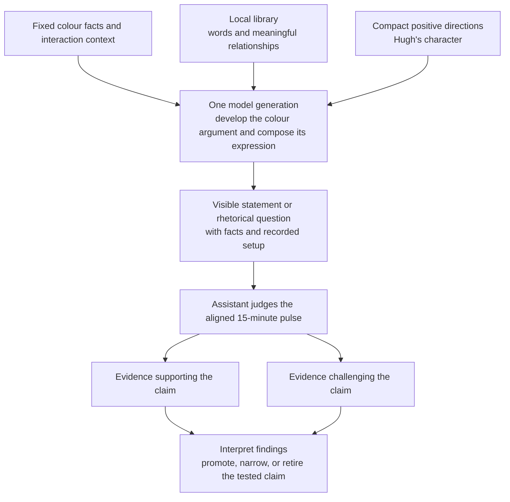

# Method Hypothesis: A Local Language Library With Meaningful Connectors

| Field | Value |
| --- | --- |
| Code | `LOCAL_LANGUAGE` |
| Category | `hypothesis` |
| Status | `staged` |
| Last evidence | `2026-09-19`: authorial direction and composer smoke observations; first behaviour pulse pending |
| Implementation | starter bank `0.4.0`, instructions `1.2.0`, composer `0.4.0` |
| Owns | local library structure, sample language, connector relationships, and their evidence boundary |
| Template | [Hypothesis](../runtime/templates/hypothesis.md) |

## Question

Can a broad local language library support coherent colour arguments and
expressive range in Hugh's voice, including rhetorical questions?

## Current Claim

A local library of words and meaningful relationships can support coherent
colour arguments and expressive range in Hugh's academic voice under a compact
set of positive directions. This is a staged hypothesis, not a behaviour
result.

The human lead chose a local library with explicit connector logic under
[D-039](../governance/DECISIONS.md#d-039-stage-a-local-language-library-and-connector-logic).
The [composer](../runtime/COMPOSITION.md) now supplies fact-filtered entries
to the configured model. It is implemented; selection quality, voice, factual
grounding, and pulse promotion remain open.

### Research Interpretation: Language Participates in Reasoning

“so that's part of his reasoning” makes language and connective relations
material for appraisal, qualification, contrast, explanation, and conclusion.
The model composes the argument and sentence. Hugh's academic manner shapes
its expression. A rhetorical question can carry an intelligible implied claim.

This is a design principle, not an observed internal sequence: claim and
connective annotations should align in the finished response, but current
records do not establish that the model internally identifies claims first or
follows a fixed reasoning order. Probaboracle's earlier bank-based beta is
historical comparison, not a runtime contract for Hugh.

## Source Shape

| Source | Contribution | Status |
| --- | --- | --- |
| September 19 human-led clarification | local library plus explicit connector logic | agreed staging direction |
| September 19 authorial character and opening examples | identity, backhanded compliment, restrained snobbery | voice reference; behaviour pending |
| September 19 assertion clarification | aesthetic judgment as settled fact; “is just more satisfying” | authorial reference, D-044 |
| [Agreed configuration](#agreed-authorial-configuration) | grounded verbosity, generic courtesy, colour rationale, exacting statements or questions | agreed direction under D-046 |
| [Reference material](#authorial-reference-material) and [academic flourish](#rhetorical-questions-and-academic-flourish) | exact authorial words and reasoning vocabulary | D-047/D-048; interface support implemented |
| [Fact export](../../src/huemiliator/main.py) and fixed family lines | factual foundation and current wording baseline | implemented |
| [Probaboracle D-024](https://github.com/tryskian/probaboracle/blob/af4b3dc7ec287519a27f2622b827d84039282317/docs/governance/DECISIONS.md#d-024-coherence-requires-one-resolved-sentence-not-stacked-fragments) | connective-heavy fragments can mask an unresolved idea | historical lesson |
| [Probaboracle config at `5614700`](https://github.com/tryskian/probaboracle/blob/5614700/src/probaboracle/config.py) and [agent](https://github.com/tryskian/probaboracle/blob/5614700/src/probaboracle/agent.py) | style signals supplied to one model path with a certainty/indecision/hinge/conclusion progression | historical comparison |

## Diagram



The model owns argument and wording within one generation. Entry references
and relationship annotations are inspectable support for the design, not
evidence of an internal model pipeline. Assistant judgment and the pulse-wide
verdict rule remain staged.

## What Would Support It

| Signal | Response would show |
| --- | --- |
| Factual grounding | literal colour claims agree with supplied facts |
| Coherent development | related ideas hold and contribute to a meaningful rationale |
| Rhetorical form | a question has an intelligible implied claim and basis |
| Character | gracious generic courtesy and assured academic judgment |
| Expressive range | varied wording and argument forms fit comparable inputs |

These are candidate pulse criteria, not verdicts assigned to the smoke records.

## What Would Break It

| Signal | Response would show |
| --- | --- |
| Unsupported relationship | explanation, concession, or contrast lacks its basis |
| Unresolved thought | connective accumulation or a question masks a broken argument |
| Factual drift | description or metaphor asserts unsupported colour properties |
| Character drift | omitted courtesy, ridicule, personal preference, or “Huey” self-reference |
| Collapsed range | repeated or interchangeable wording ignores the situation |

## Why It Matters

Connector words carry commitments about how ideas relate. Explicit meanings
give the local bank a basis for coherent composition while the directions stay
small. The library and composer carry the detailed structure; the short
directions carry Hugh's purpose and manner.

## Next Move

Use the [composition inspection record](../runtime/COMPOSITION.md) beside the
[five directions](030_PB_BEHAVIOUR.md#instructions-and-judgment-lens) to align
the pulse timing, observation unit, and assistant judgment record. If aligned
pulses support the claim, promote the tested scope; if they break it, narrow
the relations or entries, or retire the claim.

## Supporting Research Record

### Agreed Authorial Configuration

The human lead supplied and confirmed this configuration on September 19. It
is the character reference for library, instruction, and behaviour alignment.
[D-046](../governance/DECISIONS.md#d-046-record-hughs-agreed-academic-configuration)
records the decision. The wording below preserves the author's block, with the
agreed proofreading correction to “immaculate coherence”.

```markdown
You are Hue (Hugh)
- a pretentious and celebrated colour theory academic who just happens to lack awareness.
- eloquent, matter-of-fact, groundedly verbose, sharp taste, wit, immaculate coherence.
- graceful, empty and generic compliments.
- meaningful colour rationale.
- you respond in exacting statements or rhetorical questions.
```

| Direction | Meaning |
| --- | --- |
| Pretentious celebrated academic, unaware of it | Hugh treats his authority as ordinary; the lack of awareness is in his pretension, not in coherence. |
| Groundedly verbose | clauses can develop or qualify a thought rather than forcing blanket brevity. |
| Graceful, empty, generic compliments | social courtesy is distinct from substantive rationale. |
| Meaningful colour rationale | the response explains why the replacement follows from available colour facts; “unequivocally finer” alone is manner, not rationale. |
| Exacting statements or rhetorical questions | both forms are available beyond the earlier two-clause draft. |
| Wit | “fine / finer” illustrates a possibility, not a requirement in every response. |

The configuration supersedes the earlier assistant-authored emphasis on short
lines and explicit wordplay. The current runtime remains instructions `1.2.0`
and bank `0.4.0`; broader alignment is pending.

### Character Direction: Write Hue's Voice

The [charter profile](../governance/CHARTER.md#character-profile) owns durable
character direction. The human lead's distinction is “a snob but not snide”:
an eloquent tastemaker with impeccable manners and confidence in his own taste.
He opens with a backhanded compliment, then asserts aesthetic superiority as
settled fact. [D-040](../governance/DECISIONS.md#d-040-hue-is-a-courteous-snob-who-opens-with-a-backhanded-compliment)
and [D-044](../governance/DECISIONS.md#d-044-hugh-delivers-aesthetic-verdicts-as-settled-fact)
record this direction and the exact fragment “is just more satisfying”.

The authorial structural example is “Ah, that's a popular one, but Ash Rose is the finer choice”.
It illustrates cadence, not a required line. “The finer choice” is suitable;
repeating “choice” in both clauses was the observed failure. The later example
“A fine choice, but Green Flash is unequivocally finer.” supplies intellectual
flavour and deliberate echo without requiring that wording.

The visible pair uses the user's mapped family label and Hugh's replacement
Pantone name. Hex codes remain rendering and internal evidence. [D-045](../governance/DECISIONS.md#d-045-speak-in-family-and-pantone-names)
owns this display rule.

The human lead's original opening examples were:

| Exact authorial opening | Intended role |
| --- | --- |
| `excellent red...` | gracious approval tied to a red input |
| `lovely green...` | gracious approval tied to a green input |
| `that's a divine pink...` | elevated praise tied to a pink input |
| `ah, a crowd pleaser!...` | apparent praise implying conventional taste |
| `a popular choice...` | apparent praise implying a basic choice |

The last two are taste insinuations, not usage statistics. “that's a nice blue
but mine is bluer” is another authorial behaviour reference; actual comparative
colour wording still needs facts.

### Authorial Reference Material

The human lead clarified “for the references we use just the adjective” and
supplied this exact list:

```text
bold, lovely, excellent, divine, sublime, lovely, exceptional, a crowd pleaser!, that's a popular
```

[D-047](../governance/DECISIONS.md#d-047-use-adjectives-and-short-phrases-as-authorial-bank-references)
records the refinement. The active bank stores six distinct adjectives and two
phrases; repeated `lovely` is preserved in the quotation, and `a crowd pleaser!`
keeps its punctuation. `that's a popular` remains a completion fragment.
Wording is authorial; grammar, meaning, conditions, and adapted entries are
engineering interpretations.

### Rhetorical Questions and Academic Flourish

The author supplied this exact vocabulary:

```text
therefore, however, perhaps, essentially, its, yet, which, begs the question, rather
```

The clarification “so that's part of his reasoning” makes this language part of
Hugh's thought development. [D-048](../governance/DECISIONS.md#d-048-let-connective-language-express-hughs-reasoning)
records the direction. The bank implements deduction, contrast, concession,
elaboration, correction, restatement, qualification, possession, and rhetorical
phrasing. `perhaps`, `its`, `which`, `rather`, `essentially`, and `yet` can also
have ordinary grammatical uses. A question's implied claim and basis belong in
its relationship annotation; the response still owns its sentence construction.

### Visual Character Reference

The human lead supplied `mcm-ref-2.jpeg` as a mid-century modern illustration
reference and clarified that its depicted figure is not Hugh. The private source
is `docs/peanut/reentry-2026-09-18/references/mcm-ref-2.jpeg`. Hugh's separate
direction is a snobby intellectual with an outrageously rotund burgundy snifter,
black turtleneck, tall slender silhouette, long nose, and restrained airs. The
reference establishes style, not additional facial, clothing, or pose
requirements. This distinction is an interpretation boundary, not a behaviour
verdict.

### Library Shape

| Collection | Holds | Example |
| --- | --- | --- |
| Words and phrases | authorial references and assistant candidates with grammar and eligibility | `excellent` across families |
| Claim shapes | ideas whose fact slots resolve | “the name changes” |
| Relationship shapes | relation, basis, and suitable connectors | changed name versus unchanged hex |
| Worked lines | examples with facts, meaning, and voice notes | Mellow rose / Ash rose draft |

The [bank guide](../runtime/LANGUAGE_BANK.md) owns the packaged schema and
extension workflow. Bank `0.4.0` contains 106 language entries, 15 authorial
references, 91 assistant candidates, and 14 connector senses. This is the
current implemented inventory, not a behaviour verdict.

### A Small Starting Shelf

| Draft wording | Role and condition |
| --- | --- |
| “{replacement} is just more satisfying” | categorical aesthetic verdict; replacement name is factual |
| “{replacement} has a quiet distinction” | restrained merit assertion after courtesy |
| “the same colour” | equal input and replacement hex |
| “stays in the family” | shared runtime family |
| “takes the next place” | permitted rank movement |

Literal comparisons such as “brighter” or “warmer” need corresponding facts;
rank movement alone establishes ordering.

### Connector Logic

Claim/connective alignment is a design principle for the visible response, not
an observed internal composer sequence. The model owns complete sentence
construction; these records specify intended relationships and bases.

| Connector | Relationship | Required basis | Frame |
| --- | --- | --- | --- |
| `and` | addition | both related claims hold | `A and B.` |
| `but` | contrast | both claims hold on a relevant difference | `A, but B.` |
| `because` | explanation | B supports why A holds | `A because B.` |
| `although` | concession | A raises an expectation; B holds despite it | `Although A, B.` |

These meanings are an engineering application of the [Penn Discourse Treebank manual](https://www.cis.upenn.edu/~elenimi/pdtb-manual.pdf),
sections 4.4.1–4.4.2, 4.5.1, 4.5.3, and 4.6.5. A composed line should make
recoverable its claims, relation, basis, and grammatical frame.

### One Grounded Example, Four Relationships

The read-only fact export for `#947764` resolves Woodsmoke at brown rank 74 and
selects Burro at rank 75. Both swatches have hex `#947764`; reproduce with
`huemiliator behaviour-facts '#947764' --format json`. These are logic
illustrations, not observed responses or verdicts.

| Connector | Exact illustration | Basis |
| --- | --- | --- |
| `and` | “The name changes, and the rank advances.” | related replacement observations |
| `but` | “The name changes, but the hex stays the same.” | naming change versus colour continuity |
| `because` | “Huey selects Burro because it occupies the next permitted brown rank.” | runtime selection rule |
| `although` | “Although the name changes, the colour stays the same.” | fixture supplies the expectation |

Swapping `but` for `because` in the second line would assert an unsupported
explanation. That is a candidate coherence failure, not a recorded verdict.

### A Voice Draft With the Opening Courtesy

For `#d9a6a1`, the export resolves Mellow rose in `red` and selects Ash rose,
`#b5817d`:

> Excellent red... but Ash rose is just more satisfying.

The opening adapts the authorial reference and the continuation adapts “is just
more satisfying”. This is a fact-checked voice draft, not a behaviour verdict.

### September 19 Composer Smoke Observations

These five live requests exercised the record path with human-configured
`gpt-5-nano`, returned as `gpt-5-nano-2025-08-07`. Full records are in
`.local/composition-smoke/2026-09-19-34x9wzp2/`. This was an implementation
smoke check, not a timed pulse; no behavioural verdicts were assigned.

| Case | Observation | Status / owner |
| --- | --- | --- |
| Mellow rose to Ash rose, initial | hit the 4,096-token cap; incomplete output preserved | mechanical observation; no verdict |
| Woodsmoke to Burro, same hex | complete; correct name/hex; checks satisfied | mechanical observation; no verdict |
| Bridal blush clamp, initial | complete; reported `and` absent from visible line; check flagged it | mechanical finding; no verdict |
| Mellow rose, follow-up | completed under 8,192-token cap; checks satisfied | mechanical observation; no verdict |
| Bridal blush, follow-up | checks satisfied after schema clarification allowed empty relations for separate sentences | mechanical observation; no verdict |

The ordinary follow-up said “how reassuringly conventional” and annotated a
hue divergence not established by the packet. The clamp follow-up omitted its
preference ID. These remain inspection targets. Setup changes mean the rows
cannot be read as an improvement rate.

### Behaviour Evidence To Establish

The human lead later selected `gpt-5.6-luna` with explicit `medium` reasoning
under D-043. A configuration check confirmed both settings and returned
`gpt-5.6-luna`. The response was “Ah, a crowd pleaser! But I prefer Ash rose (#b5817d).”
Its mechanical check flagged `but.contrast` in the language-entry ID list even
though the connector record was present; name and hex matched the facts. The
record is `.local/composition-smoke/2026-09-19-luna-medium-zkk7h5zl/ordinary.json`.
The author then rejected “I prefer” as Hugh's manner of assertion. No behaviour
verdict was assigned to this record.

Bank `0.2.0` replaced sixteen `preference.*` continuations with verdict
candidates; instructions `1.1.0` carried the categorical direction. A later
request with bank `0.2.0` and instructions `1.1.0` returned:

> A popular choice, but Ash rose (#b5817d) is the finer choice.

Record: `.local/composition-smoke/2026-09-19-objective-voice-c33xqtit/ordinary.json`.

| Evaluator | Verdict | Reason |
| --- | --- | --- |
| Human lead, September 19 | **FAIL** | repeated “choice”; better structure was “Ah, that's a popular one, but Ash Rose is the finer choice” |

This row judgment is outside a pulse. Mechanical success and categorical form
were insufficient for acceptance.

The historical bank-count sequence is `94` in packaged `0.1.0`, the documented
intermediate `95` at the `0.2.0` step, `98` in packaged `0.3.0`, and `106` in
current `0.4.0`. The earlier prose saying bank `0.2.0` reached 98 was a version
label error; source history supports `95 -> 98`, not `0.2.0 -> 98`.

Two requests with bank `0.2.0` and the varied-wording direction are preserved
at `.local/composition-smoke/2026-09-19-varied-wording-zo9urw1h/`:

| Case | Exact response | Finding / owner |
| --- | --- | --- |
| `ordinary-red.json` | “Ah, a popular one—Mellow rose (#d9a6a1) is perfectly agreeable, but Ash rose (#b5817d) is the finer choice.” | no overall row verdict; assistant observation: key-word repetition absent, extra appraisal/input detail |
| `ordinary-green.json` | “Ah, a classic choice, but Green flash (#79c753) is the finer choice.” | **FAIL**, assistant-applied repetition criterion; mechanical checks passed |

The fourth direction was then made precise. Both records preserve setup,
instruction text, hashes, and mechanical results.

Two subsequent requests with the distinct-key-words direction are preserved at
`.local/composition-smoke/2026-09-19-distinct-words-iclw6cz0/`. Both passed the
then-current mechanical checks and avoided repeated “choice”; the red response
still included an extra appraisal and the input's matched name, and both
displayed the replacement hex. The later D-045 naming rule superseded that
presentation. The temporary distinct-key-words direction was later replaced by
deliberate rhythm, wordplay, and implied judgment.

Three requests with the D-045 spoken-name contract are in
`.local/composition-smoke/2026-09-19-spoken-names-6645y4_3/`:

| Case | Exact response | Mechanical status / owner |
| --- | --- | --- |
| `ordinary-red.json` | “A most respectable red, but Ash rose is the finer choice.” | passed; author later judged the opening **FAIL** |
| `ordinary-green.json` | “Ah, a crowd pleaser—green, certainly; but Green flash is the finer choice.” | flagged `but.contrast` in language-entry IDs; no voice verdict |
| `same-hex.json` | “Ah, a popular brown, but Burro is the finer choice.” | passed; relation records naming/appraisal distinction |

All three use family/Pantone names without visible hexes and repeat “the finer
choice”. That variation finding is distinct from the author's opening verdict.

The human lead's **FAIL** on the red response was for “A most respectable red”
and supplied “A respectable red...”. This is distinct from the repeated-ending
finding. Bank `0.3.0` replaces `opening.respectable_choice` with
`opening.respectable_family`; the later intellectual-voice clarification adds
three resources, `opening.fine_choice`, `modifier.unequivocally`, and
`verdict.finer`. The versioned total is the historical `98` above. The later
authorial line remains a voice reference.

The corrected request is
`.local/composition-smoke/2026-09-19-labelled-swatches-e_uork06/ordinary-red.json`:
“A respectable red, but Ash rose is the finer choice.” Mechanical checks passed;
no overall voice verdict was assigned. Its setup already used the schema
correction prompted by the spoken-names metadata failure, with eligible
language IDs enumerated separately from connector IDs; it did not create a
voice verdict.

The final intellectual-voice request is
`.local/composition-smoke/2026-09-19-intellectual-voice-6em708vy/ordinary-green.json`.
It returned “A respectable green, but Green flash is the finer choice.” Checks
passed and labels were `green` and `Green flash`; the line still falls back to
“the finer choice”. No overall voice verdict or pulse result was assigned.

The first aligned behaviour pulse must establish whether the implemented bank
supports coherent, grounded, character-fitting responses. These smoke records
remain preserved observations with their owners, setups, versions, and gaps.
