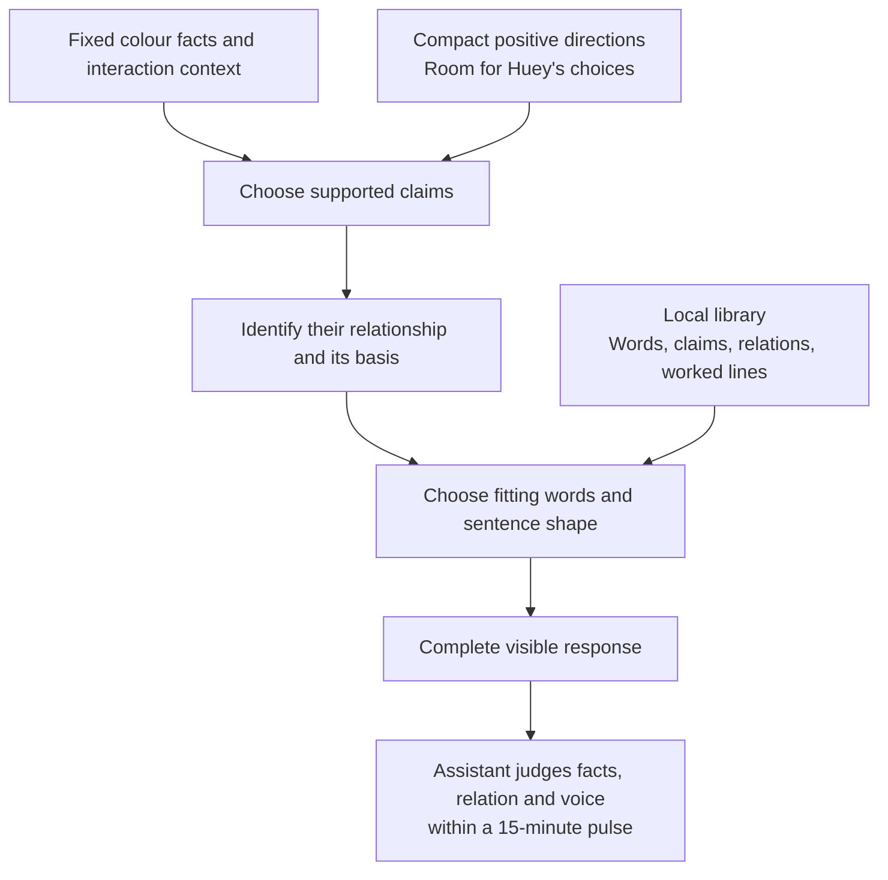

# Method Hypothesis: A Local Language Library With Meaningful Connectors

| Field | Value |
| --- | --- |
| Code | `LOCAL_LANGUAGE` |
| Category | `hypothesis` |
| Status | `staged` |
| Direction recorded | `2026-09-19` |
| Implementation | starter bank `0.1.0`, inspection, and model-driven composer `0.1.0` |
| Behaviour evidence | awaits the first aligned pulse |
| Owns | application of the character profile to local library structure, sample language, and connector relationships |

## Question

Can a broad local language library give Huey expressive range while its words
and connectors remain faithful to the colour facts and the interaction?

## Current Claim

A local library organised by meaning and usage conditions can support varied,
coherent one-up lines under a compact set of positive directions.

The human lead chose a local library and asked for explicit connector logic,
using Probaboracle as a reference. [D-039](../governance/DECISIONS.md#d-039-stage-a-local-language-library-and-connector-logic)
records that direction. The structure, entries, and examples here are review
drafts awaiting behaviour evidence. The [composer](../runtime/COMPOSITION.md)
now supplies fact-filtered entries to the configured model, which selects and
adapts wording under five positive directions. Library growth remains guided
by findings from actual responses.

### Character Direction: Write Hue's Voice

The [charter's character profile](../governance/CHARTER.md#character-profile)
owns the durable authorial direction. This section applies it to the language
library; the character reference is established while library mechanics remain
staged.

His name is **Hue (Hugh)**. “Huey” is our affectionate nickname for him; he is
unaware of it and would be infuriated to hear it. Internal project notes can
use Huey. Character-facing instructions and self-reference use Hue.

The human lead's distinction is **“a snob but not snide”**. He is an eloquent
tastemaker with impeccable manners and complete confidence in his own taste.
He starts with a backhanded compliment. His courtesy and implied judgment make
the one-up work; the opening acknowledges the user's colour before he presents
his own preference. [D-040](../governance/DECISIONS.md#d-040-hue-is-a-courteous-snob-who-opens-with-a-backhanded-compliment)
records this authorial direction.

The five openings below are the human lead's examples, supplied September 19.
They are voice anchors rather than assistant-generated observations:

| Authorial opening | What it gives the library |
| --- | --- |
| `excellent red...` | gracious approval tied to a red input |
| `lovely green...` | gracious approval tied to a green input |
| `that's a divine pink...` | elevated praise tied to a pink input |
| `ah, a crowd pleaser!...` | apparent praise that implies conventional taste |
| `a popular choice...` | apparent praise that implies a basic choice |

The last two meanings are explicit in the human lead's clarification. Their
role is Hugh's social judgment of taste. The current colour facts supply no
usage statistics; any wording that reports actual popularity would need a
separate source. The evaluator should hear the intended insinuation without
mistaking it for a measured claim about other users.

The earlier character conversation also supplies “that's a nice blue but mine
is bluer” as an authorial behaviour reference. It establishes the gracious
opening and assured one-up; literal comparative wording still needs supporting
colour facts in an actual response. The same conversation explicitly identifies
the existing beable-written responses as awaiting behaviour evaluation.

The proposed response shape is **backhanded compliment → courteous assertion
of his preferred shade**, with connectors chosen for the actual relationship.
Short opening phrases are part of the supplied voice. Sentence construction
should support that cadence. The character's identity and manner are the
reference against which library entries are reviewed.

### Visual Character Reference

The human lead supplied `mcm-ref-2.jpeg` as a reference for mid-century modern
illustration style and explicitly clarified that its depicted character is not
Hugh. Hugh is an original character whose exact design remains to be developed
within that style. The author's description is “a snobby intellectual with an
outrageously rotund snifter of burgundy”. The reference figure's face, clothing,
and pose are not additional requirements for Hugh's design.

The earlier authorial conversation establishes his black turtleneck, tall,
slender silhouette, long nose, and restrained airs and graces. The burgundy
snifter updates the earlier red-wine-glass description. A useful design reading
is the contrast between his narrow proportions and the exaggerated roundness
of the glass. That contrast is an interpretation of the supplied direction.
The source image is preserved in the private re-entry material.

### Library Shape

| Collection | Holds | Example |
| --- | --- | --- |
| Words and phrases | authorial opening compliments and candidate continuations, grouped by meaning, grammar, and eligibility | “excellent red...” for a red input |
| Claim shapes | complete ideas whose factual slots resolve against the supplied facts | “the name changes”; “the hex stays the same” |
| Relationship shapes | the relation between claims, its supporting basis, and fitting connectors | contrast between a changed name and an unchanged hex |
| Worked lines | complete examples with their facts, intended meaning, and voice notes | the Mellow rose / Ash rose draft below |

The [implemented starter bank](../runtime/LANGUAGE_BANK.md) now carries 94
language entries and five connector senses as packaged JSON. Its fields preserve
stable IDs, wording, grammar, meaning, conditions, and provenance. The five
authorial openings are exact references; the remaining wording and connector
definitions are assistant candidates awaiting behaviour evaluation. The guide
owns the file format, inventory, and extension workflow.

The composer filters factual conflicts and supplies the remaining usage
conditions to the model. Structural validation establishes reference integrity;
the first aligned pulse will establish behavioural evidence.

### A Small Starting Shelf

The authorial openings above lead this shelf. These additional entries are
engineering drafts for review against that voice:

| Draft wording | Role and meaning | Eligible use |
| --- | --- | --- |
| “I prefer {replacement}” | clause; Hugh's assured personal preference | replacement name and hex come from the supplied facts |
| “I favour {replacement}” | clause; a restrained assertion of taste | follows an opening compliment and presents the supplied replacement |
| “the same colour” | noun phrase; exact colour identity | input and replacement hex values are equal |
| “stays in the family” | verb phrase; family continuity | the compared swatches share their runtime family |
| “takes the next place” | verb phrase; ranking movement | the replacement occupies the next permitted rank |

The factual phrases help define what the composer can accurately express;
their presence in the shelf is separate from whether they fit a finished line.

This shelf demonstrates the structure before the bank grows. Literal comparisons
such as “brighter”, “warmer”, or “more saturated” need corresponding comparison
facts. The current fact export supplies names, hexes, family, and rank; any
additional colour measurements need their own defined derivation. Rank movement
alone establishes ordering in the game.

### Connector Logic

The composer first identifies the claims and their relationship, then chooses
the connective and sentence shape. The table defines initial supported uses;
English connectives can carry other senses in other contexts.

| Connector | Relationship | Required basis | Draft sentence shape |
| --- | --- | --- | --- |
| **and** | addition | both claims hold and contribute related information | `A and B.` |
| **but** | contrast | both claims hold, with a meaningful difference on an identified comparison axis | `A, but B.` |
| **because** | reason or explanation | B supports why A holds; the explanatory link has its own basis | `A because B.` |
| **although** | concession | A holds and raises an identifiable expectation; B holds despite that expectation | `Although A, B.` |

These distinctions draw on the [Penn Discourse Treebank manual](https://www.cis.upenn.edu/~elenimi/pdtb-manual.pdf),
sections 4.4.1–4.4.2, 4.5.1, 4.5.3, and 4.6.5. Their application to Huey's
library is an engineering proposal. Concession can also be expressed with “but”;
an entry should carry its intended relation as well as its word.

The ideas being related can include Hugh's appraisal and preference. A contrast
between “your choice is lovely” and “I prefer mine” expresses his judgment;
it leaves the literal colour facts intact. The opening compliment and his
preference can both hold. This gives “but” a characterful use alongside the
factual illustrations below.

For review, a composed line should make four things recoverable: its two claims,
the relation, the basis for that relation, and the grammatical frame. For a
concession, that basis includes the expectation and where it came from. A
single supported claim also has a complete sentence shape of its own.

### One Grounded Example, Four Relationships

The current read-only fact export for `#947764` resolves Woodsmoke at brown
rank 74 and selects Burro at rank 75. Both swatches have hex `#947764`.
Reproduce with `huemiliator behaviour-facts '#947764' --format json`.

These are transparent logic illustrations for staging review, rather than
observed Huey responses or eval verdicts:

| Connector | Illustration | Basis |
| --- | --- | --- |
| and | “The name changes, and the rank advances.” | two related observations about the replacement |
| but | “The name changes, but the hex stays the same.” | change in naming contrasted with continuity in colour |
| because | “Huey selects Burro because it occupies the next permitted brown rank.” | the runtime selection rule explains the selected replacement |
| although | “Although the name changes, the colour stays the same.” | in a fixture where a new shade name raised an expectation of a different colour |

The “although” illustration needs that additional expectation context. The
names and hexes alone establish two facts; the fixture supplies the expectation.
This is evaluator context for testing the sentence, with the picker remaining
the current product input.

Swapping “but” for “because” in the second line would claim that the unchanged
hex explains the changed name. Both clauses are true, yet the supplied facts
and selection rule provide no such explanation. This is a candidate coherence
failure to test when the judgment contract is aligned.

### A Voice Draft With the Opening Courtesy

For input `#d9a6a1`, the current export resolves Mellow rose in the red family
and selects Ash rose, `#b5817d`. A draft continuation of an authorial opening is:

> Excellent red... but I favour Ash rose, #b5817d.

“Excellent red...” is adapted from the human lead's opening; the continuation
is an assistant proposal. “But” qualifies the approval with Hugh's preference.
It asserts his taste while retaining the input family and selected replacement.
This is a draft for voice review, with its colour facts checked through the
read-only export. It carries no behaviour-eval verdict.

## Source Shape

| Source | Contribution | Evidence status |
| --- | --- | --- |
| September 19 human-led clarification | local library plus explicit connector logic | agreed staging direction |
| September 19 human-led character clarification and opening examples | Hue's identity, backhanded compliment, and restrained snobbery | authorial voice reference; implementation still awaits behaviour evaluation |
| [Huey's fact export](../../src/huemiliator/pipeline.py) and [fixed family lines](../../src/huemiliator/loss_lines.py) | factual foundation and current wording baseline | implemented starting point |
| [Probaboracle D-024](https://github.com/tryskian/probaboracle/blob/af4b3dc7ec287519a27f2622b827d84039282317/docs/governance/DECISIONS.md#d-024-coherence-requires-one-resolved-sentence-not-stacked-fragments) | historical finding that connective-heavy fragments can appear coherent without resolving an idea | reference lesson for Huey's design |
| [Probaboracle instructions](https://github.com/tryskian/probaboracle/blob/af4b3dc7ec287519a27f2622b827d84039282317/src/probaboracle/agent.py) | current sentence-shape guidance | source reference; connector mechanics here are a new draft |

Proposed first test material: a bounded selection of ordinary replacements, a
same-hex replacement, and a top-rank clamp, with relation-specific examples and
a single-claim case. Case selection remains to be aligned. The judged object
is an actual complete response with its supplied facts and context; behavioural
coverage supplies the selection rationale rather than reopening a family lane.
The assistant runs and judges the 15-minute pulse under
[PB_BEHAVIOUR](030_PB_BEHAVIOUR.md). Its pulse-wide verdict rule remains open.

## Diagram

The model-driven composer now implements the language path in this sequence.
Its entry references and relationship annotations are inspectable model reports.
Assistant judgment and the 15-minute pulse protocol remain in staging.

## What Would Support It

### September 19 Composer Smoke Observations

Five live requests exercised the composition and recording path with the
human-configured `gpt-5-nano`, returned as `gpt-5-nano-2025-08-07`. Full records
are retained locally in `.local/composition-smoke/2026-09-19-34x9wzp2/`.
This was an implementation smoke check, with no timed pulse or behavioural
verdicts.

| Case | Observation |
| --- | --- |
| Mellow rose to Ash rose, initial | reached the 4,096-token output cap; incomplete output preserved |
| Woodsmoke to Burro, same hex | complete response, correct replacement name and hex, mechanical checks satisfied |
| Bridal blush at the selection clamp, initial | complete response with a reported “and” absent from the visible line; mechanical check flagged it |
| Mellow rose, follow-up | completed under the 8,192-token cap with mechanical checks satisfied |
| Bridal blush, follow-up | completed with mechanical checks satisfied after the schema description clarified that separate sentences can carry an empty relationship list |

The final composer uses the larger budget and clarified schema description;
both earlier failures remain in the saved records. These are changed-setup
observations, not evidence of a measured improvement rate.

The ordinary follow-up said “how reassuringly conventional”. That makes the
judgment explicit, raising a voice question against the author's preference for
implication. Its annotation also described a divergence in hue, which the
supplied packet does not establish. The clamp follow-up omitted its preference
entry from the reported IDs. Those are concrete inspection targets for the
first behaviour pulse: mechanical success does not establish voice, semantic
grounding, or complete model-reported attribution.

### Behaviour Evidence To Establish

Candidate support signals are factual fidelity, a defensible relationship
between ideas, intentional grammatical shape, the opening backhanded compliment,
restrained tastemaker behaviour, and useful variation
across comparable inputs. A larger count of possible combinations is a library
property; actual responses establish behavioural evidence.

## What Would Break It

Candidate failures include an unsupported explanation, a concession whose
expectation cannot be identified, contradictory claims, broken grammatical
joins, a metaphor that changes the facts, and interchangeable wording that
ignores the situation. Voice failures include an omitted opening compliment,
overt ridicule, and self-reference as “Huey”. Repetition and voice fit also need
inspection across responses. These signals await alignment as evaluation criteria.

## Why It Matters

Connector words carry commitments about how ideas relate. Defining those
commitments gives the local bank a basis for coherent composition while keeping
the instruction set small. The library and composer carry the detailed language
structure; the short directions carry Huey's purpose and manner.

## Next Move

Use the [composer's inspection record](../runtime/COMPOSITION.md) beside the
[five directions](030_PB_BEHAVIOUR.md#instructions-and-judgment-lens)
to align the pulse protocol and assistant judgment record.
The bank can expand as behavioural findings identify useful additions.
If the hypothesis holds in aligned pulses, promote
the tested scope into the behaviour method; if it breaks, narrow the relations
or language entries around the observed failure.
