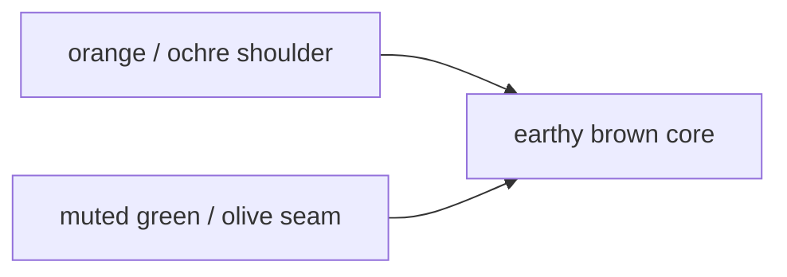

# Finding 1: Contextual Brown

Date: `2026-05-08`

## What This Finding Asked

Can `brown` survive a deterministic family-plus-rank system as a stable colour
category?

## Short Answer

Not by default.

`Brown` behaves less like a clean spectral category and more like a contextual
bucket overlapping with:

- dark orange
- muted orange
- gold
- olive
- warm neutral

That makes brown-family drift a real research signal, not just a bug.

## Signal Snapshot

| Surface | Result |
| --- | --- |
| first judged brown run | broad `yellow / gold / olive` drift |
| closed rerun rows | `2368` |
| closed rerun verdicts | `1394 pass / 974 fail / 0 pending` |
| pair signal | `117 pass / 84 fail` |
| dominant residual seams | muted green / olive and warm orange / ochre |

## Shape Of The Problem

The useful read from the closed rerun was:

- the earthy core got materially stronger
- the loud gold shoulder was no longer the whole story
- the remaining pressure lived on two family edges

## Representative Failures

| Seam | Repeated examples |
| --- | --- |
| muted green / olive | `Beech -> Covert green`, `Capers -> Dusky green`, `Black ink -> Grape leaf`, `Covert green -> Aloe` |
| orange / ochre shoulder | `Apricot orange -> Yam`, `Burnt orange -> Gold flame`, `Jaffa orange -> Hawaiian sunset`, `Golden ochre -> Autumnal`, `Topaz -> Buckthorn brown` |

## What Changed In Runtime

| Correction | Effect |
| --- | --- |
| boundary refinement | darker earthy warms entered `brown` earlier |
| brown-rank refinement | yellow / gold / olive shoulder was demoted below the earthy core |
| bright gold shoulder reclassification | loud gold shoulder colours could fall through to `orange` or `yellow` |

The next family-first cut then evicted:

- `55` unique brown fail pairs
- `0` unique brown pass pairs

## Why It Matters

This finding changed what Huemiliator is testing.

The toy is not only asking whether deterministic swatch matching works. It is
also asking whether human colour categories survive deterministic routing
without hidden context.

`Brown` was the first place where the answer was clearly:

- not cleanly
- not without category-specific handling

## What It Points To

The useful brown lesson is methodological:

- treat repeated family drift as evidence
- fix the family edge before patching rank again
- let closed reruns decide whether the category is stable enough to keep
