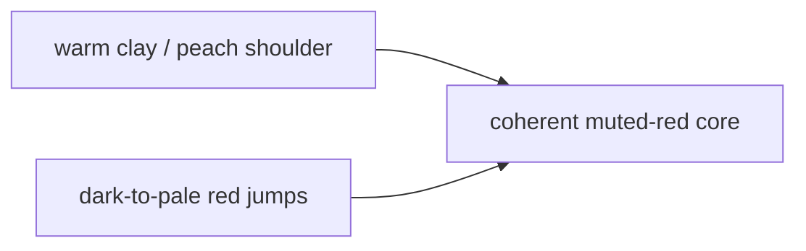

# Finding 2: Red Shoulder Drift

Date: `2026-05-15`

## What This Finding Asked

What is the next narrow `red` correction after the third closed rerun?

## Short Answer

Keep the coherent muted-red local cluster in `red`.

The next cut should target a warm-clay / peach shoulder still trapped inside
the red ladder. That likely means a narrow `red -> orange` shoulder escape, not
another broad pink-or-brown sweep.

## Active Proof Surface

The closed third corrected `red` rerun at `id > 18423` is the current proof
surface:

- `1268` total rows
- `1162` `pass`
- `106` `fail`
- `0` pending
- `129` pair-level `pass`
- `13` pair-level `fail`

Older eval rows are quarantined locally and should not be mixed back into the
live truth surface.

## Signal Snapshot

| Surface | Result |
| --- | --- |
| active proof surface | closed third corrected `red` rerun |
| row signal | `1162 pass / 106 fail` |
| pair signal | `129 pass / 13 fail` |
| dominant seam | warm clay / peach shoulder still inside `red` |
| smaller residual seam | dark-to-pale jumps that may be rank pressure |

## Shape Of The Problem

## Representative Failures

| Seam | Repeated examples |
| --- | --- |
| warm clay / peach shoulder | `Auburn -> Tawny orange`, `Desert rose -> Burnt brick`, `Garnet rose -> Desert rose`, `Holly berry -> Dusted clay`, `Rio red -> Ginger`, `Slate rose -> Crabapple`, `Terra cotta -> Burnt henna` |
| smaller dark-to-pale residual | `Oxblood red -> Withered rose`, `Peony -> Marsala`, `Burlwood -> Mellow rose`, `Renaissance rose -> Impatiens pink` |

## What Should Stay

The coherent muted-red local cluster is still healthy:

| Stable local pass cluster |
| --- |
| `Withered rose -> Cedar wood` |
| `Cedar wood -> Light mahogany` |
| `Brick dust -> Canyon rose` |
| `Canyon rose -> Mauvewood` |
| `Mesa rose -> Roan rouge` |

## Recommended Next Cut

Recommendation:

1. keep the coherent muted-red local pass cluster in `red`
2. add a tight warm-clay / peach shoulder escape from `red` to `orange`
3. rerun `red`
4. only then decide whether the smaller dark-to-pale jumps belong to a later
   rank kernel
