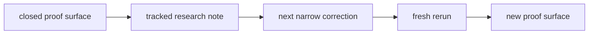

# Research

Last updated: 2026-05-21

Huemiliator keeps the tracked research lane small on purpose.

Each beta is a distinct eval approach. This folder preserves the method shifts
that changed what the evidence means.

Raw run notes and scratch material stay out of the tracked research surface
until they become evidence.

Tracked research-note names stay descriptive and topic-first, with lowercase
snake_case filenames and a `YYYY-MM-DD` suffix.

Private scratch and raw operator notes stay in `docs/peanut/`.

## Current Stage

Current live research lane:

- `Beta 1.0`
- `fail-pressure pulse`

Current active proof surface:

- third bounded `brown` continuation at `20037..20051`
- pulse-level proof surface

Current closed comparison surface:

- closed third corrected `red` rerun at `id > 18423`
- row-level family proof surface

Current beta question:

How does the first bounded `neutral` pulse open from source order `1`?

## Current Research State

| Item | Current state |
| --- | --- |
| stage | `Beta 1.0` |
| active proof surface | third bounded `brown` continuation at `20037..20051` |
| current totals | `15 total / 15 pass / 0 fail / 0 pending` |
| current question | how does the first bounded `neutral` pulse open from source order `1` |
| active beta note | `beta_1_0_fail_pressure_pulse_2026-05-21` |
| closed staging note | `pre_beta_1_fail_pressure_pulse_2026-05-16` |
| active family lane | `neutral` |
| stable prior lanes | `red`, `yellow`, `green`, `blue`, `purple`, `pink`, `orange`, `brown` |
| current audit note | `red_orange_edge_drift_audit_2026-05-16` |
| comparison baseline | closed third corrected `red` rerun at `18424..19691` |
| live DB rule | keep only the current proof surface in `eval_outputs` |

## Research Map

| Surface | Type | What it says now |
| --- | --- | --- |
| [Beta 1.0 Fail-Pressure Pulse](./beta_1_0_fail_pressure_pulse_2026-05-21.md) | active beta note | two bounded `red` pulses pass, `yellow` parks cleanly after one fail-and-recovery stack, `green` parks on two clean passes, `blue` parks behind a corrected rerun, `purple` parks on two clean `15 / 0` pulses, `pink` parks behind a clean second continuation, `orange` parks after one fail surface plus recovery, and `brown` now parks on three clean bounded pulses |
| [Pre-Beta 1.0 Fail-Pressure Pulse](./pre_beta_1_fail_pressure_pulse_2026-05-16.md) | staging note | the closed staging contract that led into the first live `Beta 1.0` pulse |
| [Brown Context Dependence](./brown_context_dependence_2026-05-08.md) | durable note | `brown` behaves like a contextual bucket rather than a clean spectral category |
| [Red Orange Edge Drift](./red_orange_edge_drift_2026-05-15.md) | active note | the next `red` cut is still a narrow warm-clay / peach edge escape |
| [Red Orange Edge Drift Audit](./red_orange_edge_drift_audit_2026-05-16.md) | audit note | the audit blockers are repaired and the red lane is now parked as a stable prior baseline inside `Beta 1.0` |

## How To Read This Folder

- durable notes hold category-level or method-level claims that survived
  more than one rerun
- active notes hold the current research edge
- handoff and decisions carry repo truth; research notes explain what the
  signal means

## Current Signal

- fail-pressure pulse is now the active `Beta 1.0` verdict unit
- the broad pink-peach and brown-wine seams are already much tighter
- the coherent muted-red local cluster should stay in `red`
- the first bounded `red` pulse passes at `11 anchors / 4 counted seams`
- the deeper old repeat cluster also passes at `10 anchors / 5 counted seams`
- the first bounded `yellow` pulse passes at `9 anchors / 6 counted seams`
- the second bounded `yellow` pulse fails at `5 anchors / 10 counted seams`
- the corrected third bounded `yellow` pulse passes at `10 anchors / 5 counted seams`
- the final fourth bounded `yellow` pulse passes cleanly at `15 anchors / 0 counted seams`
- the first bounded `green` pulse passes cleanly at `15 anchors / 0 counted seams`
- the second bounded `green` continuation also passes cleanly at `15 anchors / 0 counted seams`
- the first bounded `blue` pulse passes at `10 anchors / 5 counted seams`
- the second bounded `blue` continuation also passes at `10 anchors / 5 counted seams`
- the corrected third bounded `blue` pulse passes at `14 anchors / 1 counted seam`
- the first bounded `purple` pulse passes cleanly at `15 anchors / 0 counted seams`
- the second bounded `purple` continuation also passes cleanly at `15 anchors / 0 counted seams`
- the first bounded `pink` pulse passes at `9 anchors / 6 counted seams`
- the second bounded `pink` continuation passes cleanly at `15 anchors / 0 counted seams`
- the first bounded `orange` pulse passes at `9 anchors / 6 counted seams`
- the second bounded `orange` continuation passes at `11 anchors / 4 counted seams`
- the third bounded `orange` continuation passes at `10 anchors / 5 counted seams`
- the fourth bounded `orange` continuation fails at `7 anchors / 8 counted seams`
- the fifth bounded `orange` continuation passes cleanly at `15 anchors / 0 counted seams`
- the first bounded `brown` pulse passes cleanly at `15 anchors / 0 counted seams`
- the second bounded `brown` continuation also passes cleanly at `15 anchors / 0 counted seams`
- the third bounded `brown` continuation also passes cleanly at `15 anchors / 0 counted seams`
- `red` is now stable enough to stop being the blocking family lane
- `yellow` is now stable enough to park beside `red`
- `green` is now stable enough to park beside `red` and `yellow`
- `blue` is now stable enough to park beside `red`, `yellow`, and `green`
- `purple` is now stable enough to park beside `red`, `yellow`, `green`, and `blue`
- `pink` is now stable enough to park beside `red`, `yellow`, `green`, `blue`, and `purple`
- `orange` is now stable enough to park beside `red`, `yellow`, `green`,
  `blue`, `purple`, and `pink`
- `brown` is now stable enough to park beside `red`, `yellow`, `green`,
  `blue`, `purple`, `pink`, and `orange`
- `neutral` is now the active family lane
- the explicit yellow-to-green correction restores a local yellow pass
- the final residual chartreuse cut is now explicit in runtime code
- the explicit blue drift correction restores a much cleaner local blue pass
- one residual aqua seam remains inside the corrected blue rerun
- the first bounded `purple` pulse opens cleanly behind the parked blue stack
- the second bounded `purple` continuation also stays clean enough to park the lane
- the active beta note now explicitly records that fail-pressure pulse is
  moving lane to lane more cleanly than the earlier row-level eval shape
- the first bounded `pink` pulse opens with a visible warm-orange and wine
  drift instead of a clean `15 / 0` pass
- the second bounded `pink` continuation closes cleanly enough to park the lane
- the first bounded `orange` pulse opens with a visible pale straw, buff, and
  blush drift instead of a clean `15 / 0` pass
- the second bounded `orange` continuation keeps that drift visible but
  narrower than the opening tranche
- the third bounded `orange` continuation keeps the drift visible and shifts it
  toward a cream, straw, and olive edge
- the fourth bounded `orange` continuation opens the first real yellow-gold
  fail surface inside `orange`
- the corrected fifth bounded `orange` continuation closes cleanly at `15 / 0`
- the first bounded `brown` pulse opens cleanly through a dark earthy core
- the second bounded `brown` continuation also stays clean through a warmer
  earthy tranche
- the third bounded `brown` continuation also stays clean enough to park the lane
- the current live question is how the first bounded `neutral` pulse opens
  from source order `1`
- the closed third corrected `red` rerun stays as the closed row-level
  comparison baseline
- scoped sampling truth now matches the current runtime ladder again
- the pulse start, label, report, and local quarantine surface is now live
- the smaller remaining dark-to-pale jumps should wait behind that family cut

## Plans

Plans are useful, but they are not evidence.

Current planned sequence:

1. keep `20037..20051` as the current active proof surface
2. carry the two passing `red` pulses plus the parked `yellow`, `green`,
   `blue`, `purple`, `pink`, `orange`, and `brown` proof stacks as the current
   Beta 1.0 comparison stack
3. treat `orange` as parked behind one real fail surface, one corrected clean
   rerun, and one clean continuation
4. run the first bounded `neutral` pulse from source order `1`

These betas and staged notes are research architectures. They are not app
release versions, package versions, branch names, or one more sweep.

Each beta marks a real change in what the evaluation is asking:

- the closed row-level `red` rerun proves the family-correction baseline
- `Beta 1.0` uses the bounded pulse as the live verdict unit

Later method surfaces do not erase earlier ones. They narrow what each verdict
is allowed to mean.
