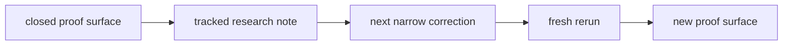

# Research

Last updated: 2026-05-17

Huemiliator keeps the tracked research lane small on purpose.

Each beta is a distinct eval approach. This folder preserves the method shifts
that changed what the evidence means.

Raw run notes and scratch material stay out of the tracked research surface
until they become evidence.

Tracked research-note names stay descriptive and topic-first, with lowercase
snake_case filenames and a `YYYY-MM-DD` suffix.

Private scratch and raw operator notes stay in `docs/peanut/`.

## Current Stage

Current staged research lane:

- `pre-Beta 1.0`
- `fail-pressure pulse`

Current closed comparison surface:

- closed third corrected `red` rerun at `id > 18423`
- row-level family proof surface

Current staging question:

Can the first bounded `red` pulse keep the same warm-clay / peach seam legible
once the verdict moves from the row to the pulse?

## Current Research State

| Item | Current state |
| --- | --- |
| stage | `pre-Beta 1.0` |
| active proof surface | closed third corrected `red` rerun at `id > 18423` |
| current totals | `1268 total / 1162 pass / 106 fail / 0 pending` |
| current question | launch the first real `red` Beta 1.0 pulse from the repaired sampler surface |
| staged pulse note | `pre_beta_1_fail_pressure_pulse_2026-05-16` |
| promotion gate | first bounded `red` Beta 1.0 pulse from the repaired sampler surface |
| next family lane | `red` first, `yellow` queued behind it |
| current audit note | `red_orange_edge_drift_audit_2026-05-16` |
| live DB rule | keep only the current proof surface in `eval_outputs` |

## Research Map

| Surface | Type | What it says now |
| --- | --- | --- |
| [Pre-Beta 1.0 Fail-Pressure Pulse](./pre_beta_1_fail_pressure_pulse_2026-05-16.md) | staging note | the next Huemiliator method boundary is staged, but `Beta 1.0` does not begin until the first real pulse run starts |
| [Brown Context Dependence](./brown_context_dependence_2026-05-08.md) | durable note | `brown` behaves like a contextual bucket rather than a clean spectral category |
| [Red Orange Edge Drift](./red_orange_edge_drift_2026-05-15.md) | active note | the next `red` cut is still a narrow warm-clay / peach edge escape |
| [Red Orange Edge Drift Audit](./red_orange_edge_drift_audit_2026-05-16.md) | audit note | the audit blockers were repaired on-branch and the first real `red` Beta 1.0 pulse is now the next gate |

## How To Read This Folder

- durable notes hold category-level or method-level claims that survived
  more than one rerun
- active notes hold the current research edge
- handoff and decisions carry repo truth; research notes explain what the
  signal means

## Current Signal

- fail-pressure pulse is the staged next method boundary, not the active live
  proof surface yet
- the broad pink-peach and brown-wine seams are already much tighter
- the coherent muted-red local cluster should stay in `red`
- the next likely cut is a warm-clay / peach edge escape from `red` to
  `orange`
- the closed third corrected `red` rerun stays the active row-level comparison
  baseline
- scoped sampling truth now matches the current runtime ladder again
- the first real `red` Beta 1.0 pulse is now the next live gate
- the smaller remaining dark-to-pale jumps should wait behind that family cut

## Plans

Plans are useful, but they are not evidence.

Current planned sequence:

1. keep the closed third corrected `red` rerun as the active proof surface
2. launch the first bounded `red` Beta 1.0 pulse from the repaired sampler
   surface
3. judge whether the warm-clay / peach seam still holds under pulse pressure
4. only then decide whether the remaining dark-to-pale jumps are still family
   issues or a later rank kernel

These betas and staged notes are research architectures. They are not app
release versions, package versions, branch names, or one more sweep.

Each beta marks a real change in what the evaluation is asking:

- the closed row-level `red` rerun proves the current family correction surface
- `pre-Beta 1.0` stages fail-pressure pulse without claiming pulse evidence yet

Later method surfaces do not erase earlier ones. They narrow what each verdict
is allowed to mean.
