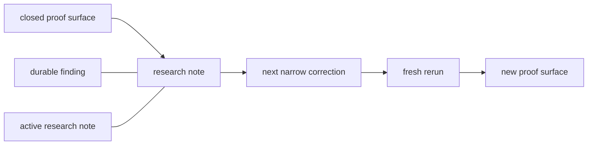

# Research

Huemiliator keeps the tracked research lane small on purpose.

Tracked research notes should answer three things quickly:

- what the current proof surface is
- what the durable findings are
- what the next runtime kernel is

Private scratch and raw operator notes stay in `docs/peanut/`.

## Current Research State

| Item | Current state |
| --- | --- |
| phase | `pre-beta` |
| active proof surface | closed third corrected `red` rerun at `id > 18423` |
| current totals | `1268 total / 1162 pass / 106 fail / 0 pending` |
| current question | what is the next narrow `red` correction? |
| next family lane | `red` first, `yellow` still queued behind it |
| live DB rule | keep only the current proof surface in `eval_outputs` |

## Research Map

| Surface | Type | What it says now |
| --- | --- | --- |
| [Finding 1: Contextual Brown](./FINDING_1_CONTEXTUAL_BROWN.md) | durable finding | `brown` behaves like a contextual bucket, not a clean spectral category |
| [Finding 2: Red Shoulder Drift](./FINDING_2_RED_SHOULDER_DRIFT.md) | active research note | the next `red` cut should be a narrow warm-clay / peach shoulder escape |

## How To Read This Folder

- durable findings hold theory-level or category-level claims that survived
  more than one rerun
- active research notes hold the current research edge
- handoff and decisions carry repo truth; research notes explain what the
  signal means

## Current Red Read

The current closed `red` proof surface says:

- the broad pink-peach and brown-wine seams are already much tighter
- the coherent muted-red local cluster should stay in `red`
- the next likely cut is a warm-clay / peach shoulder escape from `red` to
  `orange`

## Plans

Plans are useful, but they are not evidence.

Current planned sequence:

1. keep the closed third corrected `red` rerun as the active proof surface
2. cut the next narrow `red` correction
3. rerun `red`
4. only then decide whether the remaining dark-to-pale jumps are still family
   issues or a later rank kernel
