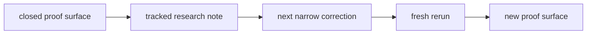

# Research

Last updated: 2026-06-06

Huemiliator keeps the tracked research lane small on purpose.

Each beta is a distinct eval approach. This folder preserves the method shifts
that changed what the evidence means.

Raw run notes and scratch material stay out of the tracked research surface
until they become evidence.

Tracked research-note names use the category code contract:
`NNN_CODE.md` or `NNN_CODE-QUALIFIER.md`. Dates live inside the docs, not in
filenames.

The live file map and shared category/status vocabulary live in
[Research Legend](./000_LEGEND.md).

Private scratch and raw operator notes stay in `docs/peanut/`.

## Current Stage

| Signal | Current read |
| --- | --- |
| live research lane | `Beta 1.0` fail-pressure pulse |
| active proof surface | broader corrected `neutral` continuation at `20106..20120` |
| verdict unit | pulse-level proof surface |
| comparison surface | closed third corrected `red` rerun at `id > 18423` |
| beta question | choose the next method or scope now that all runtime family lanes are parked |

## Current Research State

| Item | Current state |
| --- | --- |
| stage | `Beta 1.0` |
| active proof surface | `neutral` continuation pulse at `20106..20120` |
| current totals | `15 total / 14 pass / 1 fail / 0 pending` |
| current question | next method or scope after the family-lane sweep |
| active beta note | `020_B10` |
| closed staging note | `010_PB10` |
| corrected method note | `410_N3` |
| active family lane | none selected after `neutral` park |
| stable prior lanes | `red` through `neutral` |
| current audit note | `310_RED_ORANGE_AUDIT` |
| comparison baseline | closed third corrected `red` rerun at `18424..19691` |
| live DB rule | keep only the current proof surface in `eval_outputs` |

## Family Range Palette

The chips sample the current classifier order from the frozen swatch snapshot.

## Research Map

| Surface | Type | What it says now |
| --- | --- | --- |
| [Research Legend](./000_LEGEND.md) | legend | file map, code ranges, filename contract, category meanings, and status language |
| [Pre-Beta 1.0 Fail-Pressure Pulse](./010_PB10.md) | staging note | the closed staging contract that led into the first live `Beta 1.0` pulse |
| [Beta 1.0 Fail-Pressure Pulse](./020_B10.md) | active beta note | two bounded `red` pulses pass, `yellow` parks cleanly after one fail-and-recovery stack, `green` parks on two clean passes, `blue` parks behind a corrected rerun, `purple` parks on two clean `15 / 0` pulses, `pink` parks behind a clean second continuation, `orange` parks after one fail surface plus recovery, `brown` parks on three clean bounded pulses, and `neutral` parks after the split correction plus a broader `14 / 1` continuation |
| [Brown Context Dependence](./120_BROWN.md) | durable note | `brown` behaves like a contextual bucket rather than a clean spectral category |
| [Red Orange Edge Drift](./210_RED_ORANGE.md) | active note | the next `red` cut is still a narrow warm-clay / peach edge escape |
| [Red Orange Edge Drift Audit](./310_RED_ORANGE_AUDIT.md) | audit note | the audit blockers are repaired and the red lane is now parked as a stable prior baseline inside `Beta 1.0` |
| [Neutral Three-Pulse Split](./410_N3.md) | closed corrected method note | the nine cool-edge seams in `20082..20096` were rerun as three smaller eval pulses at `20097..20105`, all passing cleanly |
| [Post-Sweep Residue Map](./420_RESIDUE.md) | triaged backlog note | counted-seam residue across the row-order `Beta 1.0` pulse stack points to warm-edge audit or chart-only closeout |

## How To Read This Folder

| Doc kind | Job |
| --- | --- |
| durable note | holds category-level or method-level claims that survived more than one rerun |
| active note | holds the current research edge |
| handoff / decision | carries repo truth while research notes explain what the signal means |

## Current Signal

Each horizontal bar is one 15-row pulse. Lane labels use row-family truth from
the eval rows; archive labels stay annotations.

| Lane | Current read |
| --- | --- |
| `red` | parked; the coherent muted-red local cluster stays in `red` |
| `yellow` | failed once, corrected, and parked; the yellow-to-green correction and chartreuse cut are explicit |
| `green` | parked behind two clean pulses |
| `blue` | parked after the blue-drift correction; one aqua seam remains |
| `purple` | parked behind two clean pulses |
| `pink` | warm-orange and wine drift opened, then the lane closed cleanly |
| `orange` | pale straw, buff, blush, cream, straw, olive, and yellow-gold drift were exposed, then corrected |
| `brown` | parked behind three clean pulses despite the older context-dependence read |
| `neutral` | parked after the cool-edge split and broader source-order continuation; one warm peach seam remains as residue |

| Method / runtime signal | Read |
| --- | --- |
| verdict unit | fail-pressure pulse is the active `Beta 1.0` unit |
| comparison baseline | closed third corrected `red` rerun stays the row-level comparison baseline |
| scoped sampling | current sampling truth matches the runtime ladder again |
| operator surface | pulse start, label, report, and local quarantine are live |
| next boundary | choose the next method or scope; no further neutral rerun is required without new evidence |

## Residue Map

The residue chart counts `counted_seam` rows across the row-order `Beta 1.0`
pulse stack. It is a next-scope map, not a live failure total.

## Active Neutral Read

| Pressure group | Source rows | Corrected pulse | Read |
| --- | --- | --- | --- |
| lilac / mauve | `20082`, `20083`, `20094` | `20097..20099` | `3 anchors / 0 seams / 0 excluded` |
| blue / jade | `20085`, `20090`, `20091` | `20100..20102` | `3 anchors / 0 seams / 0 excluded` |
| mint / green | `20086`, `20087`, `20095` | `20103..20105` | `3 anchors / 0 seams / 0 excluded` |
| broader continuation | source order `48` | `20106..20120` | `14 anchors / 1 seam / 0 excluded` |
| warm residue | `20084`, `20088`, `20107` | outside the cool-edge correction | secondary peach / pearl residue |

## Plans

Plans are useful, but they are not evidence.

| Step | Move | Gate |
| ---: | --- | --- |
| 1 | keep `20097..20105` as the corrected neutral split stack | all three smaller pulses passed |
| 2 | keep `20106..20120` as the broader corrected neutral continuation | the pulse passed at `14 / 1` |
| 3 | treat `brown` as parked behind three clean bounded pulses | do not reopen the old context-dependence read without new evidence |
| 4 | use `410_N3` as the completed split-correction read | keep the undertone-bucket correction attached to the evidence |
| 5 | use `420_RESIDUE` to choose the next `Beta 1.0` method or scope | all runtime family lanes now have a parked read |

These betas and staged notes are research architectures. They are not app
release versions, package versions, branch names, or one more sweep.

| Surface | Verdict unit | What it proves |
| --- | --- | --- |
| closed row-level `red` rerun | row-level family proof | family-correction baseline |
| `Beta 1.0` | bounded fail-pressure pulse | current live lane-by-lane verdicts |

Later method surfaces do not erase earlier ones. They narrow what each verdict
is allowed to mean.
