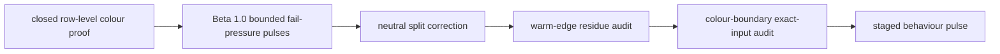
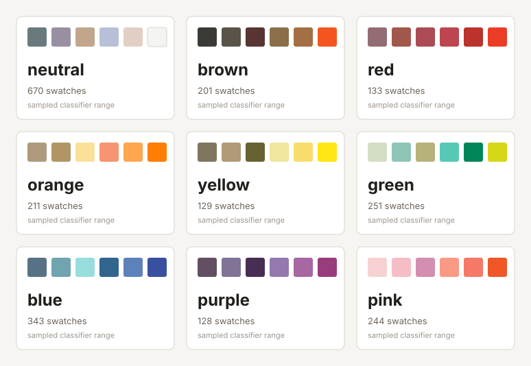
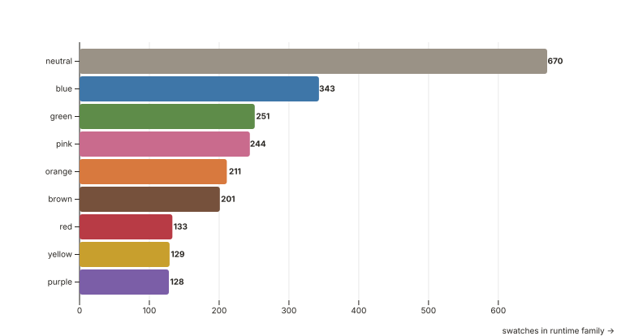
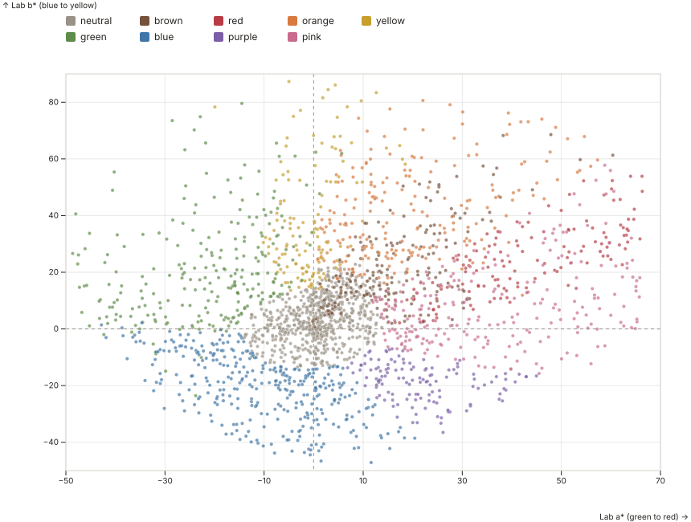
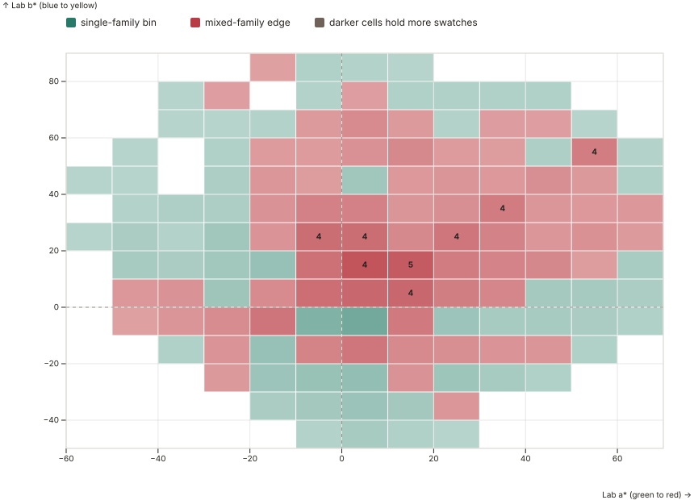
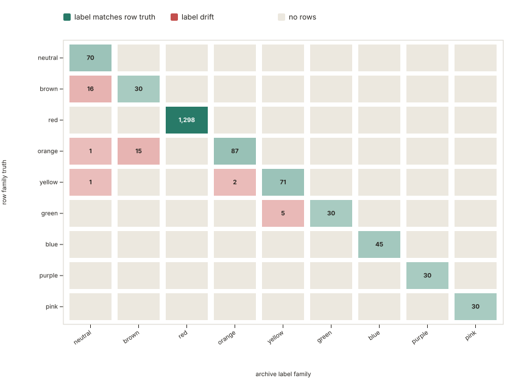
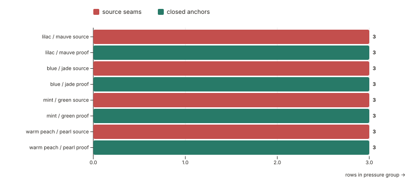
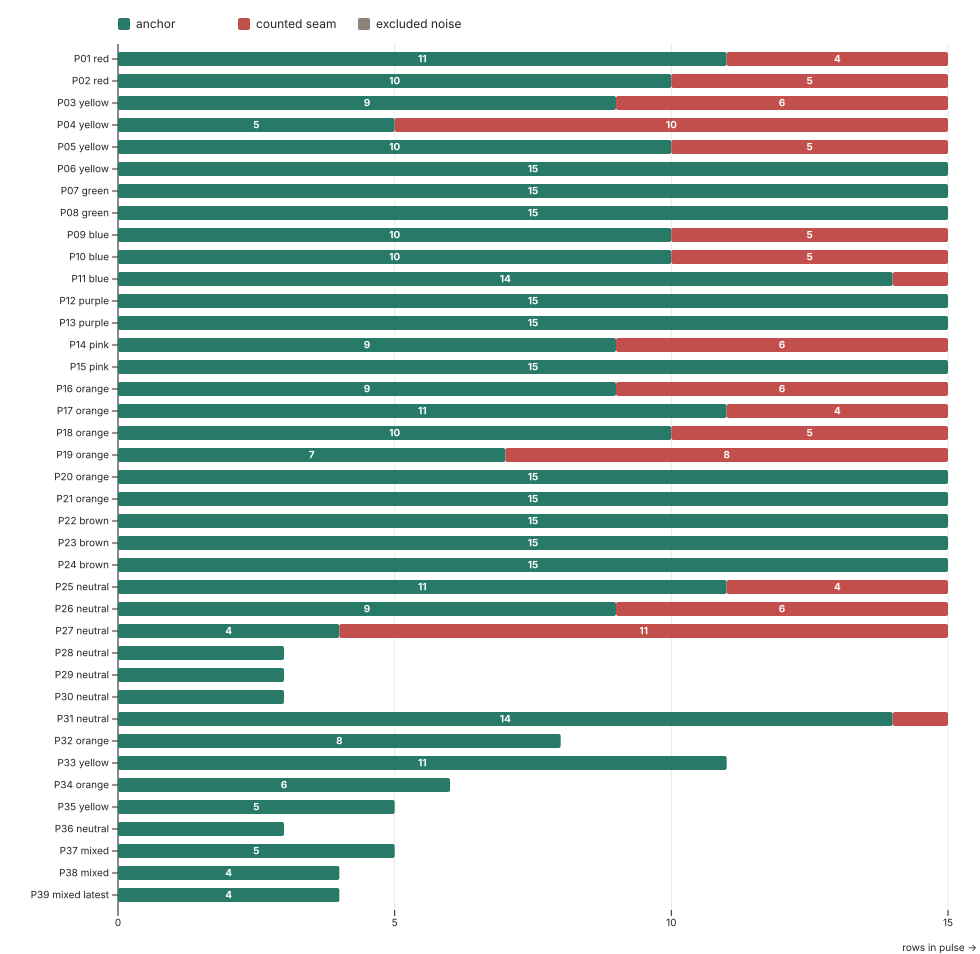
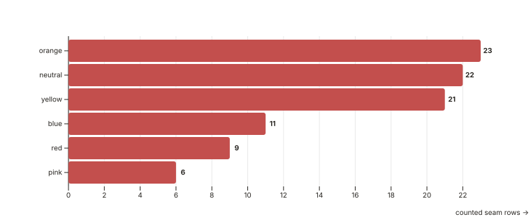

# Research

Last updated: 2026-09-20

Huemiliator's research notes record method changes and what each evidence
surface is allowed to mean. They are not release notes: `Beta 1.0`, pulse
names, and boundary names describe research methods, not app versions,
package versions, or release readiness.

## Current Stage

| Surface | Current read |
| --- | --- |
| [Behaviour boundary](030_PB_BEHAVIOUR.md) | `staged`: Huey's behaviour on stable colour facts |
| Cadence and owner | 15-minute pulses are staged; the primary assistant operates them, and Peanut and the primary assistant judge initial rounds together under [D-052](../governance/DECISIONS.md#d-052-judge-the-first-behaviour-rounds-together) |
| Language direction | [bank-free benchmark](470_V10_BENCHMARK.md): saved `huey` v10 selected under D-059; earlier bank-based composer awaits alignment |
| Startup orientation | [Session handoff](../governance/SESSION_HANDOFF.md) carries the durable startup method, ownership and next step |
| Next kernel | align bank-free composition with v10 and its captured request settings; resolve shade-selection responsibility and preserve name-only output. Punctuation follows Hugh's own voice under D-057. |
| Closed colour method | `Beta 1.0` fail-pressure pulses, followed by closed warm-edge and colour-boundary audits |
| [Carried wording correction](230_CARRIED_WORDING.md) | `20163..20166`: four Peanut **FAILs**, “the responses are too basic.” Historical colour labels retain their separate scope. |

September 20's bank-free correction supersedes September 19's local-library
direction. The earlier colour method remains the carried comparison baseline
while behaviour staging is aligned.

## Method Lineage

```mermaid
flowchart LR
  A["closed row-level colour proof"] --> B["Beta 1.0 bounded fail-pressure pulses"]
  B --> C["neutral split correction"]
  C --> D["warm-edge residue audit"]
  D --> E["colour-boundary exact-input audit"]
  E --> F["staged behaviour pulse"]
```

| Method surface | What it proves | Owning note |
| --- | --- | --- |
| closed corrected `red` rerun | row-level family comparison baseline | [B10](020_B10.md) |
| `Beta 1.0` | bounded lane-by-lane fail-pressure verdicts | [B10](020_B10.md) |
| neutral split | three smaller exact-input corrections plus broader continuation | [N3](410_N3.md) |
| warm-edge audit | five promoted residue groups, including warm-neutral `20151..20153` | [warm audit](430_WARM_EDGE_AUDIT.md) |
| colour-boundary audit | three report-derived mixed-bin pulses before classifier edits | [boundary audit](440_COLOUR_BOUNDARY_AUDIT.md) |
| behaviour pulse | proposed next object of judgment; not yet a completed evidence surface | [PB_BEHAVIOUR](030_PB_BEHAVIOUR.md) |

## Closed Colour Read

The colour research boundary is closed. Neutral's cool-edge seams were split into
`20097..20099`, `20100..20102`, and `20103..20105`; the broader continuation
`20106..20120` passed at `14 anchors / 1 counted seam / 0 excluded`. The warm
residue group `20151..20153` passed at `3 / 0 / 0`, so the neutral correction
and warm-edge correction are both closed records, not queued work.

The owning audit notes retain the complete group results, seed selection,
row identities and interpretation boundaries.

## Charts

Chips sample the current classifier order from the frozen swatch snapshot.

Bars count the current runtime family assignment across the frozen snapshot.

Points place frozen swatches by Lab `a*` and `b*`; colour shows runtime family.

Lab-space bins show mixed-family pressure and swatch density.

The archive table compares parked archive-family labels with row-family truth;
off-diagonal cells mark archive-label drift.

The neutral split pairs each historical source seam group with the anchors that
closed it. It is a correction record, not a current failure total.

Each horizontal bar represents one bounded pulse. Pulse row counts vary by
source surface and exact-input group; the chart must not be read as a fixed
15-row contract. Lane labels come from row-family truth; archive labels remain
annotations. The residue chart is a scope map, not a current failure total.

This residue chart maps counted seams across the historical `Beta 1.0` stack;
it does not report live failures.

## Map

| Note | Job |
| --- | --- |
| [000_LEGEND](000_LEGEND.md) | file map, categories, and status language |
| [030_PB_BEHAVIOUR](030_PB_BEHAVIOUR.md) | staged assistant-run behaviour boundary |
| [220_RESPONSE_CONSTRUCTION](220_RESPONSE_CONSTRUCTION.md) | construction failures, historical study, and fresh cue mini awaiting judgment |
| [450_LOCAL_LANGUAGE](450_LOCAL_LANGUAGE.md) | superseded library hypothesis, sources and historical observations |
| [460_BANK_FREE_FOUNDATION](460_BANK_FREE_FOUNDATION.md) | historical v8/v9 foundation and inspected comparison sources |
| [470_V10_BENCHMARK](470_V10_BENCHMARK.md) | current benchmark, exact prompt and three preserved responses |
| [020_B10](020_B10.md) | closed `Beta 1.0` colour method |
| [410_N3](410_N3.md) | closed neutral split correction |
| [420_RESIDUE](420_RESIDUE.md) | closed counted-seam source map |
| [430_WARM_EDGE_AUDIT](430_WARM_EDGE_AUDIT.md) | closed warm-edge audit |
| [440_COLOUR_BOUNDARY_AUDIT](440_COLOUR_BOUNDARY_AUDIT.md) | closed mixed-bin audit |

Plans are proposals. Evidence, source rows, and verdict ownership stay in the
owning notes; private scratch and raw operator records stay in `docs/peanut/`
and `.local/`.
