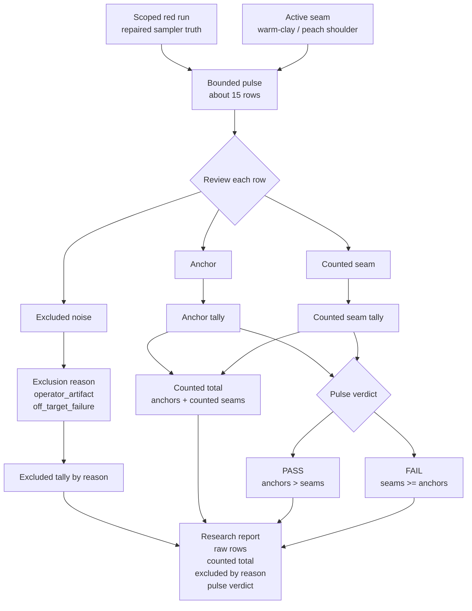

# Pre-Beta 1.0: Fail-Pressure Pulse

Date: `2026-05-16`

## What This Pre-Beta Asks

Should Huemiliator treat a bounded family run as the real binary unit once
family-seam density matters more than single-row replay?

## Status

Maybe, and the current corrected `red` proof surface is strong enough to make
the question worth staging explicitly.

The closed third corrected `red` rerun proved that row-level family correction
can narrow a real seam without widening the runtime contract. This pre-beta
note asks whether the next method step should move the binary judgment up one
level:

- the pulse becomes the binary unit
- the rows become evidence inside the pulse

## Eval Shape

This is not `Beta 1.0` yet.

It is not an app release version.

It is the staging contract for a possible research-method `1.0` promotion.

The proposed pulse shape for Huemiliator is:

- bounded non-OCR family run
- keep the colour runtime local and deterministic
- first staged target family:
  - `red`
- first staged seam:
  - `warm-clay / peach shoulder`
- start small:
  - around `15` rows
- row evidence is judged first as:
  - `anchor`
  - `counted seam`
  - `excluded noise`
- the pulse verdict is binary:
  - `PASS`
  - `FAIL`

Counted pulse rules:

- more anchors than counted seams: `PASS`
- more counted seams than anchors: `FAIL`
- tie: `FAIL`

Evidence taxonomy:

- `anchor`
  - family-valid row
  - keeps the active `red` lane coherent
  - preserves the same-family one-up move cleanly enough to support the lane
  - does not reproduce the staged warm-clay / peach failure family
- `counted seam`
  - family-valid row
  - failure belongs to the active warm-clay / peach seam
  - row is still coherent enough to retain as live evidence
  - counts against the pulse verdict
- `excluded noise`
  - row does not answer the active seam question cleanly enough to count for
    or against the pulse verdict

Exclusion reasons:

- `operator_artifact`
  - the row is malformed, truncated, or otherwise not honestly reviewable
- `off_target_failure`
  - the row fails for a different seam family than the active pulse target

Exclusion rules:

- raw pulse size stays visible
- counted pulse size stays visible
- every excluded row needs a narrow reason
- excluded rows stay reviewable after the pulse
- excluded rows never disappear into the verdict total

Reporting shape:

- raw rows
- anchors
- counted seams
- excluded rows by reason
- counted total
- pulse verdict

## Diagram

Reading note:

- the active lane stays `red`
- the active seam stays the warm-clay / peach shoulder
- raw rows are everything inside the bounded pulse
- only `anchor` and `counted seam` rows enter the verdict math
- excluded rows stay visible by reason, but do not alter the counted total
- the report has to show both the pulse verdict and how that verdict was made

## Current Huemiliator Read

| Surface | Result |
| --- | --- |
| staged lane | `pre-Beta 1.0` |
| active proof surface | closed third corrected `red` rerun at `id > 18423` |
| next live gate | first bounded `red` Beta 1.0 pulse from the repaired sampler surface |
| current evidence store | `.local/evals.sqlite` still holds row evidence |
| first Beta 1.0 target | `red` |

## What This Would Change

If this graduates into `Beta 1.0`, Huemiliator would change the unit of
judgment for bounded family runs:

- current closed comparison surface:
  - row-level `PASS / FAIL`
  - family-lane rerun proof surface
- `Beta 1.0` candidate:
  - row-level evidence labeling inside the pulse
  - pulse-level `PASS / FAIL`

That would make family-level shape harder to fake:

- one lucky row could not make the whole run look healthy
- seam density would matter more than isolated wins
- exclusion review would become part of pulse hygiene

## Why It Matters

The current closed third corrected `red` rerun already showed a coherent fail
family:

- `1268` total
- `1162` pass
- `106` fail
- `0` pending

That is exactly the kind of result that invites pulse judgment.

The row-level method already proved that the seam is real. Pulse judgment would
ask a stricter question:

- does the bounded `red` family actually pass under fail pressure
- or does warm-clay / peach seam density still outweigh the anchors

## What Stays The Same

- the picker runtime stays local and deterministic
- the frozen `margaret2` snapshot stays the primary colour reference
- runtime still owns swatch matching, family assignment, rank, and one-up
- the active technical seam is still the warm-clay / peach shoulder inside
  `red`

## What It Still Needs

Before this becomes `Beta 1.0`, Huemiliator still needs:

- one operator surface for pulse labeling and reporting
- a tight evidence taxonomy for:
  - `anchor`
  - `counted seam`
  - `excluded noise`
- one first bounded `red` pulse launched from the repaired sampler surface
- explicit research reporting that compares pulse verdicts back to the closed
  row-level `red` baseline

## Branch Update

Date: `2026-05-17`

- scoped sampler truth now follows the same effective family routing as the
  runtime ladder
- `start_source_order` now applies before scope filtering and means the real
  snapshot source-order surface again
- the surfaced `contract` command now dispatches a real runtime-contract view
- validation is green on the repair branch: `make check`

## What Would Promote It

This becomes `Beta 1.0` only when Huemiliator starts the first real pulse run.

Promotion boundary:

1. pulse contract is accepted as the next eval unit
2. the first bounded `red` pulse is launched
3. the research index flips from staged `pre-Beta 1.0` to active `Beta 1.0`
4. pulse evidence, not just hypothesis text, becomes the current method
