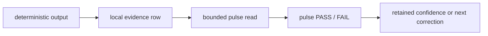
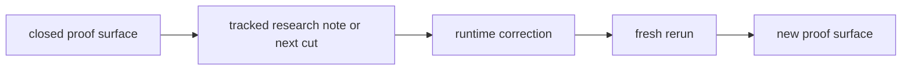

# Architecture

## Repo Map

- `src/huemiliator/`
  - runtime package, picker flow, swatch resolution, family mapping, rank
    ladder, one-up selection, output composition, and CLI entrypoints
- `data/margaret2_swatches.json`
  - frozen local swatch reference
- `.local/evals.sqlite`
  - live eval evidence store
- `docs/governance/`
  - durable rules, decisions, and active carryover
- `docs/runtime/`
  - operator procedure, system shape, and command card
- `docs/research/`
  - tracked research notes and current proof-surface reads
- `docs/diagrams/PIPELINE.md`
  - canonical picker-to-eval flow
- `output/jupyter-notebook/`
  - follow-along notebook surface
- `tests/`
  - runtime and repo contract checks

## Runtime Flow

The stable runtime path is:

1. the user picks a colour through the native macOS picker
2. the runtime captures one hex code as the canonical user state
3. the runtime resolves the nearest swatch from the frozen local snapshot
4. the runtime assigns a closed family
5. the runtime reads the same-family rank
6. the runtime selects the next same-family replacement, clamped at the top
7. the runtime appends one short fixed loss line downstream of the colour
   decision

## System Shape

- input stays picker-first and local
- colour resolution stays deterministic
- family assignment stays explicit and closed
- same-family rank stays on one fixed ladder
- one-up selection stays deterministic and non-wrapping
- the loss line stays downstream of the stable colour decision
- the runtime owns the final colour output

## Data Surfaces

- frozen swatch reference:
  - `data/margaret2_swatches.json`
- live eval evidence:
  - `.local/evals.sqlite`
- local quarantine artifacts for superseded runs:
  - `.local/parked/`
- tracked research notes:
  - current proof surface
  - durable notes
  - next narrow correction

## Eval Flow

The active method is:

- Current local CLI surfaces still log row evidence in `.local/evals.sqlite`.
  The first bounded `orange` pulse at `19917..19931` is the active
  judged proof surface. The full parked red, yellow, green, blue, purple, and
  pink proof stacks stay as the current Beta 1.0 comparison stack, and the closed third
  corrected `red` rerun stays as the closed row-level comparison baseline.
- one active family lane at a time
- one active sampler at a time
- bounded fail-pressure pulse as the current live judgment unit
- rows stay visible as evidence inside the pulse
- `warm` as an audit cohort only
- closed proof surfaces stay active until the next correction is explicit

## Placement Rules

- durable rules belong in `CHARTER`
- current active carryover belongs in `SESSION_HANDOFF`
- operator procedure belongs in `RUNBOOK`
- compact commands belong in `START_END_REFERENCE`
- durable rationale belongs in `DECISIONS`
- current proof-surface reads belong in tracked research notes
- local scratch and field material belong in `docs/peanut`

## Governance Flow

Tracked truth moves through closed proof surfaces and narrow runtime
corrections, not through mixed historical queues or branch-local notes.
