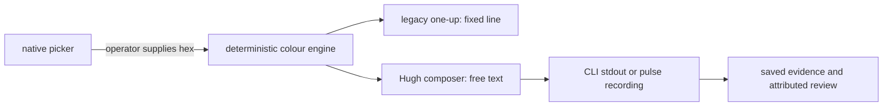
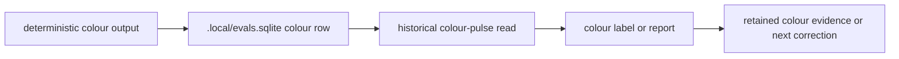
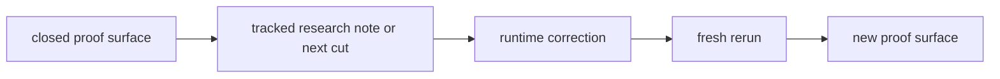

# Architecture

## Repo Map

- `src/huemiliator/`
  - runtime package, picker flow, swatch resolution, family mapping, rank
    ladder, one-up selection, output composition, and CLI entrypoints
- `data/margaret2_swatches.json`
  - frozen local swatch reference
- `.local/evals.sqlite`
  - deterministic colour-evidence store; separate from current behaviour records
- `docs/governance/`
  - durable rules, decisions, and active carryover
- `docs/runtime/`
  - operator procedure, system shape, and command card
- `docs/research/`
  - tracked research notes and current proof-surface reads
- `docs/diagrams/PIPELINE.md`
  - canonical picker, composition, and evidence flow
- `output/jupyter-notebook/`
  - follow-along notebook surface
- `tests/`
  - runtime and repo contract checks

## Runtime Flow

```mermaid
flowchart LR
  A["native picker"] -->|"operator supplies hex"| B["deterministic colour engine"]
  B --> C["legacy one-up: fixed line"]
  B --> D["Hugh composer: free text"]
  D --> E["CLI stdout or pulse recording"]
  E --> F["saved evidence and attributed review"]
```

The [pipeline](../diagrams/PIPELINE.md) shows the command and recording boundaries.
The engine matches the frozen snapshot with CIE76 and source-order tie breaks,
assigns a family and rank, then selects the next same-family shade without
wrapping. Neutral stays within its undertone bucket and clamps at the top.
Hugh composes from those fixed facts and five character points. The legacy
`one-up` command retains its fixed line.

## Operator Boundary

- the repo owns its startup checks, tracked-doc rehydrate, validation, and
  clean-main closeout
- the external Coffee Codex plugin owns the one shared Mac-wide keep-awake
  session
- repo lifecycle commands do not inspect, start, adopt, or stop Coffee state

## Data Surfaces

- language composition:
  - `huemiliator compose <hex> --dry-run` exposes the exact request
  - `huemiliator compose <hex> --format json` emits a composition record to stdout
  - fixed colour facts, picker context and five authorial character points
  - one free-text OpenAI Responses API generation; captured versioned JSON evidence
  - the compose command creates no files or database rows by itself
  - Luna / medium reasoning / medium verbosity / Top P `0.98`, configurable through `.env`
  - detailed reasoning summaries and stored responses follow the selected Platform settings under D-066
  - [configuration, inspection, and failure handling](COMPOSITION.md)
- behaviour review:
  - `.local/behaviour.sqlite`: saved compositions and attributed judgment history
  - [read-only notebook and schema](BEHAVIOUR_RECORDS.md)
- frozen swatch reference:
  - `data/margaret2_swatches.json`
- runtime colour library export:
  - `huemiliator colour-library --format json`
  - schema `huemiliator.colour_library.v1`
  - every frozen swatch with runtime family, rank, and colour metrics
- runtime colour-boundary report:
  - `huemiliator colour-boundaries --format json`
  - schema `huemiliator.colour_boundaries.v1`
  - mixed-family Lab bins with capped row samples and family-balanced samples
    for candidate selection
- deterministic colour evidence:
  - `.local/evals.sqlite` via the separate `eval-log` and colour-pulse commands
  - `end-pending-check` reads this colour store only
- local quarantine artefacts for superseded runs:
  - `.local/parked/`
- tracked research notes:
  - latest proof surface
  - durable notes
  - next narrow correction

## Deterministic Colour Evidence Flow

```mermaid
flowchart LR
  A["deterministic colour output"]
  B[".local/evals.sqlite colour row"]
  C["historical colour-pulse read"]
  D["colour label or report"]
  E["retained colour evidence or next correction"]

  A --> B --> C
  C --> D
  D --> E
```

The [closed colour baseline](../research/020_B10.md) and
[boundary audit](../research/440_COLOUR_BOUNDARY_AUDIT.md) retain their historical
scope. The live colour store is empty after the [verified archive](../research/330_EVAL_ARCHIVE.md).
Rows `20163..20166` retain historical colour labels alongside separate
[Peanut wording FAILs](../research/230_CARRIED_WORDING.md). Current behaviour
records use their own store and judgment history.

## Placement Rules

- durable rules belong in `CHARTER`
- current carryover belongs in `SESSION_HANDOFF`
- operator procedure belongs in `RUNBOOK`
- compact commands belong in `START_END_REFERENCE`
- durable rationale belongs in `DECISIONS`
- latest proof-surface reads belong in tracked research notes
- local scratch and field material belong in `docs/peanut`

## Governance Flow

```mermaid
flowchart LR
  A["closed proof surface"]
  B["tracked research note or next cut"]
  C["runtime correction"]
  D["fresh rerun"]
  E["new proof surface"]

  A --> B --> C --> D --> E
```

Tracked truth moves through closed proof surfaces and narrow runtime
corrections, not through mixed historical queues or branch-local notes.

## Behaviour Eval Flow

The implemented surface exports fixed colour facts and contract metadata. The
[PB_BEHAVIOUR](../research/030_PB_BEHAVIOUR.md) method is now active with its
first current-app pulse completed: records `7..15`, four `PASS`, five `FAIL`, one
mechanical failure, zero request errors, and `857.587` seconds. This is bounded
response evidence, not a beta promotion or aggregate behaviour verdict. A next
pulse is not automatic.

[D-065](../governance/DECISIONS.md#d-065-connect-sequential-pulses-through-attributed-feedback)
connects sequential pulses through frozen, attributed observations.
`feedback.py` reads completed evidence and the latest judgments for the named
evaluator; `behaviour_pulse.py` freezes the selected context and each request,
then waits for primary review between dispatches. Original records preserve the
complete feedback snapshot. [Behaviour Records](BEHAVIOUR_RECORDS.md#sequential-pulses)
owns operation; the connection is offline-validated, with live benefit unmeasured.

The composer serves two entry paths: `compose --format json` prints a v2
record; the first pulse's Python runner calls the same composer and saves
original requests, responses and records. The primary records each live verdict
in its ledger, then imports records and judgments into the behaviour database.
The [read-only behaviour notebook](BEHAVIOUR_RECORDS.md) reviews that evidence.
Hugh owns sentence construction; the [pipeline](../diagrams/PIPELINE.md) links
these implemented boundaries.

The colour substrate is measured before the response read starts:

1. `behaviour-facts` resolves the input into a fixed fact packet:
   - canonical hex
   - nearest swatch
   - family
   - current rank
   - replacement shade
   - fixed family loss line
2. `behaviour-facts --format json` emits the same packet as a machine-readable
   fixture
3. `compose` uses the packet for one free-text response; its JSON record is
   stdout evidence and is not automatically persisted
4. response evaluation reads the visible language against that packet
5. Polinko-facing checks can score language fidelity, tone fit, evidence fit,
   and consistency while treating the colour facts as fixed
