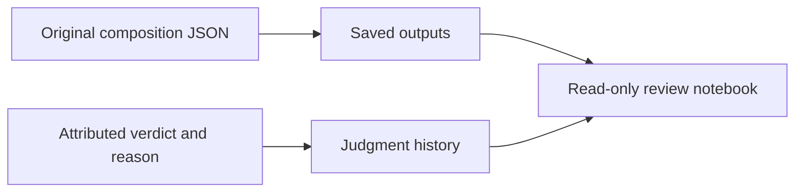

# Behaviour Records and Notebook

Open [Hugh behaviour review](../../output/jupyter-notebook/huemiliator-behaviour-review.ipynb)
to inspect saved responses, swatches, setup and attributed judgments. Its
default is the latest saved run; change `RUN_ID` to inspect an earlier one.
Run All opens `.local/behaviour.sqlite` in SQLite read-only mode. It refreshes
evidence without generating responses or recording judgments. An empty live
store displays an empty-state message.

## Schema

The small schema follows Scorey's
[saved outputs and judgment history](https://github.com/tryskian/scorey/blob/3c08ca0a770d66ea509b490592a2679f46d3d4b2/src/scorey/eval_db.py),
adapted for Hugh's composition records and attributed judgments.

| Surface | Holds |
| --- | --- |
| `eval_outputs` | run/case IDs, colour labels and hexes, response, model/settings versions, mechanical result, source path/hash, original JSON bytes |
| `eval_judgments` | output ID, evaluator, PASS/FAIL, exact note, source, timestamp and original judgment event bytes |
| `latest_judgments` | latest appended judgment for each output and evaluator |

Outputs are immutable. Judgment revisions append another event. An evaluator
with no judgment is pending; mechanical checks supply no behaviour verdict.
The [implementation](../../src/huemiliator/behaviour_db.py) owns schema version 1.
The importer accepts historical bank-based composition records (`v1`) and
bank-free records (`v2`). For v2, the legacy `bank_version` column reads
`not applicable`; no database migration is required. Original bytes, settings
and contemporaneous mechanical results retain their own record version.
There is no standalone note-only observation table: an optional note is stored
on an attributed judgment, whose schema still requires `PASS` or `FAIL`.



## Import and Judge

From the repository, import a saved mini's manifest, original records and
judgment ledger:

```sh
python -m huemiliator.behaviour_db import .local/behaviour-mini-evals/<run-id>
```

Imports preserve original bytes and are idempotent. Conflicting records or
judgment events fail atomically. The default database is `.local/behaviour.sqlite`;
an optional `--db <path>` goes before the command. An existing colour database
is rejected. `.local/evals.sqlite` is the separate live colour store.

The composer prints a record to stdout and does not auto-import it. A saved
pulse or mini directory supplies the original records and manifest for the
explicit import above. The first pulse appended each live judgment to its
ledger before importing records and judgments together. The command below
appends a later judgment directly to an imported output.

After the evaluator supplies a verdict, record its exact source and, when useful,
a concise note:

```sh
python -m huemiliator.behaviour_db judge <id> <pass|fail> \
  --evaluator 'primary assistant' --note '<optional concise note>' \
  --source '<source message>'
```

For the authorized current-app pulse, `primary assistant` records the live
per-response `PASS` or `FAIL` before the next dispatch; a Peanut verdict is not
required. Historical Peanut judgments remain preserved with their original
attribution. The notebook shows the evaluators recorded for the current pulse,
preserves historical Peanut judgments, and suppresses empty observations. Pulse
review remains a separate read of the incoming response and supplied colour
facts. The notebook refreshes from the database; source mini ledgers remain the
original import evidence. The database holds subsequent judgments.

## Current and Archived Evidence

The live deterministic colour store `.local/evals.sqlite` is empty after
[D-061's verified archive](../research/330_EVAL_ARCHIVE.md); its archived colour
rows remain historical evidence and are separate from behaviour records.
The completed current-app pulse produced 9 behaviour records and 9 primary
judgments at IDs `7..15`: 4 `PASS`, 5 `FAIL`, 1 mechanical failure and 0 request
errors in `857.587` seconds. All six inputs ran once; the first three repeated
before the 60-second dispatch guard stopped the run. Original records, raw
responses, database records and verdicts were verified, and runtime source plus
the colour database remained unchanged.
For historical review, set the notebook's `DB` to:

```python
DB = ROOT / ".local/parked/evals-20260920T214702Z-before-bank-free-evaluation/behaviour.sqlite"
```

Archived rows `1..3` retain three Peanut FAILs and three assistant FAILs;
`4..6` remain unjudged by both evaluators. These original records precede bank
`0.5.1`'s wording removal. The [construction case](../research/220_RESPONSE_CONSTRUCTION.md)
owns their context. After the archive, behaviour output and judgment IDs
resumed at `7`; the current pulse occupies `7..15`. Colour IDs continue from `20167`.

The exact method and case order are in the [pulse protocol](../../.local/behaviour-pulses/20260921T175241Z/protocol.json),
and the verified counts and integrity checks are in [the validation receipt](../../.local/behaviour-pulses/20260921T175241Z/validation.json).
The primary assistant recorded each live verdict before the next request or
finish. Review this current evidence manually in the [read-only behaviour
notebook](../../output/jupyter-notebook/huemiliator-behaviour-review.ipynb).
No automatic aggregate behaviour verdict or beta promotion was created; no
schema change was required. The old colour-eval notebook is historical and
write-capable; it is not the current behaviour review path.

## Sequential Pulses

Under [D-065](../governance/DECISIONS.md#d-065-connect-sequential-pulses-through-attributed-feedback),
the primary reviews completed pulses, selects useful observations, freezes the
next context and continues live judging. The five-point brief remains unchanged.
The [feedback reader](../../src/huemiliator/feedback.py) reads SQLite without writes
and verifies original response bytes. The [runner](../../src/huemiliator/behaviour_pulse.py)
preserves D-064's timing, request window, single attempt and live judgment gate.

```sh
# Snapshot all recorded observations from a completed, fully judged pulse.
python -m huemiliator.feedback .local/behaviour-pulses/<previous-run> \
  --output .local/feedback.json
# Freeze the next run's explicit protocol, requests and feedback offline.
python -m huemiliator.behaviour_pulse prepare .local/behaviour-pulses/<next-run> \
  --protocol .local/next-protocol.json --feedback .local/feedback.json
python -m huemiliator.behaviour_pulse verify .local/behaviour-pulses/<next-run>
# Start one authorized pulse; record each verdict in another terminal.
python -m huemiliator.behaviour_pulse run .local/behaviour-pulses/<next-run>
python -m huemiliator.behaviour_pulse judge .local/behaviour-pulses/<next-run> \
  <case-id> <pass|fail> --note '<optional observation>'
```

Use the first pulse's [protocol](../../.local/behaviour-pulses/20260921T175241Z/protocol.json)
as the structural reference, with a new run ID and the actual agreed scope.
The feedback command accepts multiple completed pulse directories. Repeated
`--observation-output-id <id>` selects useful observations across them; omitted
selection carries every nonempty note. All source judgments remain in the snapshot,
including empty notes. Later revisions require a new snapshot and preparation.

`prepared.json` binds requests, source code and snapshot hashes; `feedback.json`
and each saved composition retain exactly what was selected. The model sees
observations and their prior colour context; full historical answers stay local.
The notebook's stored original record retains the full snapshot without a schema
migration. An empty observation set supplies no inferred guidance.

The runner waits for an imported primary judgment before dispatching again.
`STOP` in the run directory ends dispatch. API failures stop without retry.
After completion, preserve the run and repeat preparation with the reviewed
feedback for the next pulse. Batch count and duration are an explicit run scope;
this connection's validation used offline requests and a mock transport only.
