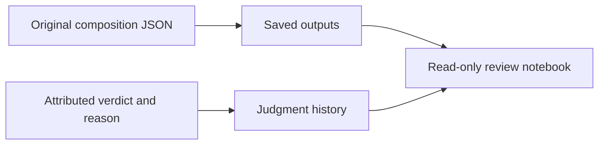

# Behaviour Records and Notebook

Open [Hugh behaviour review](../../output/jupyter-notebook/huemiliator-behaviour-review.ipynb)
to inspect saved responses, swatches, setup and attributed judgments. Its
default is the latest saved mini; change `RUN_ID` to inspect an earlier one.
Run All opens `.local/behaviour.sqlite` in SQLite read-only mode. It refreshes
evidence without generating responses or recording judgments.

## Schema

The small schema follows Scorey's
[saved outputs and judgment history](https://github.com/tryskian/scorey/blob/3c08ca0a770d66ea509b490592a2679f46d3d4b2/src/scorey/eval_db.py),
adapted for Hugh's composition records and two attributed evaluators.

| Surface | Holds |
| --- | --- |
| `eval_outputs` | run/case IDs, colour labels and hexes, response, model/settings versions, mechanical result, source path/hash, original JSON bytes |
| `eval_judgments` | output ID, evaluator, PASS/FAIL, exact note, source, timestamp and original judgment event bytes |
| `latest_judgments` | latest appended judgment for each output and evaluator |

Outputs are immutable. Judgment revisions append another event. An evaluator
with no judgment is pending; mechanical checks supply no behaviour verdict.
The [implementation](../../src/huemiliator/behaviour_db.py) owns schema version 1.



## Import and Judge

From the repository, import a saved mini's manifest, original records and
judgment ledger:

```sh
python -m huemiliator.behaviour_db import .local/behaviour-mini-evals/<run-id>
```

Imports preserve original bytes and are idempotent. Conflicting records or
judgment events fail atomically. The default database is `.local/behaviour.sqlite`;
an optional `--db <path>` goes before the command. An existing colour database
is rejected. The colour proof remains in `.local/evals.sqlite`.

After the evaluator supplies a verdict, record their exact reason and source:

```sh
python -m huemiliator.behaviour_db judge <id> <pass|fail> \
  --evaluator 'Peanut' --note '<exact reason>' --source '<source message>'
```

Use `primary assistant` for the assistant's separately attributed judgment
after Peanut. The notebook refreshes from the database; source mini ledgers
remain the original import evidence. The database holds subsequent judgments.

## Current Evidence

Rows `1..3` hold the original mini, with three Peanut FAILs and three assistant
FAILs. Rows `4..6` hold the cue mini, awaiting both evaluators. These records
precede bank `0.5.1`'s removal of `verdict.finer_choice`; they retain their
original wording. The [construction case](../research/220_RESPONSE_CONSTRUCTION.md)
owns context and limits. The 15-minute pulse protocol remains staged.
