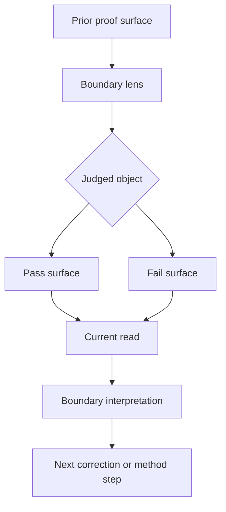

<!-- @format -->

# Boundary Template

Use this for tracked or staged method-boundary docs:

- closed row-level comparison baselines
- active beta method notes
- staged pulse-method notes

## Metadata

| Field | Value |
| --- | --- |
| Code | `NNN_BOUNDARY` |
| Category | `boundary` |
| Status | `staged`, `active`, or `closed` |
| Last evidence | `YYYY-MM-DD` |
| Owns | one sentence naming the eval boundary this doc establishes |

## Headline Shape

- `Beta X.Y: Name`
- or `Pre-Beta X.Y: Name`
- or `Method Boundary: Name`

## Section Order

1. metadata table
2. `What This Boundary Asks`
   - or `What This Beta Says`
3. `Status`
4. `Current Proof Surface`
5. `Diagram`
6. `What It Showed`
   - or `What This Would Change`
7. `Why It Matters`
8. `What It Still Cannot Show`
   - or `What It Still Needs`
9. `What Changed Next`
   - or `What Would Promote It`

## Required Boundary Moves

- state the prior proof surface explicitly
- state the current judged object and verdict unit explicitly
- state the active family lane or source slice explicitly
- state what changed in the evidence meaning
- state whether the boundary is staged, active, or closed
- state whether the boundary changes the active method or only stages one
- state the exact activation, promotion, or close condition

## Default Diagram Shape

## Boundary Questions To Answer

- what was the previous proof surface?
- what is the current judged object?
- what is the verdict unit: row, pulse, or split pulse?
- what family lane or source range defines the boundary?
- what does this boundary allow the repo to claim now?
- what still remains out of scope?
- what exact evidence would activate, promote, or close the boundary?

## Style Rules

- lead with the metadata table
- keep the opening answer short
- use one compact diagram
- keep evidence examples bounded to ids, ranges, counts, or pressure groups
- prefer proof-surface summaries over long quarantine inventories
- avoid sprawling recap if the prior beta is already documented elsewhere
