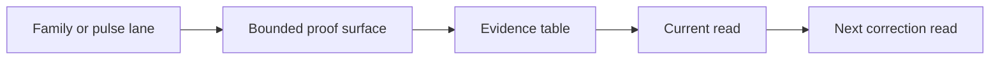

<!-- @format -->

# Lane Template

Use this for family or pulse evidence lanes where the method boundary is
already known and the doc's job is to show the active proof surface cleanly.

## Metadata

| Field | Value |
| --- | --- |
| Code | `NNN_LANE` |
| Category | `lane` |
| Status | `active`, `parked`, `closed`, or `snapshot` |
| Last evidence | `YYYY-MM-DD` |
| Owns | one sentence naming the family or pulse lane this doc tracks |

## Headline Shape

- `Family Lane: Name`
- or `Pulse Lane: Name`
- or `Correction Lane: Name`

## Section Order

1. metadata table
2. `Question`
3. `Current Shape`
4. `Evidence Table`
5. `Diagram`
6. `Read`
7. `Why It Matters`
8. `Next Move`

## Required Lane Moves

- name the exact family, pulse, or correction lane being tracked
- state the judged object and verdict unit explicitly
- state whether the lane is active, parked, closed, or a snapshot
- state the current proof surface by ids, source range, or pulse label
- keep the current evidence in a table
- state the dominant drift or anchor shape
- state the next correction read without turning the doc into a backlog dump

## Default Evidence Table

| Surface | Lane | Result | Read |
| --- | --- | --- | --- |
| `00000..00014` | family or pulse name | `anchors / seams / excluded` | one compact interpretation |

## Default Diagram Shape

## Lane Questions To Answer

- what exact lane is open?
- what ids, source range, or pulse label currently define it?
- what verdict unit is being read?
- what does the lane read show right now?
- what drift groups or anchor pockets matter?
- what remains unresolved?
- what is the immediate next move?

## Style Rules

- lead with the metadata table
- keep the evidence in tables, not long inventories
- use prose only for interpretation
- prefer one compact diagram over multiple mini-diagrams
- keep quarantine details out unless they are the point of the lane
- keep `Next Move` concrete and near-term
